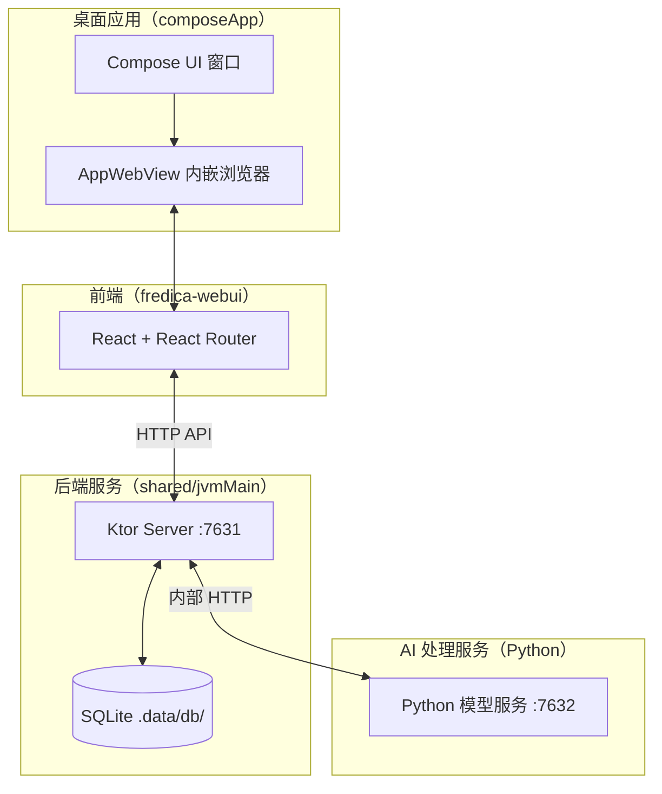
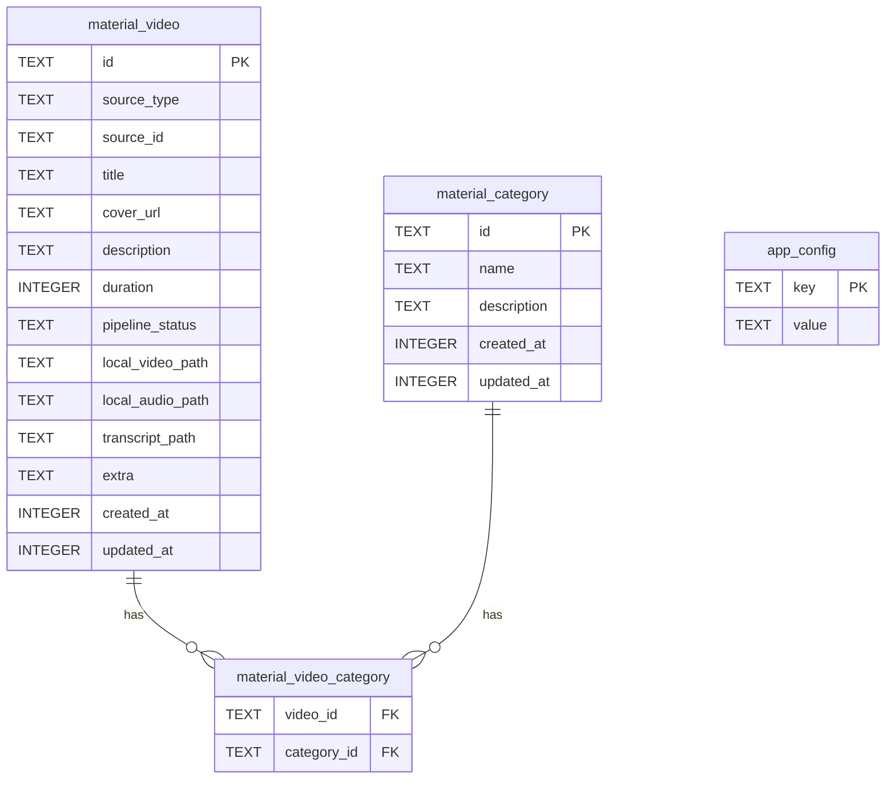

# 项目架构

## 整体架构

Fredica 采用**本地服务 + 内嵌 WebView**的架构，将 Kotlin 后端服务与 React 前端结合在一个桌面应用中。



## 模块划分

### `composeApp` — 桌面宿主

- **技术**：Kotlin Compose Multiplatform
- **职责**：
  - 创建桌面窗口，托管 `AppWebView`
  - 通过 JS Bridge 向 WebView 注入应用配置（端口、Token 等）
  - 响应 WebView 发出的 Native 消息（如打开系统浏览器、保存配置）
  - 启动内嵌的 Ktor API 服务器
- **支持平台**：JVM Desktop（Windows / macOS / Linux）、Android

**JS Bridge 消息类型：**

| 消息 Handler | 方向 | 说明 |
|-------------|------|------|
| `GetAppConfig` | Native → Web | Web 启动时获取服务器配置 |
| `SaveAppConfig` | Web → Native | 用户在设置页修改配置后保存 |
| `OpenBrowser` | Web → Native | 在系统默认浏览器中打开 URL |

### `shared` — 跨平台核心

- **技术**：Kotlin Multiplatform（commonMain + jvmMain + androidMain）
- **职责**：
  - 定义所有 API 路由的请求/响应数据模型（`commonMain`）
  - JVM 端实现 Ktor 服务器初始化与路由注册（`jvmMain`）
  - 数据库表结构与 Ktorm ORM 实体定义
  - 跨平台工具函数

**目录结构：**
```
shared/src/
├── commonMain/kotlin/
│   ├── api/
│   │   ├── FredicaApi.kt          # API 入口与路由注册
│   │   └── routes/                # 各业务路由实现
│   ├── db/                        # 数据库表定义（Ktorm）
│   └── apputil/                   # 工具函数
└── jvmMain/kotlin/
    └── api/
        └── FredicaApi.jvm.kt      # Ktor 服务器启动、认证、DB 初始化
```

### `fredica-webui` — React 前端

- **技术**：React 19 + React Router 7（文件系统路由）+ Tailwind CSS 4
- **构建工具**：Vite
- **职责**：所有用户交互界面

**路由结构（文件系统路由）：**

```
app/routes/
├── _index.tsx                          # 服务器连接配置页
├── library._index.tsx                  # 素材库主页
├── add-resource._index.tsx             # 添加资源入口
├── add-resource.bilibili.tsx           # B 站导入导航
├── add-resource.bilibili.favorite.tsx  # 收藏夹 ID 输入
├── add-resource.bilibili.favorite.fid.$fid.tsx  # 收藏夹视频列表
├── add-resource.bilibili.collection.tsx  # 合集（UI 框架）
├── add-resource.bilibili.multi-part.tsx  # 多 P 视频（UI 框架）
├── add-resource.bilibili.uploader.tsx   # UP 主（UI 框架）
├── app-desktop-home.tsx                # 桌面主页
├── app-desktop-setting.tsx             # 桌面设置
└── app-user-setting.tsx                # 用户设置
```

### `server` — 独立服务器（实验性）

- **技术**：Ktor（独立可执行 JAR）
- **当前状态**：仅有 `/` 路由，返回 `"Ktor"`
- **用途**：作为未来独立部署模式的起点，当前无实际功能

## 数据库设计



## 服务端口规划

| 端口 | 服务 | 状态 |
|------|------|------|
| `7630` | React WebUI 开发服务器（Vite） | ✅ 可用 |
| `7631` | Ktor API 服务器 | ✅ 可用 |
| `7632` | Python AI 处理服务 | <Badge type="warning" text="尚待开发" /> |

## 认证机制

所有需要认证的 API 都通过 `Authorization: Bearer <token>` 头验证。Token 生成和管理在桌面应用设置中处理。

认证逻辑位于 `FredicaApi.jvm.kt` 的 `handleAuth()` 函数。

## 图片代理与缓存

所有来自外部平台（如 B 站 CDN）的封面图都通过 Fredica 内置的图片代理服务访问：

1. 前端请求 `/api/v1/ImageProxyRoute?url={encodedUrl}`
2. 代理服务检查本地缓存（`.data/cache/images/`），缓存键为 URL 的 SHA-256
3. 缓存命中直接返回；未命中则从外部下载并写入缓存
4. 响应头携带 `Cache-Control: public, max-age=31536000, immutable`

> 图片代理接口无需认证，方便在 `` 标签中直接使用。
