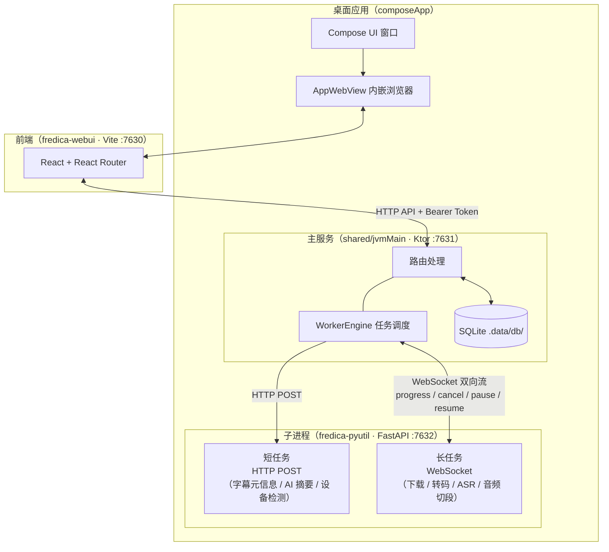

# 项目架构

## 整体架构

Fredica 采用**本地服务 + 内嵌 WebView**的架构，将 Kotlin 后端服务与 React 前端结合在一个桌面应用中。Python 辅助服务随桌面应用一同启动，以子进程形式运行。


```mermaid
graph TB
    subgraph Desktop["桌面应用（composeApp）"]
        CUI[Compose UI 窗口]
        WV[AppWebView 内嵌浏览器]

        subgraph Backend["主服务（shared/jvmMain · Ktor :7631）"]
            Ktor[路由处理]
            Worker[WorkerEngine 任务调度]
            DB[(SQLite .data/db/)]
        end

        subgraph PyService["子进程（fredica-pyutil · FastAPI :7632）"]
            PyShort["短任务\nHTTP POST\n（字幕元信息 / AI 摘要 / 设备检测）"]
            PyLong["长任务\nWebSocket\n（下载 / 转码 / ASR / 音频切段）"]
        end
    end

    subgraph WebUI["前端（fredica-webui · Vite :7630）"]
        React[React + React Router]
    end

    CUI --> WV
    WV <--> React
    React <-->|HTTP API + Bearer Token| Ktor
    Ktor <--> DB
    Ktor --- Worker
    Worker -->|HTTP POST| PyShort
    Worker <-->|WebSocket 双向流\nprogress / cancel / pause / resume| PyLong
```

## 模块划分

| 模块 | 技术 | 代码位置 |
|------|------|----------|
| `composeApp` | Compose Multiplatform | `composeApp/` |
| `shared`（主服务） | KMP + Ktor + Ktorm | `shared/src/commonMain/` · `shared/src/jvmMain/` |
| `fredica-webui` | React 19 + React Router 7 + Tailwind 4 | `fredica-webui/app/` |
| `fredica-pyutil`（子进程） | Python FastAPI | `desktop_assets/common/fredica-pyutil/` |
| `docs` | VitePress | `docs/` |

- **`composeApp`**：桌面窗口宿主，托管 AppWebView，通过 JS Bridge 与前端通信，负责启动主服务和 Python 子进程。支持 JVM Desktop（Windows / macOS / Linux）。
- **`shared`**：核心业务逻辑。`commonMain` 定义路由模型、DB 接口、任务引擎接口；`jvmMain` 实现 Ktor 服务器、SQLite、JVM Executor。详见 [任务模型](./task-model)。
- **`fredica-webui`**：所有用户界面，文件系统路由，位于 `fredica-webui/app/routes/`。
- **`fredica-pyutil`**：Python 辅助子进程，监听 `:7632`。短任务通过 HTTP POST 调用，长任务（下载/转码/ASR）通过 WebSocket 双向流执行，支持进度上报、取消、暂停/恢复。运行时（Python 3.14 嵌入式）随安装包分发，无需用户手动安装。目前仅 Windows 完整实现。

## 服务端口规划

| 端口 | 服务 | 状态 |
|------|------|------|
| `7630` | React WebUI 开发服务器（Vite） | ✅ 可用 |
| `7631` | Ktor API 服务器 | ✅ 可用 |
| `7632` | Python 辅助服务（FastAPI） | ✅ 可用（仅 Windows）|

## 认证机制

Fredica 的认证设计区分两类用户：

- **部署者（App 所有者）**：在本机运行 composeApp，直接使用内嵌 WebView，天然处于进程内信任域。
- **外部访问者**：通过局域网或公网访问 Ktor HTTP 服务（`:7631`），需要持有 Token 才能调用 API。

两种通道能够区分这两类用户，是因为 `kmpJsBridge` 仅在 `composeApp` 托管的 WebView 进程内可用——外部浏览器根本无法访问 Bridge，只能走 HTTP 路由。因此只需对 HTTP 路由做 Token 鉴权，即可在不影响部署者体验的前提下，将外部访问者隔离在授权边界之外。

两种请求通道对应不同的安全模型：

### routeApi — HTTP 路由（Bearer Token）

前端通过 `useAppFetch` / `apiFetch` 发起的所有 HTTP 请求，均在 `Authorization` 头携带 Bearer Token：

```
Authorization: Bearer <token>
```

服务端 `checkAuth()`（`FredicaApi.jvm.kt`）验证此 Token，失败时直接响应 401。Token 由用户在设置页配置，持久化到 `localStorage`，WebView 环境下通过 `get_server_info` Bridge 注入。

路由是否需要鉴权由 `FredicaApi.Route.requiresAuth` 控制（默认 `true`）；图片代理等公开接口可设为 `false`。

### kmpJsBridge — JS Bridge（进程内信任）

WebView 内的前端通过 `window.kmpJsBridge.callNative(method, params, callback)` 直接调用 Kotlin 原生方法，**无需 Token**。

安全边界由运行环境保证：Bridge 仅在 `composeApp` 托管的 WebView 内可用，外部浏览器无法访问（`getBridge()` 返回 `null`，调用会抛出 `BridgeUnavailableError`）。因此 Bridge 调用天然处于进程内信任域，不需要额外鉴权。

::: code-group

```ts [bridge.ts]
// fredica-webui/app/util/bridge.ts
<!--@include: ../../fredica-webui/app/util/bridge.ts-->
```

:::

### 对比

| | routeApi | kmpJsBridge |
|---|---|---|
| 传输方式 | HTTP（localhost:7631） | 进程内 postMessage |
| 鉴权方式 | Bearer Token | 进程内信任，无需 Token |
| 可用环境 | WebView + 普通浏览器 | 仅 WebView |
| 典型用途 | 所有业务 API | 获取服务器配置、LLM 代理、设备信息等需要绕过跨域或 Token 初始化的场景 |

## 图片代理与缓存

所有来自外部平台（如 B 站 CDN）的封面图都通过 Fredica 内置的图片代理服务访问：

1. 前端请求 `/api/v1/ImageProxyRoute?url={encodedUrl}`
2. 代理服务以 URL 的 SHA-256 为缓存键，检查本地缓存（`.data/cache/images/`）
3. 缓存命中直接返回；未命中则从外部下载并写入缓存
4. 响应头携带 `Cache-Control: public, max-age=31536000, immutable`

> 图片代理接口 `requiresAuth = false`，无需 Token，可直接用于 `` 属性。

::: code-group

```kotlin [ImageProxyRoute.kt]
// shared/src/commonMain/.../routes/ImageProxyRoute.kt
<!--@include: ../../shared/src/commonMain/kotlin/com/github/project_fredica/api/routes/ImageProxyRoute.kt-->
```

```ts [useImageProxyUrl（app_fetch.ts）]
// fredica-webui/app/util/app_fetch.ts — useImageProxyUrl
export function useImageProxyUrl(): (imageUrl: string) => string {
    const { appConfig } = useAppConfig();
    const host = getAppHost(
        appConfig.webserver_domain,
        appConfig.webserver_port,
    );
    return useCallback(
        (imageUrl: string) =>
            `${host}/api/v1/ImageProxyRoute?url=${encodeURIComponent(imageUrl)}`,
        [host],
    );
}
```

:::

