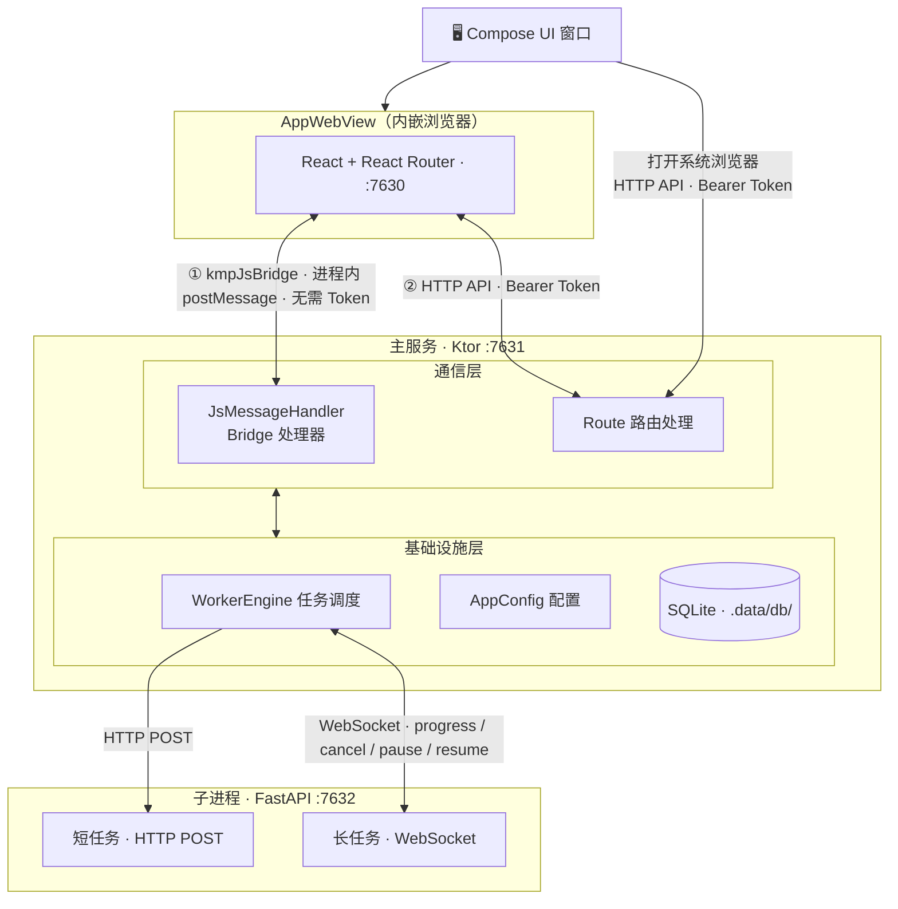

# 项目架构

## 整体架构

Fredica 采用**本地服务 + 内嵌 WebView**的架构，将 Kotlin 后端服务与 React 前端结合在一个桌面应用中。Python 辅助服务随桌面应用一同启动，以子进程形式运行。

前端与后端之间存在**两条独立的通信通道**：HTTP Route API 和 kmpJsBridge。两者的适用场景、安全模型和调用方式均不同，详见[前后端通信通道](./frontend-backend-bridge)。

```mermaid
graph TB
    CUI["🖥 Compose UI 窗口"]

    subgraph WVBox["AppWebView（内嵌浏览器）"]
        React["React + React Router · :7630"]
    end

    subgraph Backend["主服务 · Ktor :7631"]
        subgraph CommLayer["通信层"]
            Handlers["JsMessageHandler\nBridge 处理器"]
            Ktor["Route 路由处理"]
        end

        subgraph Infra["基础设施层"]
            Worker["WorkerEngine 任务调度"]
            AppConfig["AppConfig 配置"]
            DB[("SQLite · .data/db/")]
        end
    end

    subgraph PyService["子进程 · FastAPI :7632"]
        PyShort["短任务 · HTTP POST"]
        PyLong["长任务 · WebSocket"]
    end

    CUI --> WVBox
    CUI -->|"打开系统浏览器\nHTTP API · Bearer Token"| Ktor
    React <-->|"① kmpJsBridge · 进程内 postMessage · 无需 Token"| Handlers
    React <-->|"② HTTP API · Bearer Token"| Ktor
    CommLayer <--> Infra
    Worker -->|"HTTP POST"| PyShort
    Worker <-->|"WebSocket · progress / cancel / pause / resume"| PyLong
```

## 模块划分

| 模块 | 技术 | 代码位置 |
|------|------|----------|
| `composeApp` | Compose Multiplatform | `composeApp/` |
| `shared`（主服务） | KMP + Ktor + Ktorm | `shared/src/commonMain/` · `shared/src/jvmMain/` |
| `fredica-webui` | React 19 + React Router 7 + Tailwind 4 | `fredica-webui/app/` |
| `fredica-pyutil`（子进程） | Python FastAPI | `desktop_assets/common/fredica-pyutil/` |
| `docs` | VitePress | `docs/` |

- **`composeApp`**：桌面窗口宿主，托管 AppWebView，注册所有 `JsMessageHandler`，负责启动主服务和 Python 子进程。支持 JVM Desktop（Windows / macOS / Linux）。
- **`shared`**：核心业务逻辑。`commonMain` 定义路由模型、DB 接口、任务引擎接口；`jvmMain` 实现 Ktor 服务器、SQLite、JVM Executor。详见 [任务模型](./task-model)。
- **`fredica-webui`**：所有用户界面，文件系统路由，位于 `fredica-webui/app/routes/`。
- **`fredica-pyutil`**：Python 辅助子进程，监听 `:7632`。短任务通过 HTTP POST 调用，长任务（下载/转码/ASR）通过 WebSocket 双向流执行，支持进度上报、取消、暂停/恢复。运行时（Python 3.14 嵌入式）随安装包分发，无需用户手动安装。目前仅 Windows 完整实现。

## 服务端口规划

| 端口 | 服务 | 状态 |
|------|------|------|
| `7630` | React WebUI 开发服务器（Vite） | ✅ 可用 |
| `7631` | Ktor API 服务器 | ✅ 可用 |
| `7632` | Python 辅助服务（FastAPI） | ✅ 可用（仅 Windows）|

图片代理与缓存机制详见 [图片代理与缓存](./image-proxy)。
