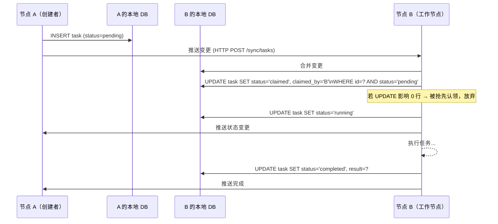

# 去中心化任务管理架构设计

> **文档状态**：草案（Draft）
> **创建日期**：2026-03-02
> **适用模块**：`server`、`shared`、`fredica-webui`

---

## 1. 背景与动机

### 现状问题

当前 Fredica 是单机架构：所有素材处理（下载、转录、AI 分析）都在运行桌面应用的同一台机器上串行执行。这带来以下痛点：

| 痛点 | 说明 |
|------|------|
| 资源竞争 | AI 转录任务占满 CPU/GPU，桌面应用卡顿 |
| 单点处理 | 只能在开机且运行 App 的机器上处理 |
| 处理瓶颈 | 批量导入大量素材时队列阻塞 |
| 算力浪费 | 家中/公司有多台机器，但算力无法汇聚 |

### 目标

构建一套**去中心化任务调度系统**，让多台设备（桌面主机、NAS、远程服务器、云机器）能够：

1. **协同分担**素材处理任务（下载、转录、AI 分析）
2. **任意节点**都可以创建任务或消费任务，无固定主从关系
3. **弹性伸缩**：随时增减节点，系统自适应
4. **离线容错**：节点掉线后，其任务自动被其他节点接管

---

## 2. 核心概念

### 2.1 任务（Task）

**任务**是系统的最小工作单元，描述"对某个素材执行某种处理"。

```
Task {
  id                  唯一标识（UUID）
  type                任务类型（见下表）
  pipeline_id         所属流水线实例 ID（同一批联动任务共享）
  material_id         关联的素材 ID（material_video.id）
  status              生命周期状态（见 §4.2）
  priority            优先级（0-10，越大越优先）
  depends_on          前置任务 ID 列表（JSON array）——所有前置任务 completed 后才可调度
  cache_policy        缓存/恢复策略：NONE | CHECK_EXISTING | PREFER_ORIGINAL（见 §6.2）
  payload             任务入参（JSON，类型相关）
  result              任务出参（JSON，成功后写入）
  result_acked_at     发起节点确认收到结果的时间（NULL 表示尚未确认，见 §6.4）
  error               错误信息（失败时写入）
  error_type          错误分类：TRANSIENT | RESOURCE | PERMANENT | RATE_LIMITED（见 §6.6）
  excluded_nodes      不应再重试此任务的节点 ID 列表（JSON array，Resource 错误时追加，见 §6.6）
  idempotency_key     任务去重键（UNIQUE，见 §3.4）
  retry_count         当前重试次数（含因 heartbeat 超时触发的重试）
  max_retries         最大重试次数（默认 3）
  created_by          发起节点 ID
  claimed_by          当前认领节点 ID
  original_claimed_by 首次认领节点 ID（任务被抢占后保留，用于缓存恢复判断）
  file_node_id        持有本地文件的节点 ID（FFMPEG/本地TRANSCRIBE 任务用）
  node_affinity       调度亲和约束："SOFT:<node_id>" 或 "HARD:<node_id>"（见 §2.4）
  timestamps          created_at / claimed_at / started_at / completed_at
                      heartbeat_at / stale_at / reclaimed_at
}
```

**任务类型：**

| 类型 | 说明 | 所需能力函数 | 节点亲和 | 缓存策略 | 预估耗时 |
|------|------|-------------|---------|---------|---------|
| `DOWNLOAD_VIDEO` | 将视频文件下载到本节点本地磁盘 | `DOWNLOAD` | 无 | `CHECK_EXISTING` | 1–30 min |
| `EXTRACT_AUDIO` | 从本地视频文件中提取音轨（WAV/FLAC） | `FFMPEG` | **HARD** | `CHECK_EXISTING` | 0.5–3 min |
| `SPLIT_AUDIO` | 将长音频切分为定长块（≤10 min/块） | `FFMPEG` | **HARD** | `PREFER_ORIGINAL` | 0.5–2 min |
| `TRANSCRIBE_CHUNK` | 对单个音频块进行语音转文字 | `TRANSCRIBE` | **SOFT** | `NONE` | 1–15 min |
| `MERGE_TRANSCRIPTION` | 合并各块 JSON 转录结果为完整文稿 | 无 | 无 | `CHECK_EXISTING` | <1 min |
| `AI_ANALYZE` | AI 内容分析/摘要/标签（输入为纯文本） | `AI_ANALYZE` | 无 | `NONE` | 0.1–5 min |
| `TRANSCODE` | 视频格式转换/压制 | `FFMPEG` | **HARD** | `CHECK_EXISTING` | 0.5–10 min |
| `GENERATE_THUMBNAIL` | 生成封面/缩略图序列 | `FFMPEG` | **HARD** | `CHECK_EXISTING` | 0.5–3 min |

任务仅声明所需的**能力函数**（做什么），不规定具体实现方式。调度器从满足该能力函数的节点中按**能力分数**择优分配，实现透明的后端解耦。节点亲和约束见 §2.4。

### 2.2 节点（Node）

**节点**是运行 Fredica 服务进程的一台设备实例。每个节点有：

```
Node {
  id            节点唯一 ID（启动时生成，持久化到本地）
  hostname      主机名
  capabilities  能力集合（Set<Capability>）
  status        online | busy | draining | offline
  max_workers   最大并行任务数
  last_seen_at  最近心跳时间（用于死亡检测）
  current_tasks 正在执行的任务 ID 列表
}
```

**节点类型（按部署场景）：**

| 节点类型 | 典型场景 | 能力示例 |
|----------|----------|----------|
| 桌面主力机 | 运行 composeApp，RTX 4070 | DOWNLOAD · FFMPEG(GPU) · TRANSCRIBE(faster-whisper/GPU/large-v3) · AI_ANALYZE(CloudAPI/deepseek) |
| GPU 工作站 | 独立 GPU 服务器，仅运行 `server` | FFMPEG(GPU) · TRANSCRIBE(faster-whisper/GPU/large-v3) · AI_ANALYZE(ollama/GPU) |
| NAS / 低配服务器 | 无显卡，7×24 在线 | DOWNLOAD · FFMPEG(CPU) · TRANSCRIBE(faster-whisper/CPU/medium) |
| Apple Silicon Mac | MacBook / Mac Mini | FFMPEG(VideoToolbox/GPU) · TRANSCRIBE(whisper.cpp/MPS/large-v3) · AI_ANALYZE(CloudAPI/openai) |
| 轻量节点 | 树莓派、低功耗 NAS | DOWNLOAD |

### 2.3 能力系统（Capability）

能力不是一个简单的布尔开关，而是一个**三维结构体**：做什么（Function）× 用什么实现（Backend）× 用什么硬件/服务（Accelerator），并附带一个**分数（Score）**用于调度优先级排序。

```kotlin
// ── 能力函数：任务声明"需要做什么" ──────────────────────────────
enum class CapabilityFunction {
    DOWNLOAD,     // 网络下载 + 足够磁盘空间
    FFMPEG,       // 视频/音频编解码处理
    TRANSCRIBE,   // 语音转文字
    AI_ANALYZE,   // AI 内容理解/摘要/标签
}

// ── 加速器类型：区分本地硬件与云端 API ──────────────────────────
sealed class Accelerator {
    /** 本地 GPU 执行 */
    data class LocalGPU(val name: String, val vramMb: Int) : Accelerator()
    /** 本地 CPU 执行 */
    object LocalCPU : Accelerator()
    /** 云端 API —— 不消耗本地算力，但需要网络与配额 */
    data class CloudAPI(val provider: String, val model: String) : Accelerator()
    // provider: "openai" | "deepseek" | "anthropic" | "openai-compatible" | ...
}

// ── 能力声明：节点向集群注册时提交 ──────────────────────────────
data class Capability(
    val function: CapabilityFunction,
    val backend: String,        // 具体实现名称（见各函数的后端清单）
    val accelerator: Accelerator,
    val models: List<String>,   // 可用模型列表（如 ["large-v3", "medium"]）
    val score: Int,             // 调度优先级分数，越高越优先（见评分规则）
    val metadata: Map<String, String> = emptyMap()
)
```

#### 各能力函数的后端清单与评分规则

**`TRANSCRIBE` — 语音转文字**

| 后端 | 加速器 | 典型模型 | 分数区间 | 说明 |
|------|--------|----------|----------|------|
| `faster-whisper` | LocalGPU (≥8GB) | large-v3 | 90–100 | CTranslate2 优化，速度最快 |
| `faster-whisper` | LocalGPU (4–8GB) | medium / large-v2 | 70–85 | |
| `whisper.cpp` | LocalGPU (MPS/CUDA) | large-v3 | 65–80 | Apple Silicon MPS 表现优秀 |
| `openai-whisper-api` | CloudAPI | whisper-1 | 60–65 | 云端转写，按分钟计费 |
| `faster-whisper` | LocalCPU | large / medium | 30–50 | 速度慢，但准确率不损失 |
| `whisper.cpp` | LocalCPU | medium / small | 20–40 | |
| `faster-whisper` | LocalCPU | small / base | 10–20 | 低配兜底 |

> 分数由节点配置决定，用于同类能力之间的调度优先级比较，**不同函数的分数不跨类比较**。

**`AI_ANALYZE` — AI 内容分析**

与 `TRANSCRIBE` 的核心差异：**云端 API 是平等甚至首选的后端**，不需要 GPU。家用环境中配置一个 API Key 即可让任意节点具备此能力。

| 后端 | 加速器 | 典型模型 | 分数区间 | 说明 |
|------|--------|----------|----------|------|
| `ollama` / `lm-studio` | LocalGPU (≥16GB) | Qwen2.5-72B 等 | 80–100 | 本地大模型，无网络依赖 |
| `deepseek-api` | CloudAPI | deepseek-v3 / r1 | 70–85 | 性价比高，适合批量分析 |
| `openai-api` | CloudAPI | gpt-4o / gpt-4o-mini | 65–85 | 灵活配置 |
| `anthropic-api` | CloudAPI | claude-3-5-haiku 等 | 65–85 | |
| `openai-compatible` | CloudAPI | 任意兼容端点 | 60–80 | 兼容各类自建/第三方服务 |
| `ollama` | LocalCPU | Qwen2.5-7B / 14B | 20–40 | 无 GPU 时的本地兜底 |

> 节点只需在配置中填写 API Key 和对应服务商，即自动声明该后端的 `AI_ANALYZE` 能力。

**`FFMPEG` — 视频/音频处理**

| 后端 | 加速器 | 分数 | 说明 |
|------|--------|------|------|
| `ffmpeg-nvenc` | LocalGPU (NVIDIA) | 90 | 硬件编码，速度约为 CPU 的 10–50× |
| `ffmpeg-vaapi` | LocalGPU (Intel/AMD, Linux) | 80 | |
| `ffmpeg-videotoolbox` | LocalGPU (Apple Silicon) | 85 | |
| `ffmpeg-cpu` | LocalCPU | 40 | 软件编码，兜底 |

**`DOWNLOAD` — 文件下载**

后端统一为 `yt-dlp`（视频平台）或 `http`（通用），无硬件差异，节点均分数 50，调度时选空闲节点即可。

#### 分数与任务调度关系

```
任务 TRANSCRIBE 发布后，调度器收集所有在线、具备 TRANSCRIBE 能力的节点：

  节点 A: faster-whisper / LocalGPU(RTX 4070, 12GB) / large-v3  → score 95
  节点 B: faster-whisper / LocalGPU(RTX 3060, 8GB)  / medium    → score 72
  节点 C: openai-whisper-api / CloudAPI               / whisper-1 → score 62
  节点 D: faster-whisper / LocalCPU                  / medium    → score 38

  调度器按 score DESC 排列，空闲的节点 A 优先认领。
  若 A 已满载，则 B 认领；若 B 也满，则 C（云端）兜底。
  节点 D 仅在所有高分节点全部满载时才会认领。
```

能力在节点配置文件（`worker.yaml`）中声明，启动时也可通过自动探测补充（如：检测 `nvidia-smi` 是否可用、检测 `ollama list` 有哪些模型）。

---

### 2.4 节点配置文件（worker.yaml）

每台机器有一份独立的 `worker.yaml`，位于节点数据目录（`.data/`）下。集群内各节点**分别维护自己的配置**，不存在中央配置分发；超时阈值等集群行为参数建议各节点保持一致（通过运维规范约定，不强制同步）。

```yaml
# ── 节点身份 ──────────────────────────────────────────────────
node:
  id: ""                  # 留空则首次启动时自动生成并写回，勿改动已生成的值
  hostname: ""            # 留空则取系统 hostname
  max_workers: 2          # 最大并行任务数（建议 ≤ CPU 核数 / 2）

# ── 集群 ──────────────────────────────────────────────────────
cluster:
  mode: "auto"            # auto（mDNS 优先）| manual（仅 seeds）
  seeds:                  # 跨网段时填写，局域网内留空即可
    - "192.168.1.10:7631"
  cluster_secret: ""      # 集群共享密钥，所有节点必须一致

  # 超时阈值（家用环境可放宽；同一集群建议各节点设置相同值）
  heartbeat_interval_sec: 30
  stale_after_sec: 180        # heartbeat 断联 3 min → stale
  reclaim_after_sec: 900      # 断联 15 min → 任务被回收
  originator_wait_sec: 1800   # 执行节点等待发起节点恢复的最长时间（30 min）

  # 集群级 API 并发上限（汇总所有节点的活跃调用数）
  api_rate_limits:
    deepseek-api:
      cluster_max_concurrent: 5
    openai-api:
      cluster_max_concurrent: 3

# ── 能力声明 ───────────────────────────────────────────────────
capabilities:

  download:
    enabled: true
    max_concurrent: 2
    disk_min_free_gb: 20      # 认领下载任务前需保证的最小可用磁盘（GB）

  ffmpeg:
    enabled: true
    backend: "ffmpeg-nvenc"   # ffmpeg-nvenc | ffmpeg-vaapi | ffmpeg-videotoolbox | ffmpeg-cpu
    score: 90

  transcribe:
    enabled: true
    backend: "faster-whisper" # faster-whisper | whisper.cpp | openai-whisper-api
    accelerator: "gpu"        # gpu | cpu
    models:
      - name: "large-v3"
        score: 95
      - name: "medium"
        score: 72
    max_concurrent: 1         # GPU 节点通常只能跑 1 个推理
    # 若 backend 为 openai-whisper-api，改为：
    # accelerator: "cloud_api"
    # api_key: "sk-..."
    # score: 62

  ai_analyze:
    enabled: true
    providers:
      - backend: "deepseek-api"
        api_key: "sk-..."
        model: "deepseek-v3"
        score: 75
        max_concurrent: 2     # 本节点对该 provider 的最大并发数
      - backend: "ollama"
        endpoint: "http://localhost:11434"
        model: "qwen2.5:72b"
        accelerator: "gpu"
        score: 88
        max_concurrent: 1

# ── 存储 ──────────────────────────────────────────────────────
storage:
  data_dir: ".data"
  results_retain_days: 7     # result_acked_at 为 NULL 时的最长保留天数
  # intermediate_cleanup 控制中间文件（audio/chunks）的清理时机：
  # on_step_complete：每步完成后立即清理上游产物（节省磁盘，但无法重试上游）
  # on_pipeline_complete：流水线全部完成后统一清理（推荐，兼顾容错）
  intermediate_cleanup: "on_pipeline_complete"

# ── 由程序自动维护，请勿手动修改 ──────────────────────────────
_runtime:
  last_shutdown_type: ""  # CLEAN | CRASH（App 模式专用）
```

**自动探测补充：** 节点启动时，若 `capabilities` 某项 `enabled: true` 但未配置 `backend`，自动探测逻辑会尝试填充：
- 检测 `nvidia-smi` 是否可用 → 自动选择 `ffmpeg-nvenc` / `faster-whisper+gpu`
- 检测 `system_profiler SPDisplaysDataType`（macOS）→ 选择 `ffmpeg-videotoolbox` / `whisper.cpp+mps`
- 检测 `ollama list` → 列出本地可用模型并注册为 `ai_analyze` 能力

---

### 2.5 处理流水线与任务依赖

#### 为什么需要任务 DAG

视频素材的处理步骤天然具有**先后依赖**和**能力联动**关系，不能简单建模为独立任务：

1. **顺序依赖**：必须先下载完才能提取音频，提取完才能切分，切分完才能转录
2. **文件本地性**：ffmpeg 和本地 Whisper 只能操作本机磁盘上的文件，不能跨节点直接访问
3. **Whisper 输入限制**：Whisper 系列模型（无论 faster-whisper / whisper.cpp）对单次输入时长有实际上限（本地模型约 30 min 以内效果最佳，OpenAI API 有 25MB 文件大小限制），长视频必须先切分

因此任务之间通过 `depends_on` 构成 **DAG（有向无环图）**，并携带 `node_affinity` 约束保证文件可达性。

#### 标准流水线模板

每次触发"完整处理"时，系统根据模板实例化一组相互依赖的任务，共享同一个 `pipeline_id`：

**短视频（≤ 30 min）**

```
DOWNLOAD_VIDEO [node_affinity: 无]
    │  完成后：file_node_id = 下载节点 A
    ▼
EXTRACT_AUDIO [node_affinity: HARD:A，需要 FFMPEG]
    │  完成后：产出单个音频文件，file_node_id 仍为 A
    ▼
TRANSCRIBE_CHUNK [node_affinity: SOFT:A，需要 TRANSCRIBE]
    │  也可被 GPU 节点 B 通过文件服务接口拉取音频后处理（见"文件服务"小节）
    ▼
AI_ANALYZE [node_affinity: 无，输入为纯文本]
```

**长视频（> 30 min）**

```
DOWNLOAD_VIDEO [node_affinity: 无]
    │
    ▼
EXTRACT_AUDIO [HARD:A，需 FFMPEG]
    │  完成后，判断时长 > 阈值（默认 30 min）
    ▼
SPLIT_AUDIO [HARD:A，需 FFMPEG]  ← 切分为 N 块，每块 ≤ 10 min
    │  完成后动态创建 N 个 TRANSCRIBE_CHUNK 任务
    ├─► TRANSCRIBE_CHUNK/1 [SOFT:A]  ─┐
    ├─► TRANSCRIBE_CHUNK/2 [SOFT:A]   │ 可并行，由不同节点认领
    ├─► TRANSCRIBE_CHUNK/3 [SOFT:A]   │
    └─► TRANSCRIBE_CHUNK/N [SOFT:A]  ─┘
                                       │ 所有 chunk 完成后
                                       ▼
                              MERGE_TRANSCRIPTION [无亲和，任意节点]
                                       │
                                       ▼
                                  AI_ANALYZE [无亲和]
```

> **动态任务创建**：`SPLIT_AUDIO` 执行完成后，由执行节点负责向任务队列写入 N 个 `TRANSCRIBE_CHUNK` 任务（依赖关系 `depends_on=[SPLIT_AUDIO.id]`），`MERGE_TRANSCRIPTION` 的 `depends_on` 则包含所有 chunk 任务 ID。这种"任务完成时产生子任务"的模式统一由 `TaskSpawnPolicy` 处理。

#### 节点亲和（Node Affinity）约束

| 约束类型 | 含义 | 调度行为 |
|----------|------|---------|
| `HARD:<node_id>` | 文件仅存在于该节点，任务**必须**在此节点执行 | 其他节点完全不可认领；若该节点离线，任务阻塞直到其上线 |
| `SOFT:<node_id>` | 优先在该节点执行（文件在此），但允许其他节点认领 | 其他节点认领时，须先通过节点间文件服务拉取文件后再执行 |
| 无 | 无文件依赖（输入为文本、URL 或云端） | 任意有能力的节点均可认领 |

`HARD` 亲和的隐含前提：**承担 `DOWNLOAD_VIDEO` 的节点必须同时具备 `FFMPEG` 能力**，否则后续 `EXTRACT_AUDIO`（`HARD` 约束）将永远无法被认领。

为避免这一死锁，流水线调度器在创建 `DOWNLOAD_VIDEO` 任务时，会**过滤掉只有 `DOWNLOAD` 而没有 `FFMPEG` 的节点**：

```
流水线需要: DOWNLOAD → EXTRACT_AUDIO → ...
调度器选取 DOWNLOAD_VIDEO 的候选节点时，额外要求节点具备 [DOWNLOAD, FFMPEG]
→ 只有全能节点（桌面机、NAS+ffmpeg）才会认领 DOWNLOAD_VIDEO
→ 纯 GPU 节点（无 DOWNLOAD）自动排除，不会造成死锁
```

#### 节点间文件服务（File Serving）

`SOFT` 亲和的 `TRANSCRIBE_CHUNK` 任务允许 GPU 节点 B（无 DOWNLOAD 能力）认领，前提是 B 能从 file_node（节点 A）拉取音频块：

```
节点 B 认领 TRANSCRIBE_CHUNK 时：
  1. 读取 task.file_node_id = A，task.payload.chunk_path = "/data/chunks/chunk_2.wav"
  2. 向节点 A 请求：GET http://A:7631/files/serve?path=<encoded_path>
     （使用 cluster_secret 认证，A 校验路径在允许的 .data/ 目录内）
  3. B 将文件缓存到本地临时目录
  4. B 执行 faster-whisper/whisper.cpp，完成后清理临时文件
```

> 文件服务接口只暴露受限路径（`.data/` 下），不允许任意路径遍历。节点间传输走 HTTPS 或 VPN，与用户 API 使用相同的 cluster_secret 认证。

#### 流水线状态追踪

`pipeline_instance` 表汇总整个流水线的进度，WebUI 展示时从此聚合，无需逐任务轮询：

```
pipeline_instance {
  id            流水线实例 ID
  material_id   素材 ID
  template      模板名（如 "bilibili_full_process"）
  status        pending | running | cancelling | cancelled | completed | failed | partial_failed
  total_tasks   任务总数（动态更新，SPLIT_AUDIO 后增加）
  done_tasks    已完成任务数
  created_at
  completed_at
}
```

#### 流水线取消传播

用户取消一个进行中的流水线时，其任务可能已散布在多个执行节点上，取消必须有序地传播。

```
用户操作 → POST /api/v1/PipelineCancelRoute { pipeline_id }
               │
               ▼
         发起节点（本地）
           │
           ├─ 1. pipeline_instance.status = 'cancelling'（过渡状态）
           │
           ├─ 2. 批量取消 pending 任务（纯 SQL，无需通知其他节点）
           │      UPDATE task SET status='cancelled'
           │      WHERE pipeline_id=? AND status='pending'
           │
           ├─ 3. 收集 running/claimed/stale 任务 → 按执行节点分组
           │
           └─ 4. 对每个执行节点广播取消：
                  POST <executor>:7631/cluster/tasks/cancel
                  { task_ids: [...] }
                       │
                       ▼
                 执行节点收到后：
                   ① 向正在运行的推理进程发送中断信号
                   ② UPDATE task SET status='cancelled'
                   ③ 清理该 pipeline 在本节点的中间产物（见下）
                   ④ 响应 OK → 发起节点将该批任务标记为 cancelled
```

**中间产物的清理策略：**

| 文件类型 | 取消时处理 |
|---------|----------|
| `pending` 任务尚未产生的文件 | 无需处理 |
| `running` 任务的临时输出（未完成） | 立即删除 |
| 已 `completed` 任务的输出文件（如提取好的音频） | 延迟删除：标记为"待清理"，在流水线全部 cancelled 后统一清理 |
| `result_acked_at` 有值的结果文件 | 不清理（发起节点已持有，与流水线取消无关） |

**流水线最终进入 `cancelled` 状态的条件：**
- 所有任务均为终态（`cancelled` / `completed` / `failed`）
- 若存在执行节点不可达（无法广播取消），则保持 `cancelling`，待节点上线后补发取消指令

---

## 3. 去中心化策略

### 3.1 节点发现

采用**双轨发现机制**，按优先级：

```
优先级 1：mDNS/DNS-SD（局域网自动发现）
  └── 每个节点在局域网广播服务名 _fredica._tcp.local.
  └── 节点间通过 mDNS 自动发现彼此，无需手动配置

优先级 2：配置静态种子节点（跨网段 / 互联网）
  └── 在 app_config 表中配置 peer_seeds: "192.168.1.10:7631,remote.server.com:7631"
  └── 从种子节点拉取完整节点列表，形成 gossip 网络
```

每个节点维护一份**节点注册表**（存在本地 SQLite），记录已知的所有节点及其最后活跃时间。

### 3.2 任务存储与同步

**核心设计决策：** 采用"共享任务队列 + 乐观锁认领"模式，而非消息推送。

```
方案对比：

❌ 中心化消息队列（如 RabbitMQ）
   → 引入外部依赖，单点故障风险

❌ 纯 P2P 广播（每次都全网广播任务）
   → 网络开销大，状态同步复杂

✅ 分布式 SQLite（任务 DB 跨节点同步）+ 乐观锁认领
   → 借助 CR-SQLite 或自定义 CRDT 同步，每节点有完整副本
   → 认领时通过 CAS（Compare-And-Swap）保证唯一认领
```

**任务同步流程：**



### 3.3 一致性保证

| 一致性目标 | 实现方式 |
|-----------|---------|
| 任务唯一认领 | SQLite `UPDATE ... WHERE status='pending'` 的原子性保证单节点唯一；跨节点用逻辑时钟向量解冲突 |
| 死亡节点任务回收 | 任何节点检测到 heartbeat_at 超时（>2 分钟）时，将任务状态重置为 `pending` |
| 最终一致性 | 节点重连后主动拉取全量 diff，合并本地状态 |
| 重复执行保护 | 任务结果的写入是幂等操作（覆盖写），已完成任务不会被再次认领 |

### 3.4 任务去重（Task Deduplication）

**问题场景：**
- 用户将同一个 BV 号的视频重复加入素材库（触发两条完全相同的流水线）
- 网络重试导致 `PipelineCreateRoute` 被调用两次
- 节点崩溃后重启，重复创建了已存在的任务

**方案：幂等键（Idempotency Key）**

每个任务在创建时计算 `idempotency_key`，SQLite `UNIQUE` 约束保证同一键只能插入一次：

```kotlin
fun computeIdempotencyKey(type: TaskType, materialId: String, payload: JsonObject): String {
    val canonical = "$type|$materialId|${payload.toCanonicalString()}"
    return SHA256(canonical).toHex()
}

// 插入时：
db.execute("""
    INSERT OR IGNORE INTO task (id, idempotency_key, ...)
    VALUES (?, ?, ...)
""", newId, key, ...)
// INSERT OR IGNORE：若 key 已存在，静默忽略（不报错，不覆盖）
```

**各任务类型的幂等键组成：**

| 任务类型 | 幂等键构成 |
|---------|----------|
| `DOWNLOAD_VIDEO` | `type + material_id + source_url` |
| `EXTRACT_AUDIO` | `type + material_id` |
| `SPLIT_AUDIO` | `type + material_id + chunk_duration_sec` |
| `TRANSCRIBE_CHUNK` | `type + material_id + chunk_index + model_name` |
| `MERGE_TRANSCRIPTION` | `type + pipeline_id` |
| `AI_ANALYZE` | `type + material_id + prompt_hash` |

**流水线级别去重：**

创建流水线前，先检查是否已有活跃流水线处理同一素材：

```sql
SELECT id, status FROM pipeline_instance
WHERE material_id = ? AND template = ?
  AND status NOT IN ('completed', 'failed', 'cancelled')
LIMIT 1
```

- 若存在 → 返回已有流水线 ID（幂等响应），不重复创建
- 若不存在 → 正常创建

---

## 4. 数据模型

### 4.1 新增数据表

```sql
-- 流水线实例
CREATE TABLE IF NOT EXISTS pipeline_instance (
    id            TEXT PRIMARY KEY,
    material_id   TEXT NOT NULL,
    template      TEXT NOT NULL,           -- 模板名，如 "bilibili_full_process"
    status        TEXT NOT NULL DEFAULT 'pending',
    total_tasks   INTEGER NOT NULL DEFAULT 0,
    done_tasks    INTEGER NOT NULL DEFAULT 0,
    created_at    INTEGER NOT NULL,
    completed_at  INTEGER
);

-- 任务队列
CREATE TABLE IF NOT EXISTS task (
    id               TEXT PRIMARY KEY,
    type             TEXT NOT NULL,          -- TaskType enum
    pipeline_id      TEXT,                   -- FK → pipeline_instance.id
    material_id      TEXT,                   -- FK → material_video.id
    status           TEXT NOT NULL DEFAULT 'pending',
    priority         INTEGER NOT NULL DEFAULT 5,
    depends_on       TEXT NOT NULL DEFAULT '[]',  -- JSON array of task IDs
    payload          TEXT NOT NULL DEFAULT '{}',  -- JSON，类型相关入参
    result           TEXT,                        -- JSON，成功后写入
    error            TEXT,
    cache_policy         TEXT NOT NULL DEFAULT 'NONE',  -- NONE|CHECK_EXISTING|PREFER_ORIGINAL
    idempotency_key      TEXT UNIQUE,                  -- 任务去重键（§3.4）
    error_type           TEXT,                         -- TRANSIENT|RESOURCE|PERMANENT|RATE_LIMITED
    excluded_nodes       TEXT NOT NULL DEFAULT '[]',   -- JSON array，Resource 错误时追加节点 ID
    retry_count          INTEGER NOT NULL DEFAULT 0,
    max_retries          INTEGER NOT NULL DEFAULT 3,
    retry_after          INTEGER,                      -- 最早可重试的 unix 时间戳（RateLimited 用）
    created_by           TEXT NOT NULL,
    claimed_by           TEXT,
    original_claimed_by  TEXT,                        -- 首次认领节点，reclaim 后保留
    file_node_id         TEXT,
    node_affinity        TEXT,                        -- "HARD:<id>" | "SOFT:<id>" | NULL
    result_acked_at      INTEGER,                     -- 发起节点确认收到结果的时间
    created_at           INTEGER NOT NULL,
    updated_at           INTEGER NOT NULL,
    claimed_at           INTEGER,
    started_at           INTEGER,
    completed_at         INTEGER,
    heartbeat_at         INTEGER,
    stale_at             INTEGER,                     -- 进入 stale 状态的时间
    reclaimed_at         INTEGER                      -- 被集群回收的时间
);

-- 节点注册表
CREATE TABLE IF NOT EXISTS worker_node (
    id            TEXT PRIMARY KEY,
    hostname      TEXT NOT NULL,
    capabilities  TEXT NOT NULL DEFAULT '[]',   -- JSON array of NodeCapability
    status        TEXT NOT NULL DEFAULT 'online',
    max_workers   INTEGER NOT NULL DEFAULT 2,
    last_seen_at  INTEGER NOT NULL,
    address       TEXT                           -- http://host:port（用于直连）
);

-- 任务与节点的日志记录
CREATE TABLE IF NOT EXISTS task_event (
    id            TEXT PRIMARY KEY,
    task_id       TEXT NOT NULL,
    node_id       TEXT NOT NULL,
    event_type    TEXT NOT NULL,   -- created|claimed|started|completed|failed|reclaimed
    message       TEXT,
    occurred_at   INTEGER NOT NULL
);
```

### 4.2 任务状态机

```
  创建任务
     │
     ▼
 ┌─────────┐   工作节点轮询 + 依赖/亲和检查    ┌──────────┐
 │ pending │ ─────────────────────────────► │ claimed  │ 短暂过渡，确认占有后立即进入 running
 └─────────┘                                └──────────┘
     ▲                                           │
     │ retry_count < max_retries                 ▼
     │                                      ┌─────────┐
     │                                      │ running │ ◄── 每 30s 更新 heartbeat_at
     │                                      └─────────┘
     │                                     /     │     \
     │                          heartbeat       │      执行出错
     │                          断联 >stale     │          │
     │                          阈值（3 min）   │          ▼
     │                               │          │      ┌────────┐
     │                               ▼    成功完成     │ failed │──► retry_count≥max → 终态
     │                          ┌───────┐    │         └────────┘
     │                          │ stale │    ▼              │
     │                          └───────┘  ┌───────────┐   │ retry_count < max
     │                         /        \  │ completed │   │
     │             原节点恢复          超过  └───────────┘   │
     │             heartbeat到达    reclaim                  │
     │                 │          阈值（15 min）             │
     │                 ▼               │                     │
     │             running（继续）      ▼                     │
     │                          ┌──────────┐                 │
     │                          │reclaimed │ ◄── 原节点被告知 │
     │                          └──────────┘  任务已被抢占   │
     └─────────────────────────────────────────────────────┘
                           重新入队（pending），缓存策略决定是否回到原节点

 注：任何状态均可被手动取消 → cancelled（终态）
```

**状态说明：**

| 状态 | 含义 | 其他节点可认领？ |
|------|------|----------------|
| `pending` | 等待认领，依赖已满足 | 是 |
| `claimed` | 被某节点锁定，即将开始执行 | 否 |
| `running` | 执行中，heartbeat 活跃 | 否 |
| `stale` | heartbeat 中断，原节点仍"拥有"任务，等待恢复 | **否**（宽限期内） |
| `reclaimed` | 宽限期已过，任务被集群回收，原节点收到通知 | — （瞬态，立即→pending）|
| `completed` | 执行成功，结果已写入 | 否（终态）|
| `failed` | 重试耗尽，永久失败 | 否（终态）|
| `cancelled` | 手动取消 | 否（终态）|

---

## 5. 节点通信协议

### 5.1 API 端点（每个节点暴露）

```
节点健康与发现：
  GET  /cluster/info       返回本节点信息（id, capabilities, status）
  GET  /cluster/peers      返回已知的节点列表

任务同步：
  GET  /cluster/tasks/diff?since={timestamp}  拉取指定时间后的任务变更
  POST /cluster/tasks/sync                    推送本节点产生的任务变更（批量）
  POST /cluster/tasks/verify                  执行节点重启后，向发起节点核对任务归属与状态
                                              请求：{ task_ids: [...], verifier_node_id: "..." }
                                              响应：{ tasks: [{ id, status, should_resume, reason }] }

心跳：
  POST /cluster/heartbeat                     节点存活广播（每 30s 由各节点发送）
                                              响应中携带 task_status_feedback（见 §6.3）

文件服务：
  GET  /files/serve?path={encoded_path}       向其他节点提供本地文件访问（见 §2.4）
```

所有集群 API 均使用与现有 API 相同的 Bearer Token 认证。集群内部节点使用共享的集群密钥（`cluster_secret`），与用户 Token 隔离。

### 5.2 通信模式

```
平时（节点在线）：
  ┌──────┐   每 30s POST /cluster/heartbeat   ┌──────┐
  │节点 A│ ─────────────────────────────────► │节点 B│
  │      │ ◄───────────────────────────────── │      │
  └──────┘       200 OK（含 B 的状态摘要）    └──────┘

任务产生时（Push 优先）：
  创建方立即向所有已知在线节点推送 /cluster/tasks/sync

任务同步恢复（Reconnect Pull）：
  节点重连后，从所有 peer 拉取 /cluster/tasks/diff?since={last_seen}
  合并到本地 DB（以 updated_at 较大者为准）
```

### 5.3 工作节点轮询模型

任务认领时引入**分数门槛机制**：若本节点的分数低于集群中其他在线节点的最高分数，则等待一个退避窗口后再尝试认领，让高分节点优先消费任务。

```kotlin
// Worker 节点内部行为（伪代码）
coroutine WorkerLoop {
    while (true) {
        if (node.activeTaskCount < node.maxWorkers) {
            val task = db.claimNextTask(node)
            if (task != null) {
                launch { executeTask(task) }
                continue
            }
        }
        delay(POLL_INTERVAL)   // 默认 5s，可配置
    }
}

// 原子认领：亲和过滤 + 依赖检查 + 分数门槛 + 乐观锁
fun claimNextTask(node: WorkerNode): Task? {
    return db.transaction {
        val task = db.query("""
            SELECT t.*
            FROM task t
            WHERE t.status = 'pending'
              -- 1. 所有前置任务已完成
              AND NOT EXISTS (
                  SELECT 1 FROM task dep
                  WHERE dep.id IN (SELECT value FROM json_each(t.depends_on))
                    AND dep.status != 'completed'
              )
              -- 2. 本节点具备该任务所需的能力函数
              AND t.type IN (${node.supportedTaskTypes()})
              -- 3. 节点亲和约束：HARD 约束只允许指定节点认领
              AND (
                  t.node_affinity IS NULL
                  OR t.node_affinity LIKE 'SOFT:%'
                  OR t.node_affinity = 'HARD:' || ?   -- ? = node.id
              )
              -- 4. 分数门槛：SOFT/无亲和任务，若有更高分节点在线则礼让
              AND NOT EXISTS (
                  SELECT 1 FROM worker_node w
                  WHERE w.id != ? AND w.status = 'online'
                    AND w.last_seen_at > ?
                    AND w.capability_score_for(t.type) > ?
                    -- HARD 亲和任务不受此限制（只有指定节点能认领）
                    AND (t.node_affinity IS NULL OR t.node_affinity LIKE 'SOFT:%')
              )
            ORDER BY t.priority DESC, t.created_at ASC
            LIMIT 1
        """, node.id, node.id, now() - HEARTBEAT_TIMEOUT, node.scoreFor(task?.type))

        if (task != null) {
            val rows = db.execute("""
                UPDATE task SET status = 'claimed', claimed_by = ?, claimed_at = ?, updated_at = ?
                WHERE id = ? AND status = 'pending'
            """, node.id, now(), now(), task.id)
            if (rows == 1) task else null  // rows=0 → 被其他节点抢先，放弃本轮
        } else null
    }
}

// 任务执行完成后更新 heartbeat（每 30s）
coroutine HeartbeatLoop(taskId: String) {
    while (taskIsRunning(taskId)) {
        db.execute("UPDATE task SET heartbeat_at = ? WHERE id = ?", now(), taskId)
        delay(30_000)
    }
}
```

**分数门槛的实际效果：**

```
场景：TRANSCRIBE 任务，集群中有 A(score=95)、B(score=72)、C(score=38)

A 空闲时：B 和 C 检测到 A 在线且分数更高 → 均不抢先认领 → A 认领
A 满载时：B 检测到 A 满载（activeTask >= maxWorkers）→ 门槛放开 → B 认领
A、B 均满时：C 的门槛解除 → C 认领（可能走云端 API 兜底）
```

---

## 6. 容错、重试与结果持久化

家庭环境的核心特点是：**网络不稳定、服务随时可能重启、设备随时可能关机**。本节从四个维度应对这一现实。

---

### 6.1 分级超时机制（Staged Heartbeat Timeout）

**问题：** 家用 Wi-Fi 下偶发的 30s 断网不应导致一个运行了 2 小时的转录任务被强制重置。

**设计：两个可配置阈值，而非一刀切：**

```
heartbeat_stale_after   （默认 3 min，可配置）
heartbeat_reclaim_after （默认 15 min，可配置；数据中心可设为 5 min）
```

```
running
  │
  │ heartbeat 断联 > stale_after（3 min）
  ▼
stale                     ← 其他节点此时不可认领，原节点仍"拥有"任务
  │                 \
  │ 原节点恢复        \  断联 > reclaim_after（15 min）
  │ heartbeat 到达    \
  ▼                   ▼
running（恢复）      reclaimed → pending（其他节点可认领）
                       └─ retry_count++，并记录 reclaim 事件
```

**防脑裂（同时回收竞争）：**

多个在线节点可能同时检测到同一个 `stale` 任务超时。使用乐观锁：

```sql
UPDATE task
SET status = 'reclaimed', reclaimed_at = ?, updated_at = ?
WHERE id = ? AND status = 'stale' AND claimed_by = <dead_node>
```

只有一个节点能 UPDATE 成功（影响行数 = 1），其他节点检测到 0 行则放弃，避免重复处理。

---

### 6.2 任务可缓存性与恢复策略（Cache Policy）

不同任务类型在崩溃后的恢复成本差异巨大：

| 缓存策略 | 含义 | 适用任务 |
|----------|------|---------|
| `CHECK_EXISTING` | 重试前先检查输出文件/结果是否已存在，存在则跳过重新执行 | `DOWNLOAD_VIDEO`、`EXTRACT_AUDIO`、`TRANSCODE`、`MERGE_TRANSCRIPTION` 等 ffmpeg 确定性操作 |
| `PREFER_ORIGINAL` | 优先将任务重新分配给 `original_claimed_by` 节点，因为中间产物（如切分好的音频块）仍在该节点磁盘上 | `SPLIT_AUDIO`（块文件在原节点） |
| `NONE` | 无缓存，必须完整重新执行 | `TRANSCRIBE_CHUNK`（模型推理）、`AI_ANALYZE`（LLM 输出） |

**`CHECK_EXISTING` 的执行逻辑：**

```
执行器在开始执行前，检查 task.payload 中声明的输出路径是否存在且完整（大小 > 0，可选校验 checksum）
  → 存在：直接写入 result，跳过实际执行，标记 completed
  → 不存在：正常执行
```

**`PREFER_ORIGINAL` 的调度逻辑：**

```
reclaim 后，调度器将 task.node_affinity 临时设为 SOFT:<original_claimed_by>
  → 若原节点在 prefer_window（默认 30 min）内重新上线 → 原节点优先认领
  → 若超出 prefer_window → 退化为普通 SOFT 或无亲和，任意节点认领并重建前置产物
```

**`TRANSCRIBE_CHUNK` 的特殊设计——`initial_prompt`：**

语音转录中，相邻块之间使用上一块末尾的文本作为 `initial_prompt`，可显著减少跨块边界的识别错误和幻觉（hallucination）。这也是将长音频**切分为短块**的重要收益之一。

- 每个 `TRANSCRIBE_CHUNK` 任务的 `payload` 包含 `initial_prompt` 字段（可为 null）
- 当前一个 chunk 完成时，由 `MERGE_TRANSCRIPTION` 的前置逻辑将其末尾文本写入下一 chunk 的 payload
- 因此 `TRANSCRIBE_CHUNK` 之间存在**软顺序依赖**：在质量优先模式下，每个 chunk 等待前一个完成后再开始；在速度优先模式下，全部并行（无 initial_prompt）

```
质量优先（顺序执行）：
  CHUNK_1 → CHUNK_2（用 CHUNK_1 末尾文本作 init_prompt）→ CHUNK_3 → ...
  优点：转录边界质量高，缺点：无法并行

速度优先（并行执行）：
  CHUNK_1 ─┐
  CHUNK_2  ├─► MERGE_TRANSCRIPTION
  CHUNK_3 ─┘
  优点：多节点并行，缺点：块边界可能有少量错误
```

模式由流水线创建时的 `pipeline.quality_mode` 参数控制，默认"速度优先"。

---

### 6.3 被抢占节点通知（Zombie Worker Notification）

**问题：** 原节点的 heartbeat 因网络闪断而中断，任务被 reclaim 并分配给新节点。随后原节点网络恢复，仍在继续执行该任务——此时系统出现两个节点同时处理同一任务的"僵尸"情况。

**解决方案：心跳响应携带任务状态反馈**

原节点恢复后，会向集群发送 heartbeat。任意节点收到后，将当前任务状态附在响应中：

```
原节点 POST /cluster/heartbeat  { node_id, running_task_ids: ["task_abc"] }
            ↓
接收节点响应：{
  ok: true,
  task_status_feedback: [
    { task_id: "task_abc", status: "reclaimed", reclaimed_at: 1234567890 }
  ]
}
```

原节点收到 `reclaimed` 反馈后：
1. **立即中止**该任务的执行（interrupt 推理进程）
2. **清理中间产物**（可选，由 `cache_policy` 决定是否保留）
3. 在本地 DB 将该任务标记为 `reclaimed`，不再重试

**若原节点已完成任务但不知道自己被 reclaim 了：**

原节点尝试写入 `status='completed'` 时：

```sql
UPDATE task SET status='completed', result=?
WHERE id=? AND status='running' AND claimed_by=<self>
-- 若此时 DB 中该任务已被 reclaimed（claimed_by 已变更），则影响 0 行
```

写入失败（0 行）→ 原节点检测到被抢占，丢弃本次结果（或尝试通过 task_event 上报结果，供新执行节点参考）。

---

### 6.4 结果持久化与发起节点恢复（Result Durability）

**问题：** 发起节点（`created_by`）在任务执行期间可能崩溃或关机。执行节点完成任务后，发起节点不在线，结果无法立即同步。

**设计：执行节点本地结果缓存 + 双向确认**

```
执行节点（B）完成任务后：
  1. 将 result 写入本地 DB（status=completed）
  2. 尝试向发起节点（A）推送：POST A:7631/cluster/tasks/sync
       → A 在线：A 接收，写入本地 DB，响应 { acked: ["task_id"] }
                 B 收到 ack 后，将 task.result_acked_at 设为当前时间
       → A 离线：推送失败，B 将任务加入"待同步队列"，每 5 min 重试
  3. 若 result_acked_at 为 NULL，B 永远保留该结果（不清理）
  4. 发起节点 A 重新上线时：
       - 通过 /cluster/tasks/diff?since=<last_seen> 拉取所有变更
       - 对每个 completed 任务，向执行节点拉取输出文件（若有）
       - 写入本地 DB 后，发送 ack，执行节点设置 result_acked_at
```

**结果文件的处理：**

对于 `TRANSCRIBE_CHUNK`、`MERGE_TRANSCRIPTION` 等产生文件输出的任务：
- 执行节点在 `result` JSON 中写入 `{ output_path: "/data/results/task_abc.json" }`
- 该路径通过节点间文件服务（§2.4）向发起节点暴露
- 发起节点 ack 前，执行节点不会清理 `/data/results/` 下的结果文件
- 可设置最长保留时间（默认 7 天），超时后无论是否 ack 均清理，防止磁盘耗尽

**`result_acked_at` 的作用：**

| `result_acked_at` | 含义 |
|-------------------|------|
| `NULL` | 发起节点尚未确认，执行节点保留结果文件 |
| 有值 | 发起节点已确认，执行节点可安全清理结果文件缓存 |

**双向同步的实现方式：**

这不需要专门的"双向"连接——仍然基于现有的 HTTP Pull + Push 机制：
- 执行节点每次 heartbeat 顺带推送未 ack 的结果
- 发起节点重连后主动拉取 diff，并对每条 completed 记录发送 ack
- 两者均为无状态 HTTP，不需要持久连接

---

### 6.5 节点重启恢复序列（Startup Recovery Protocol）

节点崩溃后重启，本地 DB 的状态可能已与集群实际状态脱节。不能盲目重跑（任务可能已被 reclaim），也不能直接丢弃（任务可能仍属于自己）。启动时必须先与远端核对，再决定行动。

#### 通用启动序列

```
节点启动
  │
  ├─ 1. 加载本地 DB，读取 node_id、last_shutdown_type
  ├─ 2. 向集群广播上线（POST /cluster/heartbeat）
  ├─ 3. 执行"启动恢复扫描"（角色分支，见下）
  └─ 4. 进入正常工作循环（worker loop + sync loop）
```

#### 执行节点的启动恢复——"先问后做"

执行节点重启后，本地 DB 中可能有 `claimed_by = self`、状态为 `running / claimed / stale` 的任务。这些是崩溃时正在处理的任务。

**核对流程（Verify Before Resume）：**

```
对本地每个 claimed_by=self 的活跃任务，按 created_by 分组：

  ─── 同一发起节点的任务，一次批量 verify ──────────────────────
  POST <originator>:7631/cluster/tasks/verify
  { task_ids: ["t1","t2",...], verifier_node_id: self.id }

  ─── 发起节点的响应 ────────────────────────────────────────────
  {
    tasks: [
      { id:"t1", status:"running",   claimed_by:self,  should_resume:true  },
      { id:"t2", status:"reclaimed", claimed_by:other, should_resume:false },
      { id:"t3", status:"cancelled",                   should_resume:false },
      { id:"t4", status:"completed",                   should_resume:false }
    ]
  }

  ─── 执行节点根据 should_resume 决策 ───────────────────────────
  should_resume: true
    → CHECK_EXISTING：检查输出文件是否已存在，存在则直接 completed，否则重新执行
    → PREFER_ORIGINAL：检查中间产物（如分块文件），从断点处恢复
    → NONE：从头重新执行（无法续跑）

  should_resume: false
    → 清理本地中间产物（可选，按 cache_policy 决定是否保留）
    → 更新本地 DB（sync 发起节点的最新状态）
    → 该任务不再重试
```

**发起节点不可达时的处理：**

```
发起节点离线
  │
  ├─ 进入"等待发起节点"状态
  │    最长等待：originator_wait_timeout（默认 30 min）
  │    期间：每 2 min 重试 verify；UI 显示"等待发起节点恢复"
  │
  ├─ 等待期间发起节点上线 → 正常执行 verify 流程
  │
  └─ 超时（30 min）仍未响应
       → 视为"孤儿任务"，按 stale → reclaim 逻辑处理（retry_count 不增加）
       → 其他节点可重新认领（无需等待原执行节点）
```

> **30 min 等待**的意义：家用环境下，发起节点（桌面）可能只是在睡眠或重启，给它足够的时间恢复而不必立即放弃任务。

#### 发起节点的启动恢复——角色分支

**① 桌面应用（composeApp）——用户在场，由用户决策**

App 重启时，扫描本地 DB 中 `created_by = self` 的活跃任务（`pending / claimed / running / stale`），根据上次退出类型决定行为：

```
last_shutdown_type = CLEAN（正常退出，App 退出时主动写入）
  → 任务可能仍在其他节点运行，无需干预，静默同步 DB 即可

last_shutdown_type = CRASH（异常退出，启动时发现标志未写入）
  → 弹出恢复对话框：

  ┌──────────────────────────────────────────────────┐
  │  上次退出时有未完成的任务                           │
  │                                                   │
  │  ● 正在其他节点处理中：3 个（转录 2、分析 1）        │
  │  ● 等待开始（pending）：2 个                        │
  │                                                   │
  │  [继续全部]  [仅取消 pending]  [全部取消]           │
  └──────────────────────────────────────────────────┘

  继续全部     → 重新与集群同步，不干预执行中的任务，等待结果推送
  仅取消 pending → 将 pending 任务广播 cancelled；执行中任务不受影响
  全部取消     → 广播 cancelled 给所有活跃任务；执行节点收到后中止处理
```

退出时的 `last_shutdown_type` 标志写入 `app_config` 表（key = `last_shutdown_type`），App 正常退出的最后一步写入 `CLEAN`，启动时读取后重置为 `PENDING_CHECK`，恢复扫描完成后置为 `CLEAN`。

**② 纯服务端（server 模块）——无用户，自动恢复**

Server 不主动发起任务，因此重启后不存在"发起节点恢复"问题，只需执行执行节点的恢复流程（verify before resume）即可。

若未来 server 需要支持任务发起（如定时批量任务），采用**自动续跑策略**：直接同步 DB，不弹对话框，pending 任务保持原状等待认领。

#### verify 请求的发起节点处理逻辑

发起节点收到 `/cluster/tasks/verify` 请求后，按如下规则为每个 task_id 生成响应：

| 发起节点 DB 中的任务状态 | claimed_by | 响应 should_resume |
|------------------------|------------|-------------------|
| `running` 或 `stale` | = verifier | `true`（任务仍属于你，继续） |
| `running` 或 `stale` | ≠ verifier | `false`（已被其他节点认领） |
| `reclaimed` | 任意 | `false`（已被回收） |
| `completed` | 任意 | `false`（已完成，可能由其他节点完成） |
| `cancelled` | 任意 | `false`（已取消） |
| `pending` | 任意 | `false`（认领已失效，重新竞争） |

同时，发起节点将 verifier 发来的本地状态（"我还活着，我有这些任务"）作为一次隐式 diff 合并，更新自己的 DB——相当于执行节点的"反向 sync"。

---

### 6.6 错误分类与差异化重试

统一的 `max_retries` 无法应对性质截然不同的失败。错误必须先分类，再决定重试策略。

**错误类型定义：**

```kotlin
sealed class TaskError {
    /** 瞬态错误：稍后重试即可，原节点优先 */
    data class Transient(val message: String, val retryAfterSec: Int = 30) : TaskError()

    /** 资源错误：原节点无力处理，必须换节点重试 */
    data class Resource(val message: String, val hint: ResourceHint) : TaskError()

    /** 永久错误：重试无意义，直接失败 */
    data class Permanent(val message: String) : TaskError()

    /** API 限流：按服务商指定的时间退避 */
    data class RateLimited(val provider: String, val retryAfterSec: Int) : TaskError()
}

enum class ResourceHint {
    OUT_OF_MEMORY,  // 显存/内存不足 → 换节点
    DISK_FULL,      // 磁盘空间不足 → 换节点或等待清理
    GPU_BUSY,       // GPU 被其他进程占用 → 稍后或换节点
}
```

**错误分类映射表：**

| 实际错误 | 类型 | 重试行为 |
|---------|------|---------|
| 网络连接超时 / HTTP 5xx | `Transient` | 30s 后重试，原节点优先 |
| faster-whisper CUDA OOM | `Resource(OUT_OF_MEMORY)` | **原节点加入 `excluded_nodes`**，换节点重试 |
| 磁盘写入失败（No space） | `Resource(DISK_FULL)` | 原节点加入 `excluded_nodes`，换节点重试 |
| 输入文件不存在 / 格式损坏 | `Permanent` | 立即失败，`retry_count` 置为 `max_retries` |
| API 400 / 401 / 422 | `Permanent` | 立即失败（参数错误或密钥无效，重试无意义） |
| API 429 Rate Limited | `RateLimited` | 读取 `Retry-After` 响应头，写入 `task.retry_after`，到期后重试 |
| 进程被 SIGKILL（OOM Killer） | `Resource(OUT_OF_MEMORY)` | 同 CUDA OOM |
| heartbeat 超时（节点崩溃） | 走 §6.1 的 stale/reclaim 流程 | — |

**`excluded_nodes` 的调度集成：**

```sql
-- worker 认领时额外过滤被排除的节点
AND ? NOT IN (SELECT value FROM json_each(t.excluded_nodes))
-- ? = node.id
```

`Resource` 错误发生时，执行节点在写入 `error_type` 的同时，将自身 node_id 追加到 `excluded_nodes`，并通过 sync 广播给其他节点。

**`RateLimited` 的调度集成：**

```sql
-- 仅当 retry_after 已过期或为 NULL 时才可认领
AND (t.retry_after IS NULL OR t.retry_after <= unixepoch())
```

---

### 6.7 磁盘空间管理

视频处理产生的文件量大、生命周期各异，若不主动管理，节点磁盘会在无感知中耗尽。

**数据目录结构与生命周期：**

```
.data/
├── downloads/{material_id}/video.mp4        ← DOWNLOAD_VIDEO 输出
├── audio/{material_id}/audio.wav            ← EXTRACT_AUDIO 输出
├── chunks/{material_id}/chunk_{n}.wav       ← SPLIT_AUDIO 输出
├── results/{task_id}/transcript.json        ← TRANSCRIBE/MERGE 输出
└── cache/images/                            ← 图片代理缓存（已有）
```

**清理触发时机：**

| 目录 | 清理时机 |
|------|---------|
| `chunks/` | 该 material 所有 TRANSCRIBE_CHUNK 任务均 completed 后 |
| `audio/` | SPLIT_AUDIO completed 后（chunks 为工作集），或流水线 completed |
| `downloads/` | 流水线 completed 且 `cache_policy != PREFER_ORIGINAL`，或取消时 |
| `results/` | `result_acked_at` 有值后（或超过 `results_retain_days`，默认 7 天） |

**认领前磁盘检查：**

执行节点在认领 `DOWNLOAD_VIDEO` 或 `FFMPEG` 类任务前，先验证可用磁盘空间：

```kotlin
fun canClaimTask(task: Task): Boolean {
    val required = task.payload.estimatedOutputBytes ?: DEFAULT_ESTIMATE
    val available = File(config.dataDir).usableSpace
    val minFree = config.diskMinFreeGb.toBytes()
    return (available - required) > minFree
}
```

- `estimatedOutputBytes`：由流水线创建时从素材元数据（视频时长 × 码率估算）填入 payload
- `diskMinFreeGb`：在 `worker.yaml` 中配置，建议至少 20 GB
- 磁盘不足时：不认领该任务，等待其他节点或本地清理后再试（不计入 retry_count）

**磁盘预警：**

节点在 heartbeat 中上报当前可用磁盘容量，集群可在"处理中心"UI 中展示各节点的磁盘使用状态，避免用户毫无预兆地遭遇下载失败。

---

### 6.8 外部 API 集群级限流

多个节点共享同一 API Key 时，若同时并发调用，极易触发服务商的限流（429）。

**节点级限流（第一道防线，简单有效）：**

在 `worker.yaml` 中为每个 CloudAPI provider 配置 `max_concurrent`：

```yaml
capabilities:
  ai_analyze:
    providers:
      - backend: "deepseek-api"
        max_concurrent: 2   # 本节点同时最多 2 个并发调用
```

节点认领时检查本地活跃的同类 API 任务数：

```kotlin
val active = db.count("SELECT COUNT(*) FROM task WHERE status='running' AND claimed_by=? AND payload LIKE ?",
    node.id, "%deepseek-api%")
if (active >= provider.maxConcurrent) return null  // 本节点已满，不认领
```

**集群级协调（第二道防线，通过 heartbeat 实现）：**

每个节点在 heartbeat 中上报当前各 provider 的活跃调用数：

```json
{
  "node_id": "node-A",
  "active_api_calls": { "deepseek-api": 2, "openai-api": 0 }
}
```

其他节点汇总后计算集群总并发，若超过 `cluster_max_concurrent`（在 `worker.yaml` 中配置），本节点延迟认领 AI_ANALYZE 任务：

```yaml
cluster:
  api_rate_limits:
    deepseek-api:
      cluster_max_concurrent: 5   # 整个集群合计不超过 5 个并发
```

**429 退避处理：**

收到 429 后，任务进入 `RateLimited` 错误流程（§6.6）：读取 `Retry-After` 响应头写入 `task.retry_after`，调度器在此时间前不认领该任务。同时，收到 429 的节点将该 provider 的本地 `max_concurrent` 临时减半（自适应退避），恢复后逐步还原。

> **共享 API Key 的建议配置**：若 N 个节点共享同一 Key，每个节点的 `max_concurrent` 建议设为 `总配额 / N`，`cluster_max_concurrent` 设为总配额，两道防线共同保障。

---

## 7. 与现有架构的集成

### 7.1 桌面应用（composeApp）

- 应用启动时自动启动节点，注册到集群
- 正常退出时向 `app_config` 写入 `last_shutdown_type=CLEAN`；崩溃后重启检测到缺失则触发恢复对话框（见 §6.5）
- WebUI 中新增"处理中心"页面，展示全局任务队列状态
- 用户在素材库点击"分析"时，创建任务而非直接执行
- App 作为**发起节点**时角色明确：负责创建任务、接收结果、响应 verify 请求；同时也可作为执行节点处理自己创建的任务

### 7.2 后端 API（shared/jvmMain）

- 新增 `TaskRoute`：创建、查询、取消任务
- 新增 `ClusterRoute`：节点发现、心跳、任务同步
- 现有 `pipeline_status` 字段通过任务完成回调自动更新

### 7.3 独立工作节点（server 模块）

```
当前：server 模块仅返回 "Ktor"（实验性）
目标：server 模块成为完整的无头工作节点

能力：
  - 启动 Ktor 服务，暴露 /cluster/* API
  - 注册到已知 peer，加入集群
  - 按配置能力认领并执行任务
  - 无 UI 依赖，适合部署在 NAS/服务器/Docker
```

**角色定位——纯执行节点，不主动发起任务：**

server 模块的职责是**执行**，不是**发起**。任务始终由用户通过桌面 App（或未来的 Web 端）创建，server 只认领和处理。这一边界带来以下简化：

- 重启恢复无需用户交互，直接执行"verify before resume"（§6.5）
- 不需要维护 `last_shutdown_type` 标志
- 崩溃后自动重启（由系统守护进程 / Docker restart policy 负责），重启后自动恢复

> 若将来需要 server 支持定时触发（如每日自动处理新导入素材），应通过独立的定时任务模块实现，创建任务时仍以该 server 节点的 `node_id` 作为 `created_by`，且不弹恢复对话框，直接自动续跑。

### 7.4 AI 能力接入层

节点的 AI 能力（转录、分析）通过**统一接入层**对任务执行器屏蔽后端差异：

```
任务执行器
    │
    ├─ TRANSCRIBE 任务
    │       │
    │       ├── backend=faster-whisper  → 本机 HTTP (:7632, Python 进程)
    │       ├── backend=whisper.cpp     → 本机子进程调用
    │       └── backend=openai-whisper-api → 外部 HTTPS 请求
    │
    └─ AI_ANALYZE 任务
            │
            ├── backend=ollama          → 本机 HTTP (:11434)
            ├── backend=deepseek-api   → 外部 HTTPS 请求
            ├── backend=openai-api     → 外部 HTTPS 请求
            └── backend=openai-compatible → 外部 HTTPS 请求（可配置端点）
```

**关键原则：**
- Python 进程（`:7632`）和 Ollama（`:11434`）**不参与集群协议**，仅作为本机服务被 Ktor 驱动，保持轻量
- API Key 等凭证**存储在本节点的 `app_config` 中**，不随任务传播到其他节点
- 新增服务商只需实现一个接口适配器，任务系统无需修改

### 7.5 数据库策略

```
单节点场景（本地运行）：
  保持现有 SQLite（.data/db/）不变，任务表追加到同一 DB

多节点场景（分布式）：
  选项 A - 共享 SQLite（NAS 网络盘）：
    最简单，适合家庭局域网 NAS 场景
    ⚠️ 注意：SQLite WAL 模式在网络文件系统上存在风险
    → 仅适合低写入频率场景，写入前加分布式文件锁

  选项 B - 各自本地 SQLite + 增量同步：（推荐）
    每台机器有自己的 SQLite，通过 /cluster/tasks/sync API 同步
    → 离线可用，重连后自动合并，健壮性最好

  选项 C（远期）- CR-SQLite：
    基于 CRDT 的 SQLite 扩展，内置冲突解决
    → 最优雅，但引入外部 native 依赖
```

---

## 8. WebUI 设计（新增页面）

### 8.1 处理中心（/processing）

```
┌────────────────────────────────────────────────────────────┐
│  处理中心                                    集群: 3 节点在线 │
├────────────────────────────────────────────────────────────┤
│  待处理  12   进行中  3   已完成  847   失败  2             │
├──────────────────────────┬─────────────────────────────────┤
│  任务队列                │  集群节点                        │
│                          │                                  │
│  [▶ 下载] BV1xx... ●●●○ │  • 主机 (本机)  [online]  2/2   │
│  [⚙ 转写] BV2xx... ●●○○ │    CPU: 45%  下载 转写          │
│  [⏳ 待处理] BV3xx...    │                                  │
│  [✓ 完成] BV4xx...  灰   │  • NAS-Server  [online]  1/4   │
│  [✗ 失败] BV5xx...  红   │    CPU: 12%  下载               │
│                          │                                  │
│  [全部] [进行中] [失败]   │  • GPU-Box     [online]  1/1   │
│                          │    GPU: 87%  转写 分析           │
└──────────────────────────┴─────────────────────────────────┘
```

### 8.2 素材卡片状态联动

素材库卡片上新增处理进度 Badge，取自关联任务状态：

```
[未处理] → [下载中 ▶▶] → [转写中 ⚙] → [分析中 ✨] → [已完成 ✓]
```

---

## 9. 实施路径（分阶段）

### Phase 1：单节点任务队列（2–3 周）

目标：将现有"立即执行"模式改造为异步任务队列，不涉及多节点。

- [ ] 设计并创建 `task` 和 `task_event` 数据表
- [ ] 实现 `TaskRoute`（创建/查询/取消）
- [ ] 实现单节点 Worker 协程，按顺序消费 pending 任务
- [ ] WebUI 新增基础任务列表页（轮询刷新）
- [ ] 素材导入时改为创建任务而非同步执行

**交付物：** 本机任务队列，异步处理素材，UI 显示进度。

### Phase 2：集群节点注册与发现（2–3 周）

目标：`server` 模块变成可运行的工作节点。

- [ ] 实现 `worker_node` 表与心跳机制
- [ ] 实现 `ClusterRoute`（/cluster/info, /cluster/heartbeat）
- [ ] `server` 模块启动时读取配置，注册到 peer 节点
- [ ] mDNS 局域网自动发现（使用 `jmdns` 库）
- [ ] WebUI 展示集群节点列表

**交付物：** 多节点可见彼此，但尚未分担任务。

### Phase 3：分布式任务认领（2–3 周）

目标：多节点真正协同处理任务。

- [ ] 实现 `/cluster/tasks/sync` 和 `/cluster/tasks/diff` 端点
- [ ] 实现跨节点乐观锁认领（处理 race condition）
- [ ] 实现死亡检测与任务回收
- [ ] 能力系统：节点按能力过滤可认领的任务类型
- [ ] WebUI 处理中心页面，展示任务→节点归属

**交付物：** 真正去中心化，多节点分摊负载。

### Phase 4：健壮性与可观测性（持续）

**数据完整性**
- [ ] 任务去重：实现 `idempotency_key` 字段（`UNIQUE`）与 `INSERT OR IGNORE`（§3.4）
- [ ] 流水线级去重：创建前查重，幂等返回已有流水线 ID（§3.4）

**流水线能力**
- [ ] 流水线取消传播：`/cluster/tasks/cancel` 端点 + 执行节点中断逻辑 + 中间产物清理（§2.5）
- [ ] 优先级调度（如：用户手动触发的任务 > 批量后台任务）

**容错与重试**
- [ ] 错误分类（`TRANSIENT` / `RESOURCE` / `PERMANENT` / `RATE_LIMITED`）与差异化重试策略（§6.6）
- [ ] `excluded_nodes` 机制：Resource 错误后排除原节点，换节点重试（§6.6）
- [ ] `retry_after` 字段：RateLimited 错误按服务商 `Retry-After` 退避（§6.6）
- [ ] 失败任务自动重试策略（指数退避）
- [ ] 节点重启恢复序列：执行节点"先问后做"（verify before resume）+ App 崩溃恢复对话框（§6.5）
- [ ] `last_shutdown_type` 标志写入与检测（§6.5）

**磁盘管理**
- [ ] 认领下载/FFMPEG 任务前的磁盘空间预检（§6.7）
- [ ] 中间产物生命周期管理：chunks / audio / results 分阶段清理（§6.7）
- [ ] heartbeat 上报节点磁盘使用量，处理中心 UI 展示（§6.7）

**外部 API 限流**
- [ ] 节点级 `max_concurrent` 控制：认领前检查本地活跃 API 调用数（§6.8）
- [ ] 集群级 `cluster_max_concurrent` 协调：heartbeat 汇总各节点调用数（§6.8）
- [ ] 429 自适应退避：临时减半本节点并发数并逐步恢复（§6.8）

**配置与可观测性**
- [ ] `worker.yaml` 解析、校验与启动时自动能力探测（`nvidia-smi` / `ollama list` 等）（§2.4）
- [ ] 节点配置 UI（能力开关、并行数调整、`worker.yaml` 可视化编辑）
- [ ] 任务事件日志（task_event 表）与历史查看
- [ ] 集群指标：处理吞吐量、节点负载均衡率、磁盘使用趋势

---

## 10. 关键技术决策

| 决策点 | 选择 | 理由 |
|--------|------|------|
| 任务存储 | 各节点本地 SQLite + HTTP 增量同步 | 无外部依赖，离线可用，SQLite 原子写入保证单节点认领唯一 |
| 节点发现 | mDNS（局域网）+ 静态 seed（跨网段） | 零配置覆盖最常见场景，保留手动配置兜底 |
| 通信协议 | HTTP/REST（复用现有 Ktor） | 无需新协议，防火墙友好，易调试 |
| 一致性模型 | 最终一致性（Eventual Consistency） | 任务系统允许短暂不一致，最终收敛即可 |
| 死亡检测 | 被动超时检测（任何节点均可触发） | 无需选主，去中心化，简单可靠 |
| AI 能力建模 | CloudAPI 与 LocalGPU/CPU 统一为 Accelerator 类型，分数量化优先级 | 家用环境插 API Key 即可用；有 GPU 则自动优先本地；两者可共存兜底 |
| FFMPEG/Whisper GPU 区分 | 后端名称显式编码硬件路径（ffmpeg-nvenc / faster-whisper+LocalGPU） | GPU 与 CPU 同能力函数，分数差距大，调度器自动择优，无需人工干预 |

---

## 11. 安全考量

```
集群内部认证：
  使用独立的 cluster_secret（区别于用户 Bearer Token）
  所有 /cluster/* 端点验证 X-Cluster-Secret 头

网络隔离：
  工作节点默认只监听局域网接口（非 0.0.0.0）
  跨公网部署时，建议通过 VPN/Tailscale 互联

数据隔离：
  任务 payload 中不存储原始凭证（如 B 站 Cookie）
  凭证留在本节点配置，工作节点仅接收无敏感信息的任务描述
```

---

## 12. 参考与依赖

| 库 / 技术 | 用途 | 现有/新增 |
|----------|------|----------|
| Ktor Server | 暴露 Cluster API | 现有 |
| Ktorm + SQLite | 任务持久化 | 现有 |
| Kotlinx Coroutines | Worker 协程调度 | 现有 |
| jmdns（`javax.jmdns`） | mDNS 节点发现 | **新增** |
| Kotlinx Serialization | 任务 payload JSON | 现有 |

无需引入 Kafka、Redis、etcd 等重型中间件，全部基于现有技术栈扩展。
