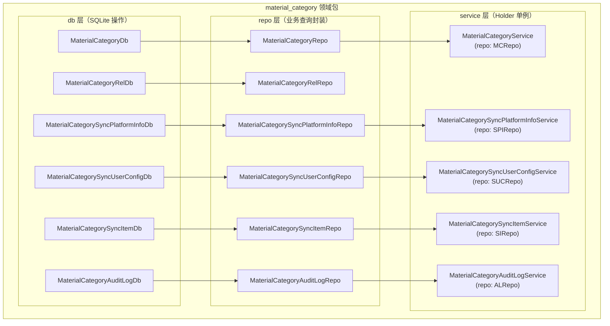
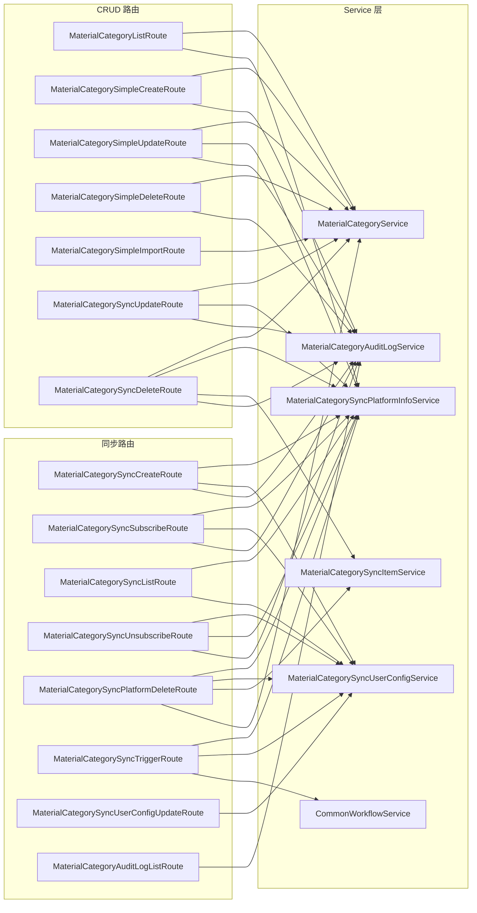
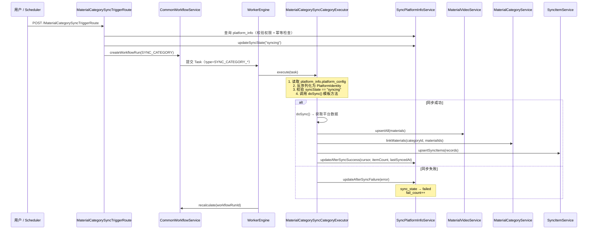

# 素材分类用户化重构（18.A）

> 本文档设计素材分类系统的用户化重构：将全局共享分类改为用户关联分类，引入公开/私有可见性，并新增"公开信息同步分类"支持 Bilibili 收藏夹、UP 主投稿列表等外部数据源的自动同步与跨用户共享。

---

## 1. 现状分析

### 1.1 当前数据模型

```
material_category_simple (全局共享，无用户隔离)
├── id          TEXT PK
├── name        TEXT UNIQUE    ← 全局唯一，多用户冲突
├── description TEXT
├── created_at  INTEGER
└── updated_at  INTEGER

material_category_rel (M:N 关联)
├── material_id TEXT
└── category_id TEXT
    └── PK(material_id, category_id)
```

### 1.2 当前问题

| 问题 | 说明 |
|------|------|
| 无用户隔离 | 所有用户共享同一套分类，A 创建的分类 B 也能看到和删除 |
| name 全局唯一 | 不同用户无法创建同名分类（如"学习"） |
| 无可见性控制 | 没有公开/私有概念 |
| 无外部数据源 | Bilibili 收藏夹等外部信息源没有对应的分类抽象 |
| 素材无归属 | `material` 表无 `owner_id`，素材本身也是全局共享 |

### 1.3 现有路由

| 路由 | 方法 | minRole | 说明 |
|------|------|---------|------|
| `MaterialCategoryListRoute` | POST | GUEST | 分页+条件查询分类 |
| `MaterialCategorySimpleCreateRoute` | POST | TENANT | 创建简易分类（name 去重） |
| `MaterialCategorySimpleDeleteRoute` | POST | TENANT | 删除简易分类及关联 |
| `MaterialCategorySimpleUpdateRoute` | POST | TENANT | 更新简易分类 |
| `MaterialCategorySyncUpdateRoute` | POST | TENANT | 更新同步分类（仅 name/description） |
| `MaterialCategorySyncDeleteRoute` | POST | TENANT | 删除同步分类（级联清理同步元数据） |
| `MaterialCategorySimpleImportRoute` | POST | TENANT | 导入素材并关联分类 / 替换素材的简易分类关联（合并原 `MaterialImportRoute` + `MaterialSetCategoriesRoute`） |

### 1.4 现有前端组件

| 组件 / 路由 | 职责 | 状态 |
|-------------|------|------|
| `MaterialCategoryPanel.tsx` | 素材库左侧分类筛选面板（pill 标签 + 新建输入框） | ✅ 完整 |
| `CategoryPickerModal.tsx` | 导入/编辑时的分类选择弹窗（checkbox 列表 + 新建） | ✅ 完整（无用户过滤） |
| `add-resource._index.tsx` | 添加资源入口（4 个来源选项，仅 Bilibili 可用） | ✅ 完整 |
| `add-resource.bilibili.tsx` | Bilibili 子页面布局（4 tab：收藏夹/合集/分P/UP主） | ✅ 完整（3 tab 标记 todo） |
| `add-resource.bilibili.favorite.tsx` | 收藏夹 fid 输入 + URL 解析 | ✅ 完整 |
| `add-resource.bilibili.favorite.fid.$fid.tsx` | 收藏夹视频列表浏览 + 导入 | ✅ 完整（无分类支持） |
| `add-resource.bilibili.multi-part.tsx` | 多 P 视频 BVID 输入 + 分 P 选择 + CategoryPicker | ✅ 完整 |
| `add-resource.bilibili.uploader.tsx` | UP 主 UID 输入表单 | ⚠️ 纯 UI 桩（handleSubmit = console.log） |
| `add-resource.bilibili.collection.tsx` | 合集/列表 ID 输入表单 | ⚠️ 纯 UI 桩（handleSubmit = console.log） |

---

## 2. 设计目标

1. **用户关联**：每个分类有明确的 `owner_id`，用户只能管理自己的分类
2. **公开/私有**：分类可标记为 `public`，其他用户可以看到公开分类及其素材（只读）
3. **同步分类**：支持绑定外部数据源（Bilibili 收藏夹、UP 主投稿列表等），自动/手动同步内容
4. **信源公开**：同步分类默认对所有用户可见，任何用户都能浏览同步到的素材
5. **向后兼容**：旧数据直接迁移，不保留旧接口

---

## 3. 数据模型设计

### 3.1 `material_category_simple` 表（重构，原 `material_category`）

简易分类表。用户手动创建的分类存储在此表中。同步分类通过 `material_category_sync_platform_info.category_id` 关联到此表，但同步分类的 `description` 来源于平台信息（`display_name`），也可允许应用端自定义。

```sql
CREATE TABLE material_category_simple (
    id                  TEXT PRIMARY KEY,
    owner_id            TEXT NOT NULL,              -- 创建者 user_id
    name                TEXT NOT NULL,              -- 同一用户下唯一（非全局唯一）
    description         TEXT NOT NULL DEFAULT '',   -- 仅简易分类有用户可编辑的描述
    allow_others_view   INTEGER NOT NULL DEFAULT 0, -- 允许他人查看分类内素材列表
    allow_others_add    INTEGER NOT NULL DEFAULT 0, -- 允许他人向分类添加素材
    allow_others_delete INTEGER NOT NULL DEFAULT 0, -- 允许他人从分类移除素材
    created_at          INTEGER NOT NULL,
    updated_at          INTEGER NOT NULL,
    UNIQUE(owner_id, name)                         -- 同一用户下名称唯一
);
```

**变更要点：**
- **表名变更**：从 `material_category` 重命名为 `material_category_simple`，明确区分简易分类与同步分类
- 新增 `owner_id`：关联 `auth_user.id`
- `UNIQUE` 约束从 `(name)` 改为 `(owner_id, name)`：不同用户可创建同名分类
- 新增三个细粒度权限列：`allow_others_view`、`allow_others_add`、`allow_others_delete`
  - `allow_others_view = 1` 等同旧设计的"公开分类"，他人可在列表中看到
  - 同步分类自动创建时默认 `allow_others_view=1`（其余两项为 0）
- **`description` 字段说明**：简易分类的 `description` 由用户自由编辑；同步分类自动创建时 `description` 默认为空，显示名来源于 `material_category_sync_platform_info.display_name`（也可允许应用端覆盖）

#### 3.1.1 "待分类"默认分类（每用户固定 ID）

每个用户拥有一个不可删除的"待分类"默认分类，用于收容删除分类时产生的孤儿素材。

**固定 ID 规则：** `uncategorized:{userId}`（如 `uncategorized:user-abc-123`）

> **安全约束：** `userId` 由认证系统生成（UUID 格式），不含冒号。若未来 userId 格式变更，需确保不含 `:` 字符，否则 `startsWith("uncategorized:")` 的判断逻辑会产生歧义。

**创建时机：** 在以下场景中自动确保默认分类存在（`ensureUncategorized`）：
- `MaterialCategorySimpleCreateRoute`：用户首次创建分类时
- `MaterialCategorySimpleDeleteRoute`：删除分类前（确保孤儿素材有归属）
- `MaterialCategorySyncCreateRoute`：首次创建同步源时（同步分类自动创建前）

```kotlin
object MaterialCategoryDefaults {
    fun uncategorizedId(userId: String) = "uncategorized:$userId"
    const val UNCATEGORIZED_NAME = "待分类"

    fun ensureUncategorized(userId: String) {
        val id = uncategorizedId(userId)
        // INSERT OR IGNORE — 已存在则跳过
        MaterialCategoryService.repo.insertOrIgnore(
            MaterialCategory(
                id = id,
                ownerId = userId,
                name = UNCATEGORIZED_NAME,
                description = "",
                allowOthersView = false,
                allowOthersAdd = false,
                allowOthersDelete = false,
                createdAt = epochSec(),
                updatedAt = epochSec(),
            )
        )
    }
}
```

**约束：**
- 不可删除：`MaterialCategorySimpleDeleteRoute` 拒绝删除 `id` 以 `uncategorized:` 开头的分类
- 不可重命名：`MaterialCategorySimpleUpdateRoute` 拒绝修改默认分类的 `name`
- 前端列表中排序靠后，可折叠显示

### 3.2 `material_category_rel` 表（扩展）

```sql
CREATE TABLE material_category_rel (
    material_id  TEXT NOT NULL,
    category_id  TEXT NOT NULL,
    added_by     TEXT NOT NULL DEFAULT 'user',  -- 关联来源：'user'（手动）| 'sync'（同步引擎）
    added_at     INTEGER NOT NULL,              -- 关联创建时间（epoch sec）
    PRIMARY KEY (material_id, category_id)
);
```

**变更要点：**
- 新增 `added_by`：区分素材是由用户手动关联（`'user'`）还是同步引擎自动关联（`'sync'`）。用于前端展示"来源"标签，以及 `MaterialCategorySimpleImportRoute` 编辑模式中保留同步关联的判断依据
- 新增 `added_at`：记录关联创建时间，便于审计和排序
- 联合主键 `(material_id, category_id)` 不变，保证 M:N 关系唯一性

**`added_by` 写入规则：**
- `MaterialCategorySimpleImportRoute`（手动导入/编辑）→ `added_by = 'user'`
- `MaterialCategorySyncCategoryExecutor`（同步引擎写入）→ `added_by = 'sync'`
- 编辑模式保留同步关联：`deleteByMaterialIdExcluding` 只删除 `added_by = 'user'` 的关联，保留 `added_by = 'sync'` 的关联（替代原来通过查询 `sync_platform_info` 判断的方式，更直接高效）

### 3.3 `material_category_sync_platform_info` 表（新增）

平台公开信息表。每条记录代表一个**全局唯一的平台数据源**（如某个 Bilibili 收藏夹、某个 UP 主），与用户无关。

```sql
CREATE TABLE material_category_sync_platform_info (
    id              TEXT PRIMARY KEY,              -- UUID
    sync_type       TEXT NOT NULL,                 -- 鉴别器（sealed interface 类型标识）
    platform_id     TEXT NOT NULL,                 -- 平台原生 ID（从 sync_type 特定字段派生）
    platform_config TEXT NOT NULL DEFAULT '{}',    -- JSON，平台侧不可变参数（见 §3.3.2）
    display_name    TEXT NOT NULL DEFAULT '',       -- 数据源显示名（如收藏夹名、UP 主昵称）
    category_id     TEXT NOT NULL,                 -- 关联的 material_category_simple.id
    last_synced_at  INTEGER,                       -- 上次同步完成时间（epoch sec）
    sync_cursor     TEXT NOT NULL DEFAULT '',       -- 增量同步游标（平台相关）
    item_count      INTEGER NOT NULL DEFAULT 0,    -- 已同步条目数
    sync_state      TEXT NOT NULL DEFAULT 'idle',  -- 同步状态机（见 §3.3.3）
    last_error      TEXT,                          -- 最近一次同步失败的错误信息（null = 无错误）
    fail_count      INTEGER NOT NULL DEFAULT 0,    -- 连续失败次数（成功后归零）
    created_at      INTEGER NOT NULL,
    updated_at      INTEGER NOT NULL,
    UNIQUE(sync_type, platform_id)                 -- 同一平台数据源全局唯一
);
```

#### 3.3.1 设计要点

- **平台信息与用户配置解耦**：此表只存储平台公开信息（"这是哪个收藏夹"），不含任何用户偏好设置。用户的同步策略存储在 `material_category_sync_user_config` 中（§3.4）
- **`UNIQUE(sync_type, platform_id)` 去重**：`platform_id` 由各子类型的平台原生标识符派生，而非 JSON 去重。例如：
  - `bilibili_favorite` → `platform_id = "{media_id}"`（如 `"12345678"`）
  - `bilibili_uploader` → `platform_id = "{mid}"`（如 `"456789"`）
  - `bilibili_season` → `platform_id = "{mid}:{season_id}"`（如 `"456789:1001"`）
  - `bilibili_series` → `platform_id = "{mid}:{series_id}"`（如 `"456789:2001"`）
  - `bilibili_video_pages` → `platform_id = "{bvid}"`（如 `"BV1xx411c7mD"`）
- **一个 platform_info 对应一个 category**：首次添加时自动创建 `material_category_simple`（`allow_others_view=1`），`category_id` 指向它
- **`sync_state`**：同步状态机，管理同步生命周期和失败恢复（见 §3.3.3）
- **`platform_config`**：JSON 存储平台侧不可变参数（如 `media_id`、`mid`、`season_id` 等），用于构造 API 请求。与旧设计的 `sync_config` 不同，此字段仅包含平台标识信息，不含用户偏好
- **`sync_cursor`**：增量同步游标，语义由 `sync_type` 决定。属于平台信息（所有订阅者共享同一游标）。各类型的游标策略：收藏夹用 `fav_time`、UP 主投稿用 `pubdate`、合集/列表/多 P 视频为全量同步不使用游标（保持空字符串）。详见 §6.4 对比表

#### 3.3.2 `MaterialCategorySyncPlatformIdentity` sealed interface（Kotlin 模型）

平台身份标识对象，负责：(1) 提供 `platformId` 用于去重；(2) 序列化为 `platform_config` JSON。

```kotlin
@Serializable
sealed interface MaterialCategorySyncPlatformIdentity {
    val syncType: String     // 用于 DB sync_type 列
    val platformId: String   // 用于 DB platform_id 列（UNIQUE 约束的一部分）

    // ── Bilibili 收藏夹 ──────────────────────────────────────────────
    @Serializable
    @SerialName("bilibili_favorite")
    data class BilibiliFavorite(
        @SerialName("media_id") val mediaId: Long,
    ) : MaterialCategorySyncPlatformIdentity {
        override val syncType get() = "bilibili_favorite"
        override val platformId get() = mediaId.toString()
    }

    // ── Bilibili UP 主投稿 ───────────────────────────────────────────
    @Serializable
    @SerialName("bilibili_uploader")
    data class BilibiliUploader(
        val mid: Long,
    ) : MaterialCategorySyncPlatformIdentity {
        override val syncType get() = "bilibili_uploader"
        override val platformId get() = mid.toString()
    }

    // ── Bilibili 合集（新版 season）─────────────────────────────────
    @Serializable
    @SerialName("bilibili_season")
    data class BilibiliSeason(
        @SerialName("season_id") val seasonId: Long,
        val mid: Long,
    ) : MaterialCategorySyncPlatformIdentity {
        override val syncType get() = "bilibili_season"
        override val platformId get() = "$mid:$seasonId"
    }

    // ── Bilibili 列表（旧版 series）─────────────────────────────────
    @Serializable
    @SerialName("bilibili_series")
    data class BilibiliSeries(
        @SerialName("series_id") val seriesId: Long,
        val mid: Long,
    ) : MaterialCategorySyncPlatformIdentity {
        override val syncType get() = "bilibili_series"
        override val platformId get() = "$mid:$seriesId"
    }

    // ── Bilibili 多 P 视频（分 P 作为独立素材）─────────────────────
    @Serializable
    @SerialName("bilibili_video_pages")
    data class BilibiliVideoPages(
        val bvid: String,
    ) : MaterialCategorySyncPlatformIdentity {
        override val syncType get() = "bilibili_video_pages"
        override val platformId get() = bvid
    }
}
```

**Bilibili API 对应关系：**

| sealed 子类 | Bilibili API | 参数 | `platformId` | 分页 | 增量游标 |
|-------------|-------------|------|-------------|------|---------|
| `BilibiliFavorite` | `favorite_list.get_video_favorite_list_content(media_id, pn)` | `media_id` | `"{media_id}"` | pn/ps | `fav_time` |
| `BilibiliUploader` | `User(mid).get_videos(pn, ps, order)` | `mid` | `"{mid}"` | pn/ps | `pubdate` |
| `BilibiliSeason` | `User(mid).get_channel_videos_season(sid, pn, ps)` | `season_id` + `mid` | `"{mid}:{season_id}"` | pn/ps | 无（全量，有限集合） |
| `BilibiliSeries` | `User(mid).get_channel_videos_series(sid, pn, ps)` | `series_id` + `mid` | `"{mid}:{series_id}"` | pn/ps | 无（全量，有限集合） |
| `BilibiliVideoPages` | `Video(bvid).get_pages()` | `bvid` | `"{bvid}"` | 无分页 | 无（全量，有限集合） |

**未来可扩展：**
- `BilibiliCollectedFavorites`：收藏的合集（`get_favorite_collected(uid)`），需要登录凭据
- `YoutubePlaylist`、`YoutubeChannel` 等其他平台

#### 3.3.3 同步状态机

`sync_state` 字段管理平台信息的同步生命周期：

```
                    ┌─────────────────────────────────┐
                    │                                 │
                    ▼                                 │
    ┌──────┐   trigger   ┌─────────┐   success   ┌───────┐
    │ idle │ ──────────→ │ syncing │ ──────────→ │ idle  │
    └──────┘             └─────────┘             └───────┘
        ▲                    │
        │                    │ failure
        │                    ▼
        │              ┌──────────┐
        │   cooldown   │  failed  │
        │   expired    │          │
        │              └──────────┘
        │                    │
        │                    │ retry (manual or auto)
        └────────────────────┘
```

| 状态 | 含义 | 转换条件 |
|------|------|---------|
| `idle` | 空闲，可接受同步请求 | 初始状态；同步成功后回到此状态 |
| `syncing` | 正在执行同步任务 | 收到同步触发（手动/cron/freshness 过期） |
| `failed` | 最近一次同步失败 | 同步任务执行出错 |

**失败处理策略：**
- 同步失败时：`sync_state='failed'`，`last_error` 记录错误信息，`fail_count++`
- 退避重试：下次自动同步间隔 = `30min * min(2^fail_count, 32)`（指数退避，上限 32 倍 = 16 小时，见 §6.7.5 退避时间表）
- 手动重试：用户可随时手动触发，不受退避限制，但 `fail_count` 不归零（成功后才归零）
- 同步成功时：`sync_state='idle'`，`fail_count=0`，`last_error=null`

### 3.4 `material_category_sync_user_config` 表（新增）

用户同步配置表。每条记录代表一个用户对某个平台数据源的**个人订阅设置**。一个 `platform_info` 可以有多个 `user_config`（多用户订阅同一数据源）。

```sql
CREATE TABLE material_category_sync_user_config (
    id                   TEXT PRIMARY KEY,              -- UUID
    platform_info_id     TEXT NOT NULL,                 -- FK → material_category_sync_platform_info.id
    user_id              TEXT NOT NULL,                 -- 订阅者 user_id
    enabled              INTEGER NOT NULL DEFAULT 1,    -- 是否启用此用户的自动同步
    cron_expr            TEXT NOT NULL DEFAULT '0 */6 * * *', -- cron 表达式（默认每 6 小时）
    freshness_window_sec INTEGER NOT NULL DEFAULT 3600, -- "视为最新"窗口（秒）。0 = 不使用
    created_at           INTEGER NOT NULL,
    updated_at           INTEGER NOT NULL,
    UNIQUE(platform_info_id, user_id)                  -- 同一用户对同一数据源只能有一条配置
);
```

#### 3.4.1 设计要点

- **一对多关系**：一个 `platform_info` 可被多个用户订阅，每人有独立的同步策略
- **`cron_expr`**：标准 5 字段 cron 表达式，控制自动同步频率。空字符串表示不自动同步（仅手动触发）。路由层通过 `CronExpressionValidator.isValid(expr)` 校验格式合法性（见下方工具类设计）
- **`freshness_window_sec`**：核心多用户协作字段。含义："如果此数据源在 N 秒内已被任何人同步过，则视为最新，跳过本次同步"
  - 例：用户 A 设置 `freshness_window_sec=3600`（1 小时），用户 B 在 30 分钟前触发了同步 → 用户 A 的 cron 触发时检查 `platform_info.last_synced_at`，发现在窗口内，跳过同步
  - 默认值 `3600`（1 小时），避免多用户重复同步。设为 `0` 表示不使用此功能，每次 cron 触发都执行同步
- **`enabled`**：用户级开关。与 `platform_info` 的 `sync_state` 独立——即使平台信息处于 `failed` 状态，用户仍可保持 `enabled=1`（等待自动恢复）
- **首次添加同步源时**：同时创建 `platform_info`（如不存在）和 `user_config`。如果 `platform_info` 已存在（他人先添加），则只创建 `user_config`

#### 3.4.2 `MaterialCategorySyncUserConfig` 数据类（Kotlin 模型）

```kotlin
data class MaterialCategorySyncUserConfig(
    val id: String,                   // 用户订阅配置 ID（UUID）
    val platformInfoId: String,       // 关联的 platform_info.id（外键）
    val userId: String,               // 订阅用户 ID（外键 → auth_user.id）
    val enabled: Boolean,             // 用户级开关，false 时 cron 不触发同步
    val cronExpr: String,             // cron 表达式，控制自动同步频率（如 "0 */6 * * *"）
    val freshnessWindowSec: Int,      // 新鲜度窗口（秒），窗口内跳过同步；0 = 每次都同步
    val createdAt: Long,              // 创建时间（Unix 秒）
    val updatedAt: Long,              // 最后更新时间（Unix 秒）
)
```

#### 3.4.3 Freshness 判定逻辑

```kotlin
fun shouldSkipSync(platformInfo: MaterialCategorySyncPlatformInfo, userConfig: MaterialCategorySyncUserConfig): Boolean {
    if (userConfig.freshnessWindowSec <= 0) return false
    val lastSynced = platformInfo.lastSyncedAt ?: return false
    val now = System.currentTimeMillis() / 1000
    return (now - lastSynced) < userConfig.freshnessWindowSec
}
```

#### 3.4.4 `CronExpressionValidator` 工具类

校验 cron 表达式格式合法性，供 `MaterialCategorySyncUserConfigUpdateRoute` 等路由使用。

```kotlin
// 位于 material_category/ 包内
object CronExpressionValidator {
    private val FIELD_RANGES = listOf(0..59, 0..23, 1..31, 1..12, 0..7) // min, hour, dom, mon, dow

    /**
     * 校验标准 5 字段 cron 表达式。
     * 支持：数字、逗号列表、范围（-）、步进（/）、通配符（*）。
     * 不支持：特殊字符（L, W, #）、秒字段、年字段。
     */
    fun isValid(expr: String): Boolean {
        val fields = expr.trim().split("\\s+".toRegex())
        if (fields.size != 5) return false
        return fields.zip(FIELD_RANGES).all { (field, range) -> isFieldValid(field, range) }
    }

    private fun isFieldValid(field: String, range: IntRange): Boolean {
        if (field == "*") return true
        return field.split(",").all { part ->
            val stepParts = part.split("/", limit = 2)
            val base = stepParts[0]
            val step = stepParts.getOrNull(1)?.toIntOrNull()
            if (step != null && step <= 0) return@all false
            when {
                base == "*" -> true
                base.contains("-") -> {
                    val (lo, hi) = base.split("-", limit = 2).map { it.toIntOrNull() }
                    lo != null && hi != null && lo in range && hi in range && lo <= hi
                }
                else -> base.toIntOrNull()?.let { it in range } == true
            }
        }
    }
}
```

### 3.5 `material_category_sync_item` 表（新增）

```sql
CREATE TABLE material_category_sync_item (
    platform_info_id TEXT NOT NULL,             -- FK → material_category_sync_platform_info.id
    material_id      TEXT NOT NULL,             -- 对应 material.id（确定性 ID）
    platform_id      TEXT NOT NULL DEFAULT '',  -- 平台侧原始 ID（如 bvid），便于去重
    synced_at        INTEGER NOT NULL,          -- 本条同步时间
    PRIMARY KEY (platform_info_id, material_id)
);
```

**用途：**
- 记录每个平台数据源拉取了哪些素材，用于增量同步去重和统计
- FK 指向 `platform_info`（而非 `user_config`），因为同步结果是平台级共享的
- 与 `material_category_rel` 独立：`sync_item` 记录"这条素材是从这个数据源来的"，`material_category_rel` 记录"这条素材属于这个分类"。同步时两张表同时写入

### 3.6 `material_category_audit_log` 表（新增）

分类操作审计日志表。记录所有对分类权限、信息的修改操作。

```sql
CREATE TABLE material_category_audit_log (
    id          TEXT PRIMARY KEY,              -- UUID
    category_id TEXT NOT NULL,                 -- 被操作的分类 ID
    user_id     TEXT NOT NULL,                 -- 操作者 user_id
    action      TEXT NOT NULL,                 -- 操作类型（见下方枚举）
    detail      TEXT NOT NULL DEFAULT '{}',    -- JSON，操作详情（变更前后值）
    created_at  INTEGER NOT NULL
);
CREATE INDEX idx_audit_log_category ON material_category_audit_log(category_id);
CREATE INDEX idx_audit_log_user ON material_category_audit_log(user_id);
```

**`action` 枚举值：**

| action | 含义 | detail 示例 |
|--------|------|------------|
| `create` | 创建分类 | `{"name":"..."}` |
| `update_name` | 修改分类名称 | `{"old":"旧名", "new":"新名"}` |
| `update_description` | 修改分类描述 | `{"old":"...", "new":"..."}` |
| `update_permission` | 修改细粒度权限 | `{"field":"allow_others_add", "old":0, "new":1}` |
| `update_permission_bulk` | 批量修改多个权限字段 | `{"fields":[{"field":"allow_others_view","old":0,"new":1},{"field":"allow_others_add","old":0,"new":1}]}` |
| `delete` | 删除分类 | `{"name":"被删除的分类名"}` |
| `add_material` | 向分类添加素材 | `{"material_id":"..."}` |
| `remove_material` | 从分类移除素材 | `{"material_id":"..."}` |
| `sync_subscribe` | 用户订阅同步源 | `{"platform_info_id":"...", "sync_type":"bilibili_favorite"}` |
| `sync_unsubscribe` | 用户取消订阅同步源 | `{"platform_info_id":"..."}` |

### 3.7 实体关系图

```
auth_user
    │
    ├──< material_category_simple (owner_id)
    │       │
    │       ├──< material_category_rel >── material
    │       │
    │       └──< material_category_audit_log (category_id)
    │
    ├──< material_category_sync_user_config (user_id)
    │       │
    │       └──> material_category_sync_platform_info (platform_info_id)
    │               │
    │               ├──> material_category_simple (category_id)
    │               │
    │               └──< material_category_sync_item >── material
    │
    └──< material (owner_id, 未来扩展)
```

**关键关系说明：**
- `platform_info` → `category`：一对一，每个平台数据源对应一个自动创建的分类
- `user_config` → `platform_info`：多对一，多个用户可订阅同一平台数据源
- `user_config` → `auth_user`：多对一，一个用户可订阅多个数据源
- `sync_item` → `platform_info`：多对一，同步结果属于平台数据源（所有订阅者共享）
- `audit_log` → `category`：多对一，一个分类可有多条操作日志
- `material_category_rel.added_by`：区分手动关联（`'user'`）与同步引擎关联（`'sync'`），编辑模式只替换 `'user'` 关联

---

## 4. 权限模型

### 4.1 分类细粒度权限

分类权限由三个 `allow_others_*` 列决定。所有权限变更和分类信息修改均写入 `material_category_audit_log`（§3.6）。

#### 4.1.1 权限矩阵

| 操作 | Owner | 他人（public + allow） | 他人（public, !allow） | 他人（private） | ROOT | GUEST |
|------|-------|----------------------|----------------------|----------------|------|-------|
| 查看分类存在 | ✅ | ✅ | ✅ | ❌ | ✅ | ✅（仅 public） |
| 查看分类内素材列表 | ✅ | ✅（需 `allow_others_view`） | ❌ | ❌ | ✅ | ✅（需 `allow_others_view`） |
| 向分类添加素材 | ✅ | ✅（需 `allow_others_add`） | ❌ | ❌ | ✅ | ❌ |
| 从分类移除素材 | ✅ | ✅（需 `allow_others_delete`） | ❌ | ❌ | ✅ | ❌ |
| 编辑分类信息（名称/描述） | ✅ | ❌ | ❌ | ❌ | ✅ | ❌ |
| 修改可见性/权限设置 | ✅ | ❌ | ❌ | ❌ | ✅ | ❌ |
| 删除分类 | ✅ | ❌ | ❌ | ❌ | ✅ | ❌ |
| 创建分类 | ✅（TENANT+） | — | — | — | ✅ | ❌ |

#### 4.1.2 权限判定逻辑

```kotlin
fun canViewMaterials(category: MaterialCategory, userId: String?, role: AuthRole): Boolean {
    if (role == AuthRole.ROOT) return true
    if (category.ownerId == userId) return true
    return category.allowOthersView
}

fun canAddMaterial(category: MaterialCategory, userId: String?, role: AuthRole): Boolean {
    if (role == AuthRole.ROOT) return true
    if (category.ownerId == userId) return true
    if (!category.allowOthersView) return false
    return category.allowOthersAdd
}

fun canDeleteMaterial(category: MaterialCategory, userId: String?, role: AuthRole): Boolean {
    if (role == AuthRole.ROOT) return true
    if (category.ownerId == userId) return true
    if (!category.allowOthersView) return false
    return category.allowOthersDelete
}
```

#### 4.1.3 审计日志写入时机

所有以下操作在执行成功后写入 `material_category_audit_log`：
- 创建分类（`create`）
- 修改分类名称（`update_name`）、描述（`update_description`）
- 修改权限设置（`update_permission`）（单字段修改）
- 批量修改多个权限字段（`update_permission_bulk`）（多字段一次性修改）
- 删除分类（`delete`）
- 添加/移除素材（`add_material` / `remove_material`）
- 订阅/取消订阅同步源（`sync_subscribe` / `sync_unsubscribe`）

审计日志为追加写入，不可修改或删除（ROOT 也不行）。

### 4.2 同步数据源权限与多用户策略

由于平台信息（`platform_info`）与用户配置（`user_config`）已解耦（§3.3 / §3.4），同步权限模型围绕"共享数据源 + 个人订阅"设计。

#### 4.2.1 同步操作权限

| 操作 | 条件 |
|------|------|
| 添加同步源（创建 platform_info + user_config） | TENANT+。如 platform_info 已存在，仅创建 user_config |
| 订阅已有同步源（仅创建 user_config） | TENANT+。可查看其他租户的订阅策略 |
| 修改自己的同步策略（cron、freshness_window） | `user_config.user_id` = 当前用户 |
| 启用/禁用自己的订阅 | `user_config.user_id` = 当前用户 |
| 取消自己的订阅（删除 user_config） | `user_config.user_id` = 当前用户 |
| 触发手动同步 | 该数据源的任何订阅者（TENANT+），或 ROOT |
| 查看同步源信息和所有订阅者策略 | 所有已认证用户（TENANT+） |
| 删除 platform_info（级联删除所有 user_config） | 关联分类的 owner 或 ROOT |

#### 4.2.2 多用户同步策略

**核心原则：** 平台数据源的同步结果是共享的（所有订阅者看到相同的素材列表），但同步触发策略是个人的。

**Cron 调度合并逻辑：**
- `MaterialCategorySyncScheduler` 遍历所有 `enabled=1` 的 `user_config`，按 `platform_info_id` 分组
- 对每个 `platform_info`，取所有订阅者中最早到期的 cron 触发时间作为下次同步时间
- 触发同步前，检查 freshness：如果 `platform_info.last_synced_at` 在任一订阅者的 `freshness_window_sec` 内，该订阅者的本次触发被跳过
- **合并规则**：只要有至少一个订阅者的 cron 匹配且未被 freshness 跳过，就触发同步。即"任一订阅者需要同步"即触发，而非"所有订阅者都需要"才触发

**跨租户可见性：**
- 所有 TENANT+ 用户可查看任意 `platform_info` 的完整信息（包括 `sync_state`、`last_synced_at`、`fail_count`）
- 所有 TENANT+ 用户可查看同一 `platform_info` 下所有 `user_config` 的策略设置（cron、freshness_window、enabled）
- 用户只能修改自己的 `user_config`

**同步失败对订阅者的影响：**
- `platform_info.sync_state = 'failed'` 时，所有订阅者的 UI 显示失败状态
- 该数据源的任何订阅者可手动触发重试（不受退避限制）
- 自动重试遵循指数退避（§3.3.3），由 `MaterialCategorySyncScheduler` 统一管理

### 4.3 GUEST 权限

Guest 用户（未登录/访客 token）：
- 可以浏览公开分类列表（只读）
- 可以查看公开分类中的素材（需 `allow_others_view=1`）
- 不能创建、编辑、删除任何分类
- 不能添加/移除素材
- 不能添加同步源或管理订阅

---

## 5. 路由设计

### 5.1 分类 CRUD 路由（重构）

#### `MaterialCategoryListRoute`（重构）

```
POST /api/v1/MaterialCategoryListRoute
minRole: GUEST
```

**请求模型（`MaterialCategoryListRequest`）：**

`MaterialCategoryFilter` 枚举作为独立顶层类，位于 `material_category/model/MaterialCategoryFilter.kt`（见 §11.2）。

```kotlin
// material_category/model/MaterialCategoryFilter.kt
@Serializable
enum class MaterialCategoryFilter {
    @SerialName("all")    ALL,      // 自己的全部分类 + 他人的 public 分类
    @SerialName("mine")   MINE,     // 仅自己的简易分类（不含同步分类）
    @SerialName("sync")   SYNC,     // 仅同步分类（自己创建的 + 他人 public 的）
    @SerialName("public") PUBLIC,   // 仅 public 分类（含同步分类）
}

// material_category/model/MaterialCategoryListRequest.kt
@Serializable
data class MaterialCategoryListRequest(
    val filter: MaterialCategoryFilter = MaterialCategoryFilter.ALL,  // 筛选模式（ALL/MINE/SYNC/PUBLIC）
    val search: String? = null,   // 模糊搜索关键词（匹配 name/description），null 不过滤
    val offset: Int = 0,          // 分页偏移量
    val limit: Int = 50,          // 每页条数，上限 100
)
```

**响应模型（`MaterialCategoryListResponse`）：**

```kotlin
@Serializable
data class MaterialCategoryListResponse(
    val items: List<MaterialCategory>,  // §9.1 模型
    val total: Int,                     // 符合条件的总数（用于前端分页 UI）
    val offset: Int,
    val limit: Int,
)
```

**请求示例：**

```json
{ "filter": "all", "search": "bilibili", "offset": 0, "limit": 20 }
```

**响应示例（基于 §9.1 `MaterialCategory` 模型）：**

```json
{
    "items": [
        {
            "id": "cat-abc",
            "owner_id": "user-1",
            "name": "Bilibili 收藏夹",
            "description": "自动同步的收藏夹",
            "allow_others_view": true,
            "allow_others_add": false,
            "allow_others_delete": false,
            "material_count": 42,
            "is_mine": true,
            "sync": {
                "id": "pi-xyz",
                "sync_type": "bilibili_favorite",
                "platform_config": { "type": "bilibili_favorite", "media_id": 12345 },
                "display_name": "我的收藏夹",
                "last_synced_at": 1700000000,
                "item_count": 42,
                "sync_state": "idle",
                "last_error": null,
                "fail_count": 0,
                "subscriber_count": 2,
                "owner_id": "user-1",
                "my_subscription": {
                    "id": "uc-001",
                    "enabled": true,
                    "cron_expr": "0 */6 * * *",
                    "freshness_window_sec": 3600
                }
            },
            "created_at": 1700000000,
            "updated_at": 1700000000
        },
        {
            "id": "cat-def",
            "owner_id": "user-1",
            "name": "学习资料",
            "description": "",
            "allow_others_view": false,
            "allow_others_add": false,
            "allow_others_delete": false,
            "material_count": 5,
            "is_mine": true,
            "sync": null,
            "created_at": 1700000000,
            "updated_at": 1700000000
        }
    ],
    "total": 15,
    "offset": 0,
    "limit": 20
}
```

**字段说明：**

- `is_mine`：布尔值，前端据此决定是否显示编辑/删除按钮
- `sync`：如果该分类关联了同步源，附带 `MaterialCategorySyncPlatformInfoSummary`（§9.3）；简易分类此字段为 `null`
- `search`：按分类名称模糊匹配（`LIKE '%keyword%'`），可选
- **GUEST 身份**：`filter` 参数被忽略，始终只返回 `allow_others_view = 1` 的分类（含同步分类，因同步分类强制 `allow_others_view=1`），`is_mine` 始终为 `false`

**分类类型区分策略：**

所有分类类型（同步分类、简易分类）统一在一个分页接口返回，通过以下方式区分：
1. **`sync` 字段是否为 `null`**：`null` 表示简易分类，非 `null` 表示同步分类
2. **`is_mine` 字段**：区分自己的分类和他人的分类
3. **`filter` 参数**：前端可按需筛选特定类型

前端 `groupCategories()` 函数可据此三维度分组：
- 我的同步分类：`is_mine && sync != null`
- 我的简易分类：`is_mine && sync == null`
- 他人的分类：`!is_mine`

**`material_count` 计算**：LEFT JOIN `material_category_rel` 后 COUNT(DISTINCT material_id)，与当前实现一致。

**实现要点（`MaterialCategoryDb.listForUser` 重构）：**

当前实现是无参 `listAll()` 返回全部分类。重构后签名变为：

```kotlin
fun listForUser(
    userId: String?,
    filter: MaterialCategoryFilter = MaterialCategoryFilter.ALL,
    search: String? = null,
    offset: Int = 0,
    limit: Int = 50,
): Pair<List<MaterialCategory>, Int>  // (分页结果, 总数)
```

SQL 查询逻辑（WHERE 子句按 filter 动态拼接）：

1. `filter = ALL`：`WHERE owner_id = :userId OR allow_others_view = 1`（同步分类因强制 `allow_others_view=1` 而自动包含在内）
2. `filter = MINE`：`WHERE owner_id = :userId AND id NOT IN (SELECT category_id FROM material_category_sync_platform_info)`
3. `filter = SYNC`：`WHERE id IN (SELECT category_id FROM material_category_sync_platform_info)`
   > **注：** 同步分类按设计对所有用户可见（§2 设计目标"信源公开"），不受 `allow_others_view` 限制。此处不加 ACL 过滤。
4. `filter = PUBLIC`：`WHERE allow_others_view = 1`
5. `userId = null`（Guest）：无论 filter 值，强制覆盖为 `WHERE allow_others_view = 1`（`:userId` 绑定为 `null`，`owner_id = null` 永远不匹配，SQL 安全）。同步分类因强制 `allow_others_view=1` 而自动包含在结果中，但 Guest 无法通过 `filter = SYNC` 单独筛选同步分类。

搜索条件追加：`AND name LIKE '%' || :search || '%'`（search 非 null 时）。

分页：`ORDER BY created_at DESC LIMIT :limit OFFSET :offset`。

总数查询：同条件 `SELECT COUNT(*) ...`（不含 LIMIT/OFFSET）。

`is_mine` 字段在 SQL 中计算：`CASE WHEN owner_id = :userId THEN 1 ELSE 0 END AS is_mine`。

`sync` 字段通过 LEFT JOIN `material_category_sync_platform_info` + `material_category_simple` 获取（后者提供 `category_owner_id`），非 null 时构造 `MaterialCategorySyncPlatformInfoSummary`（§9.3，需传入 `categoryOwnerId`）。

#### `MaterialCategorySimpleCreateRoute`（重构，原 `MaterialCategoryCreateRoute`）

```
POST /api/v1/MaterialCategorySimpleCreateRoute
minRole: TENANT
```

**请求模型（`MaterialCategorySimpleCreateRequest`）：**

```kotlin
@Serializable
data class MaterialCategorySimpleCreateRequest(
    val name: String,              // 分类名称（必填，1-64 字符）
    val description: String = "",  // 分类描述（可选）
)
```

**响应**：`MaterialCategory`（§9.1 模型，`sync` 字段为 `null`）

**请求示例：**

```json
{ "name": "学习资料", "description": "前端学习" }
```

**响应示例：**

```json
{
    "id": "cat-new",
    "owner_id": "user-1",
    "name": "学习资料",
    "description": "前端学习",
    "allow_others_view": false,
    "allow_others_add": false,
    "allow_others_delete": false,
    "material_count": 0,
    "is_mine": true,
    "sync": null,
    "created_at": 1700000000,
    "updated_at": 1700000000
}
```

**错误：**
- `"分类名称不能为空"`
- `"分类名称过长"`（>64 字符）
- `"同名分类已存在"`（同一用户下）

**实现要点：**
- `owner_id` 自动从 `context.userId!!` 获取，前端不传
- `allow_others_view` 默认 `false`（私有分类）
- **当前 `createOrGet` 语义变更**：旧实现用 `INSERT OR IGNORE` + 按 name 查回，全局唯一。重构后改为 `INSERT OR IGNORE` + 按 `(owner_id, name)` 查回，同一用户下唯一。如果 name 已存在，返回已有分类（幂等）

#### `MaterialCategorySimpleUpdateRoute`（新增）

```
POST /api/v1/MaterialCategorySimpleUpdateRoute
minRole: TENANT
```

**请求模型（`MaterialCategorySimpleUpdateRequest`）：**

```kotlin
@Serializable
data class MaterialCategorySimpleUpdateRequest(
    val id: String,                              // 分类 ID（必填）
    val name: String? = null,                    // 新名称，null 不修改
    val description: String? = null,             // 新描述，null 不修改
    val allowOthersView: Boolean? = null,        // 是否允许他人查看，null 不修改
    val allowOthersAdd: Boolean? = null,         // 是否允许他人添加素材，null 不修改
    val allowOthersDelete: Boolean? = null,      // 是否允许他人删除素材，null 不修改
)
```

**响应模型：**

```kotlin
@Serializable
data class MaterialCategoryUpdateResponse(
    val success: Boolean = true,       // 操作是否成功
    val category: MaterialCategory,    // 更新后的完整分类对象（§9.1）
)
```

**请求示例：**

```json
{ "id": "cat-abc", "name": "新名称", "allow_others_view": true }
```

**响应示例：**

```json
{
    "success": true,
    "category": {
        "id": "cat-abc",
        "owner_id": "user-1",
        "name": "新名称",
        "description": "",
        "allow_others_view": true,
        "allow_others_add": false,
        "allow_others_delete": false,
        "material_count": 5,
        "is_mine": true,
        "sync": null,
        "created_at": 1700000000,
        "updated_at": 1700000001
    }
}
```

**错误：**
- `"分类不存在"`
- `"权限不足"`（非 owner 且非 ROOT）
- `"默认分类不可重命名"`（`id` 以 `uncategorized:` 开头且请求含 `name` 字段）
- `"默认分类权限设置不可修改"`（`id` 以 `uncategorized:` 开头且请求含 ACL 字段）
- `"同名分类已存在"`（同一用户下改名冲突）
- `"该分类是同步分类，请使用 MaterialCategorySyncUpdateRoute"`（目标分类关联了 `material_category_sync_platform_info`）
- `"分类名称不能为空"`
- `"分类名称过长"`（>64 字符）

**实现要点：**
- 只更新请求中提供的字段（partial update），未提供的字段保持不变
- 权限检查：`category.ownerId == context.userId || context.identity is RootUser`
- **同步分类拦截**：`SELECT COUNT(*) FROM material_category_sync_platform_info WHERE category_id = :id`，如果 > 0，直接拒绝并提示使用 `MaterialCategorySyncUpdateRoute`
- 改名时检查 `UNIQUE(owner_id, name)` 约束：先查询是否存在同名分类（排除自身 id）

#### `MaterialCategorySyncUpdateRoute`（新增）

```
POST /api/v1/MaterialCategorySyncUpdateRoute
minRole: TENANT
```

**请求模型（`MaterialCategorySyncUpdateRequest`）：**

```kotlin
@Serializable
data class MaterialCategorySyncUpdateRequest(
    val id: String,                    // 分类 ID（非 platform_info ID）
    val name: String? = null,          // 新名称，null 不修改
    val description: String? = null,   // 新描述，null 不修改
    // allow_others_* 不可修改：同步分类强制 allow_others_view=true
)
```

**响应模型**：同 `MaterialCategoryUpdateResponse`

**请求示例：**

```json
{ "id": "cat-sync-1", "name": "B站收藏夹（重命名）" }
```

**响应示例：**

```json
{
    "success": true,
    "category": {
        "id": "cat-sync-1",
        "owner_id": "user-1",
        "name": "B站收藏夹（重命名）",
        "description": "",
        "allow_others_view": true,
        "allow_others_add": false,
        "allow_others_delete": false,
        "material_count": 42,
        "is_mine": true,
        "sync": { "..." },
        "created_at": 1700000000,
        "updated_at": 1700000001
    }
}
```

**错误：**
- `"分类不存在"`
- `"权限不足"`（非 owner 且非 ROOT）
- `"该分类不是同步分类"`（目标分类未关联 `material_category_sync_platform_info`）
- `"同名分类已存在"`（同一用户下改名冲突）
- `"分类名称不能为空"`
- `"分类名称过长"`（>64 字符）

**实现要点：**
- **同步分类校验**：`SELECT COUNT(*) FROM material_category_sync_platform_info WHERE category_id = :id`，如果 = 0，拒绝并提示使用 `MaterialCategorySimpleUpdateRoute`
- **权限不可修改**：同步分类强制 `allow_others_view=true`，请求中不接受权限字段
- 权限检查：`category.ownerId == context.userId || context.identity is RootUser`
- 只更新 `name` 和 `description`（partial update）

#### `MaterialCategorySimpleDeleteRoute`（重构，原 `MaterialCategoryDeleteRoute`）

```
POST /api/v1/MaterialCategorySimpleDeleteRoute
minRole: TENANT

请求：{ "id": "..." }
响应：{ "success": true }

错误：
  - "分类不存在"
  - "权限不足"（非 owner 且非 ROOT）
  - "默认分类不可删除"（id 以 uncategorized: 开头）
  - "该分类是同步分类，请使用 MaterialCategorySyncDeleteRoute"
```

**实现要点：**

当前 `deleteById(id)` 无权限检查，直接删除。重构后：

```kotlin
fun simpleDeleteById(id: String, userId: String, isRoot: Boolean) {
    // 0. 默认分类不可删除
    if (id.startsWith("uncategorized:"))
        throw IllegalArgumentException("默认分类不可删除")
    // 1. 查询分类是否存在
    // 2. 权限检查：owner_id == userId || isRoot
    // 3. 同步分类拦截：SELECT COUNT(*) FROM material_category_sync_platform_info WHERE category_id = :id
    //    如果 > 0，拒绝并提示使用 MaterialCategorySyncDeleteRoute
    // 4. 事务内执行：
    db.useTransaction {
        // 4a. 找出孤儿素材（仅属于当前分类，删除后无其他分类关联）
        //     SELECT material_id FROM material_category_rel WHERE category_id = :id
        //     AND material_id NOT IN (
        //         SELECT material_id FROM material_category_rel WHERE category_id != :id
        //     )
        // 4b. 将孤儿素材移入该用户的"待分类"默认分类
        //     INSERT OR IGNORE INTO material_category_rel (material_id, category_id)
        //     VALUES (:orphanMaterialId, :uncategorizedId)
        MaterialCategoryDefaults.ensureUncategorized(category.ownerId)
        val uncatId = MaterialCategoryDefaults.uncategorizedId(category.ownerId)
        // ... 批量 INSERT OR IGNORE 孤儿素材到 uncatId
        // 4c. 删除 material_category_rel WHERE category_id = :id
        // 4d. 删除 material_category_simple WHERE id = :id
    }
    // 注意：不删除 material 本身
}
```

#### `MaterialCategorySyncDeleteRoute`（新增）

```
POST /api/v1/MaterialCategorySyncDeleteRoute
minRole: TENANT

请求：{ "id": "..." }
响应：{ "success": true }

错误：
  - "分类不存在"
  - "权限不足"（非 owner 且非 ROOT）
  - "该分类不是同步分类"
```

**实现要点：**

同步分类删除需要级联清理同步相关数据：

```kotlin
fun syncDeleteById(id: String, userId: String, isRoot: Boolean) {
    // 1. 查询分类是否存在
    // 2. 权限检查：owner_id == userId || isRoot
    // 3. 同步分类校验：SELECT COUNT(*) FROM material_category_sync_platform_info WHERE category_id = :id
    //    如果 = 0，拒绝并提示使用 MaterialCategorySimpleDeleteRoute
    // 4. 事务内执行：
    db.useTransaction {
        // 4a. 删除 material_category_sync_item WHERE platform_info_id IN (SELECT id FROM ... WHERE category_id = :id)
        // 4b. 删除 material_category_sync_user_config WHERE platform_info_id IN (SELECT id FROM ... WHERE category_id = :id)
        // 4c. 删除 material_category_sync_platform_info WHERE category_id = :id
        // 4d. 找出孤儿素材（仅属于当前分类，删除后无其他分类关联）
        // 4e. 将孤儿素材移入该用户的"待分类"默认分类
        MaterialCategoryDefaults.ensureUncategorized(category.ownerId)
        val uncatId = MaterialCategoryDefaults.uncategorizedId(category.ownerId)
        // ... 批量 INSERT OR IGNORE 孤儿素材到 uncatId
        // 4f. 删除 material_category_rel WHERE category_id = :id
        // 4g. 删除 material_category_simple WHERE id = :id
    }
    // 注意：不删除 material 本身，仅解除关联并收容孤儿
}
```

**与 `MaterialCategorySimpleDeleteRoute` 的区别：**
- Simple 版本拒绝删除同步分类（引导用户使用 Sync 版本）
- Sync 版本级联删除 `sync_platform_info`、`sync_user_config`、`sync_item` 等同步元数据
- 两者都删除 `material_category_rel` 关联和 `material_category_simple` 记录本身

> **实现说明（Issue 6）：** 孤儿素材对账逻辑已提取为 `MaterialCategoryDb.reconcileOrphanMaterials(categoryId, ownerId)` 可复用函数，两个删除路由（`MaterialCategorySimpleDeleteRouteExt`、`MaterialCategorySyncDeleteRouteExt`）均调用此函数而非内联实现。`reconcileOrphanMaterials` 在无孤儿素材时不创建"待分类"默认分类（避免不必要的副作用）。另新增 `reconcileAllOrphanMaterials()` 函数，在应用启动时（`FredicaApi.onAppReady()`）异步执行，修复因异常中断导致的遗留孤儿素材。该函数查询 `material` 表中无任何分类关联的素材，然后为 `material_category_simple` 中的每个 `owner_id` 创建"待分类"并关联所有孤儿素材（注意：`material` 表无 `owner_id` 列，因此无法按素材归属分配，当前实现将孤儿素材关联到所有已知用户的"待分类"下）。

#### `MaterialCategorySimpleImportRoute`（合并原 `MaterialImportRoute` + `MaterialSetCategoriesRoute`）

```
POST /api/v1/MaterialCategorySimpleImportRoute
minRole: TENANT

请求（导入模式）：{
  "source_type": "bilibili",
  "videos": [{ bvid, title, cover, page, duration, upper, fav_time }],
  "category_ids": ["..."],
  "source_fid": "12345"          // 可选，记录来源收藏夹
}
请求（编辑模式）：{
  "material_id": "...",
  "category_ids": ["..."]
}
响应：{ success: true }

模式判断：请求中含 material_id → 编辑模式；含 videos → 导入模式
权限检查：category_ids 中的每个分类必须满足以下之一：
  - 当前用户拥有的简易分类（owner_id == currentUserId）
  - 他人分类且 allow_others_add = 1
错误：
  - "分类不存在或无权操作"（category_ids 中包含不属于当前用户且 allow_others_add=0 的分类）
  - "不能手动添加到同步分类"（category_ids 中包含有 platform_info 关联的分类）
  - "至少选择一个分类"（导入模式下 category_ids 为空）
```

**导入模式行为：**

```
用户勾选视频 → 点击"导入"
  → CategoryPickerModal 弹出
  → 用户选择分类 → 点击"确认"
  → POST MaterialCategorySimpleImportRoute {
      source_type, videos, category_ids, source_fid?
    }
  → 后端：
    1. 校验 category_ids 权限（owner_id == currentUserId 或 allow_others_add = 1）
    2. 对每个 video 生成确定性 ID：bilibili_bvid__{bvid}__P{page}
    3. INSERT OR IGNORE material（幂等）
    4. INSERT OR IGNORE material_category_rel（关联分类）
  → 前端：更新 libraryMap，视频行显示"已入库"标记
```

**编辑模式行为 — 保留同步分类关联：**

当前 `setMaterialCategories` 实现是 **delete-all + insert-new**：

```sql
DELETE FROM material_category_rel WHERE material_id = ?;
INSERT OR IGNORE INTO material_category_rel (material_id, category_id) VALUES (?, ?);
```

这会**删除同步引擎写入的关联**。重构后利用 `added_by` 字段**只替换用户手动添加的关联**：

```kotlin
// 编辑模式：只删除 added_by='user' 的关联，保留 added_by='sync' 的关联
MaterialCategoryRelDb.deleteByMaterialIdExcluding(materialId, excludeCategoryIds = emptySet())
// deleteByMaterialIdExcluding 内部：DELETE ... WHERE material_id = :materialId AND added_by = 'user'

// 插入新的用户关联
for (catId in newCategoryIds) {
    MaterialCategoryRelDb.insertOrIgnore(materialId, catId, addedBy = "user")
}
```

等效 SQL：

```sql
-- 只删除用户手动添加的关联（added_by = 'user'），保留同步引擎关联
DELETE FROM material_category_rel
WHERE material_id = :materialId
  AND added_by = 'user';

-- 插入新的关联（INSERT OR IGNORE 保证幂等）
INSERT OR IGNORE INTO material_category_rel (material_id, category_id, added_by, added_at)
VALUES (:materialId, :categoryId, 'user', :now);
```

> **注意**：此方案比旧的子查询方案更简洁——直接利用 `added_by` 字段区分来源，无需 JOIN `material_category_simple` 或 `material_category_sync_platform_info` 表。

**编辑模式时序图：**

```
用户点击"修改分类" → CategoryPickerModal（仅显示"我的分类"）
  → 用户勾选/取消 → onConfirm(categoryIds)
    → POST MaterialCategorySimpleImportRoute { material_id, category_ids }
      → 后端校验：每个 category_id 的 owner_id == currentUserId 或 allow_others_add = 1
      → 后端校验：每个 category_id 不在 material_category_sync_platform_info 中
      → 删除该素材在当前用户普通分类中的旧关联
      → 插入新关联
      → 保留：同步分类关联、他人分类关联（不动）
```

### 5.2 同步源路由（重构：platform_info + user_config 分离）

路由围绕"平台数据源"和"用户订阅"两层设计。添加同步源时自动创建/复用 `platform_info`，并为当前用户创建 `user_config`。

#### `MaterialCategorySyncCreateRoute`（重构）

添加同步源。如果 `platform_info` 已存在（他人先添加），仅创建当前用户的 `user_config`（订阅）。

```
POST /api/v1/MaterialCategorySyncCreateRoute
minRole: TENANT

请求：{
    "sync_type": "bilibili_favorite",       // sealed interface 鉴别器
    "platform_config": { "media_id": 12345 }, // 平台参数（JSON）
    "display_name"?: "我的收藏夹",
    "cron_expr"?: "0 */6 * * *",            // 可选，自动同步 cron
    "freshness_window_sec"?: 3600           // 可选，视为最新窗口
}

响应：{
    platform_info: { id, sync_type, platform_id, display_name, category_id, sync_state, ... },
    user_config: { id, platform_info_id, user_id, cron_expr, freshness_window_sec, enabled, ... },
    category: { id, name, allow_others_view: true, ... },
    is_new_platform: true | false           // 是否新创建了 platform_info
}

错误：
  - "请求参数无效"（sync_type 不在 sealed 子类列表中，或 platform_config 反序列化失败）
  - "已订阅该数据源"（当前用户已有 user_config）+ existing_user_config_id
  - "display_name 过长"（>64 字符）
```

**实现要点：**

```kotlin
override suspend fun handler(param: String, context: RouteContext): ValidJsonString {
    val p = param.loadJsonModel<Param>().getOrThrow()
    val userId = context.userId!!

    // 1. 反序列化 platform_config → MaterialCategorySyncPlatformIdentity 子类
    val identity: MaterialCategorySyncPlatformIdentity = try {
        json.decodeFromJsonElement(
            MaterialCategorySyncPlatformIdentity.serializer(),
            buildJsonObject {
                put("type", p.syncType)
                p.platformConfig.forEach { (k, v) -> put(k, v) }
            }
        )
    } catch (e: Exception) {
        return buildJsonObject { put("error", "请求参数无效") }.toValidJson()
    }

    // 2. 查找已有 platform_info（按 UNIQUE(sync_type, platform_id) 去重）
    val existingPlatform = MaterialCategorySyncPlatformInfoService.repo
        .findByPlatformKey(identity.syncType, identity.platformId)

    // 3. 如果已有 platform_info，检查当前用户是否已订阅
    if (existingPlatform != null) {
        val existingConfig = MaterialCategorySyncUserConfigService.repo
            .findByPlatformInfoAndUser(existingPlatform.id, userId)
        if (existingConfig != null) {
            return buildJsonObject {
                put("error", "已订阅该数据源")
                put("existing_user_config_id", existingConfig.id)
            }.toValidJson()
        }
    }

    // 4. 事务：创建 platform_info（如不存在）+ user_config + category（如不存在）
    val isNewPlatform = existingPlatform == null
    val platformInfo = existingPlatform ?: run {
        val categoryId = generateId()
        val platformInfoId = generateId()
        val autoName = generateSyncCategoryName(identity)
        MaterialCategorySyncPlatformInfoService.repo.createWithCategory(
            platformInfoId = platformInfoId,
            categoryId = categoryId,
            syncType = identity.syncType,
            platformId = identity.platformId,
            platformConfig = json.encodeToString(MaterialCategorySyncPlatformIdentity.serializer(), identity),
            displayName = p.displayName ?: autoName,
            categoryName = autoName,
            categoryOwnerId = userId,
        )
        MaterialCategorySyncPlatformInfoService.repo.findById(platformInfoId)!!
    }

    val userConfigId = generateId()
    MaterialCategorySyncUserConfigService.repo.create(
        id = userConfigId,
        platformInfoId = platformInfo.id,
        userId = userId,
        cronExpr = p.cronExpr ?: "",
        freshnessWindowSec = p.freshnessWindowSec ?: 0,
    )

    // 5. 写审计日志
    MaterialCategoryAuditLogService.repo.insert(
        categoryId = platformInfo.categoryId,
        userId = userId,
        action = "sync_subscribe",
        detail = buildJsonObject {
            put("platform_info_id", platformInfo.id)
            put("sync_type", identity.syncType)
        }.toString(),
    )

    // 6. 返回结果（不立即触发同步，由前端决定是否调用 TriggerRoute）
}
```

**`generateSyncCategoryName` 命名规则：**

| sync_type | 自动名称格式 | 示例 |
|-----------|-------------|------|
| `bilibili_favorite` | `[B站收藏夹] {media_id}` | `[B站收藏夹] 12345` |
| `bilibili_uploader` | `[B站UP主] {mid}` | `[B站UP主] 67890` |
| `bilibili_season` | `[B站合集] {season_id}` | `[B站合集] 111` |
| `bilibili_series` | `[B站列表] {series_id}` | `[B站列表] 222` |
| `bilibili_video_pages` | `[B站分P] {bvid}` | `[B站分P] BV1xx` |

每次同步时，Executor 调用平台元数据 API 获取真实名称（收藏夹标题、UP 主昵称等）并更新 `platform_info.display_name`，确保名称始终与平台保持同步。

**事务设计 — `createWithCategory`：**

`platform_info` 和 `category` 必须在同一事务中创建，避免孤立记录：

```sql
BEGIN;
INSERT INTO material_category_simple (id, owner_id, name, description,
    allow_others_view, allow_others_add, allow_others_delete, created_at, updated_at)
VALUES (:categoryId, :ownerId, :autoName, '', 1, 0, 0, :now, :now);

INSERT INTO material_category_sync_platform_info (id, sync_type, platform_id, platform_config,
    display_name, category_id, sync_state, created_at, updated_at)
VALUES (:platformInfoId, :syncType, :platformId, :platformConfig,
    :displayName, :categoryId, 'idle', :now, :now);
COMMIT;
```

**去重保证：** `UNIQUE(sync_type, platform_id)` 基于平台原生 ID 去重，不依赖 JSON 字符串比较。`platform_id` 由 `MaterialCategorySyncPlatformIdentity.platformId` 属性派生（见 §3.3.2），保证确定性。

#### `MaterialCategorySyncSubscribeRoute`（新增）

订阅已有的平台数据源。与 `MaterialCategorySyncCreateRoute` 不同，此路由不创建 `platform_info`，仅创建 `user_config`。

```
POST /api/v1/MaterialCategorySyncSubscribeRoute
minRole: TENANT

请求：{
    "platform_info_id": "...",
    "cron_expr"?: "0 */6 * * *",
    "freshness_window_sec"?: 3600
}

响应：{
    user_config: { id, platform_info_id, user_id, cron_expr, freshness_window_sec, enabled, ... }
}

错误：
  - "数据源不存在"
  - "已订阅该数据源"
```

**实现要点：**

```kotlin
override suspend fun handler(param: String, context: RouteContext): ValidJsonString {
    val p = param.loadJsonModel<Param>().getOrThrow()
    val userId = context.userId!!

    val platformInfo = MaterialCategorySyncPlatformInfoService.repo.findById(p.platformInfoId)
        ?: return buildJsonObject { put("error", "数据源不存在") }.toValidJson()

    val existing = MaterialCategorySyncUserConfigService.repo.findByPlatformInfoAndUser(platformInfo.id, userId)
    if (existing != null) {
        return buildJsonObject {
            put("error", "已订阅该数据源")
            put("existing_user_config_id", existing.id)
        }.toValidJson()
    }

    val configId = generateId()
    MaterialCategorySyncUserConfigService.repo.create(
        id = configId,
        platformInfoId = platformInfo.id,
        userId = userId,
        cronExpr = p.cronExpr ?: "",
        freshnessWindowSec = p.freshnessWindowSec ?: 0,
    )

    MaterialCategoryAuditLogService.repo.insert(
        categoryId = platformInfo.categoryId,
        userId = userId,
        action = "sync_subscribe",
        detail = buildJsonObject {
            put("platform_info_id", platformInfo.id)
            put("sync_type", platformInfo.syncType)
        }.toString(),
    )

    val config = MaterialCategorySyncUserConfigService.repo.findById(configId)!!
    return buildJsonObject { put("user_config", json.encodeToJsonElement(config)) }.toValidJson()
}
```

#### `MaterialCategorySyncListRoute`（重构）

列出同步数据源及其订阅者信息。所有 TENANT+ 用户可查看全部数据源和所有订阅者的策略设置。

```
POST /api/v1/MaterialCategorySyncListRoute
minRole: GUEST

请求：{ "filter"?: "all" | "mine" }
响应：[{
    platform_info: {
        id, sync_type, platform_id, platform_config, display_name,
        category_id, category_name, owner_id, last_synced_at, item_count,
        sync_state, last_error, fail_count
    },
    subscribers: [{
        user_config_id, user_id, username, display_name,
        cron_expr, freshness_window_sec, enabled
    }],
    my_config?: {
        user_config_id, cron_expr, freshness_window_sec, enabled
    },
    is_subscribed: true | false
}]
```

**实现要点：**

```sql
-- 查询所有 platform_info + 关联的 category 名称和 owner_id
SELECT p.*, c.name AS category_name, c.owner_id AS category_owner_id
FROM material_category_sync_platform_info p
JOIN material_category_simple c ON c.id = p.category_id
ORDER BY p.created_at DESC;

-- 对每个 platform_info，查询所有 subscriber
SELECT uc.*, u.username, u.display_name AS user_display_name
FROM material_category_sync_user_config uc
JOIN auth_user u ON u.id = uc.user_id
WHERE uc.platform_info_id = :platformInfoId
ORDER BY uc.created_at ASC;
```

- `filter = "mine"`：仅返回当前用户已订阅的数据源（`is_subscribed = true`）
- `filter = "all"`（默认）：返回全部数据源
- GUEST 身份：返回全部数据源的基本信息，但 `subscribers` 列表为空（隐私保护）
- `my_config`：当前用户的订阅配置快捷引用（如已订阅），前端用于显示"我的设置"
- `platform_config` 字段在响应中反序列化为 JSON 对象（非字符串），前端可直接读取 `media_id`、`mid` 等字段

#### `MaterialCategorySyncUnsubscribeRoute`（新增，替代旧 DeleteRoute）

取消当前用户对某个数据源的订阅。删除 `user_config`，不影响 `platform_info` 和其他订阅者。

```
POST /api/v1/MaterialCategorySyncUnsubscribeRoute
minRole: TENANT

请求：{ "user_config_id": "..." }
响应：{ success: true }

错误：
  - "订阅不存在"
  - "权限不足"（非本人订阅且非 ROOT）
```

**实现要点：**

```kotlin
override suspend fun handler(param: String, context: RouteContext): ValidJsonString {
    val p = param.loadJsonModel<Param>().getOrThrow()
    val userId = context.userId!!
    val isRoot = context.identity is AuthIdentity.RootUser

    val config = MaterialCategorySyncUserConfigService.repo.findById(p.userConfigId)
        ?: return buildJsonObject { put("error", "订阅不存在") }.toValidJson()
    if (config.userId != userId && !isRoot)
        return buildJsonObject { put("error", "权限不足") }.toValidJson()

    // 删除 user_config
    MaterialCategorySyncUserConfigService.repo.deleteById(config.id)

    // 写审计日志
    val platformInfo = MaterialCategorySyncPlatformInfoService.repo.findById(config.platformInfoId)!!
    MaterialCategoryAuditLogService.repo.insert(
        categoryId = platformInfo.categoryId,
        userId = userId,
        action = "sync_unsubscribe",
        detail = buildJsonObject { put("platform_info_id", config.platformInfoId) }.toString(),
    )

    return buildJsonObject { put("success", true) }.toValidJson()
}
```

**注意：** 取消订阅不删除 `platform_info`。即使最后一个订阅者取消，`platform_info` 和关联的 `category` 仍保留（数据不丢失）。owner 或 ROOT 可通过 `MaterialCategorySyncPlatformDeleteRoute` 彻底删除。

#### `MaterialCategorySyncPlatformDeleteRoute`（新增）

彻底删除平台数据源。级联删除所有 `user_config`、`sync_item`、`category_rel`、`category`。

```
POST /api/v1/MaterialCategorySyncPlatformDeleteRoute
minRole: TENANT

请求：{ "platform_info_id": "..." }
响应：{ success: true, deleted_subscribers: 3 }

错误：
  - "数据源不存在"
  - "权限不足"（非关联分类的 owner 且非 ROOT）
  - "同步任务正在运行，请等待完成后再删除"（sync_state = 'syncing'）
```

**权限说明：** 关联分类的 `owner_id == userId` 或 `isRoot` 可删除。与 §4.2.1 保持一致（"仅 ROOT" 描述有误，已修正为 owner 或 ROOT）。

**实现要点 — 级联删除顺序：**

```kotlin
fun deletePlatformInfo(platformInfoId: String, userId: String, isRoot: Boolean) {
    val info = MaterialCategorySyncPlatformInfoService.repo.findById(platformInfoId)
        ?: error("数据源不存在")
    // 权限检查：关联分类的 owner_id == userId || isRoot
    val category = MaterialCategoryService.repo.findById(info.categoryId)!!
    if (category.ownerId != userId && !isRoot)
        error("权限不足")
    if (info.syncState == "syncing")
        error("同步任务正在运行，请等待完成后再删除")

    db.useTransaction {
        // 事务内级联删除（顺序重要）
        //    a. DELETE FROM material_category_sync_user_config WHERE platform_info_id = :id
        //    b. DELETE FROM material_category_sync_item WHERE platform_info_id = :id
        //    c. DELETE FROM material_category_rel WHERE category_id = :categoryId
        //    d. DELETE FROM material_category_sync_platform_info WHERE id = :id
        //    e. DELETE FROM material_category_simple WHERE id = :categoryId
        //    注意：不删除 material 本身
    }
}
```

**为什么不删除 material：** 同一个 bilibili 视频可能被多个分类引用（用户手动导入 + 同步分类），删除同步源只应解除分类关联，不应删除素材数据。素材的生命周期由 `MaterialDeleteRoute` 单独管理。

> **注：** 删除同步源后，已导入的素材（`material` 表的记录及视频文件）继续保留在"待分类"下。如果 Bilibili 平台上的内容已下线（视频被删除或收藏夹失效），对应素材的存档价值不受影响——这正是本地存档的意义。用户可在素材库中手动删除不需要的素材。

#### `MaterialCategorySyncTriggerRoute`（重构）

手动触发同步。任何该数据源的订阅者或 ROOT 可触发。

```
POST /api/v1/MaterialCategorySyncTriggerRoute
minRole: TENANT

请求：{ "platform_info_id": "..." }
响应：{ workflow_run_id: "..." }

错误：
  - "数据源不存在"
  - "未订阅该数据源"（非订阅者且非 ROOT）
  - "同步任务正在运行"（幂等保护，返回已有 workflow_run_id）
```

**状态机与手动触发的关系：**
- `idle` → 可触发
- `syncing` → 幂等保护，返回已有 workflow_run_id，不重复创建
- `failed` → **可触发**（手动触发不受退避限制，用户主动重试应立即响应）；自动调度才遵循指数退避（§6.7）

> **防滥用：** 手动触发虽不受退避限制，但受 `syncing` 幂等保护——同步进行中再次触发只返回已有 `workflow_run_id`，不会创建重复任务。前端按钮在同步进行中应显示为 loading/disabled 状态（§7.6.3），进一步降低误触频率。

**`syncing` 状态超时恢复：**

如果 Executor 崩溃或 WorkflowRun 异常终止，`sync_state` 可能永久停留在 `syncing`。防护机制：

1. **调度器检测**：`MaterialCategorySyncScheduler` 每次 tick 时，检查 `sync_state = 'syncing'` 且 `updated_at` 超过阈值（默认 30 分钟）的记录，强制重置为 `failed` 并记录 `last_error = "sync timeout: state stuck in syncing"`
2. **手动触发兜底**：`SyncTriggerRoute` 的幂等检查中，如果 `sync_state = 'syncing'` 但 `fetchActiveWorkflows()` 返回空（WorkflowRun 已终止），则自动重置为 `failed` 后继续正常触发流程

```kotlin
// MaterialCategorySyncScheduler.tick() 中的超时检测
val stuckThreshold = System.currentTimeMillis() / 1000 - 1800 // 30 分钟
val stuckInfos = MaterialCategorySyncPlatformInfoService.repo
    .findBySyncStateAndUpdatedBefore("syncing", stuckThreshold)
for (info in stuckInfos) {
    MaterialCategorySyncPlatformInfoService.repo.updateAfterSyncFailure(
        info.id, error = "sync timeout: state stuck in syncing"
    )
    logger.warn("Reset stuck syncing state for platform_info ${info.id}")
}
```

**实现要点：**

```kotlin
override suspend fun handler(param: String, context: RouteContext): ValidJsonString {
    val p = param.loadJsonModel<Param>().getOrThrow()
    val userId = context.userId!!
    val isRoot = context.identity is AuthIdentity.RootUser

    // 1. 查询 platform_info
    val platformInfo = MaterialCategorySyncPlatformInfoService.repo.findById(p.platformInfoId)
        ?: return buildJsonObject { put("error", "数据源不存在") }.toValidJson()

    // 2. 权限检查：必须是订阅者或 ROOT
    if (!isRoot) {
        val myConfig = MaterialCategorySyncUserConfigService.repo
            .findByPlatformInfoAndUser(platformInfo.id, userId)
        if (myConfig == null)
            return buildJsonObject { put("error", "未订阅该数据源") }.toValidJson()
    }

    // 3. 幂等检查：sync_state == 'syncing' 时返回已有 workflow
    if (platformInfo.syncState == "syncing") {
        val activeWorkflows = fetchActiveWorkflows(platformInfoId = platformInfo.id)
        if (activeWorkflows.isNotEmpty()) {
            return buildJsonObject {
                put("workflow_run_id", activeWorkflows.first().id)
                put("already_running", true)
            }.toValidJson()
        }
        // WorkflowRun 已终止但 sync_state 仍为 syncing（超时/崩溃），强制重置
        MaterialCategorySyncPlatformInfoService.repo.updateAfterSyncFailure(
            platformInfo.id, error = "sync timeout: workflow terminated but state not updated"
        )
    }

    // 4. 更新状态机：idle/failed → syncing
    MaterialCategorySyncPlatformInfoService.repo.updateSyncState(platformInfo.id, "syncing")

    // 5. 创建 WorkflowRun（单任务）
    val taskType = syncTaskType(platformInfo.syncType)
    val workflowRunId = CommonWorkflowService.createWorkflow(
        template = "sync_${platformInfo.syncType}",
        materialId = platformInfo.categoryId,
        tasks = listOf(TaskDef(
            type = taskType,
            materialId = platformInfo.categoryId,
            payload = buildJsonObject {
                put("platform_info_id", platformInfo.id)
                put("category_id", platformInfo.categoryId)
                put("sync_type", platformInfo.syncType)
                put("platform_config", json.parseToJsonElement(platformInfo.platformConfig))
                put("sync_cursor", platformInfo.syncCursor)
            }.toString(),
            priority = TaskPriority.SYNC_CATEGORY,
            maxRetries = 2,
        )),
    )

    return buildJsonObject { put("workflow_run_id", workflowRunId) }.toValidJson()
}
```

**时序图 — 手动触发同步完整流程：**

```
用户点击"立即同步"
  → POST MaterialCategorySyncTriggerRoute { platform_info_id: "pi-123" }
    → 后端查询 platform_info + 权限检查（是否为订阅者或 ROOT）
    → 幂等检查：sync_state == 'syncing' → 返回已有 workflow_run_id
    → 更新 sync_state: idle/failed → syncing
    → CommonWorkflowService.createWorkflow(
        template = "sync_bilibili_favorite",
        tasks = [TaskDef(type = "SYNC_BILIBILI_FAVORITE", payload = {
            platform_info_id, category_id, sync_type, platform_config, sync_cursor
        })]
      )
    → 返回 { workflow_run_id: "wfr-xxx" }
  → 前端收到 workflow_run_id，开始轮询进度

WorkerEngine 轮询 → 领取 SYNC_BILIBILI_FAVORITE 任务
  → MaterialCategorySyncBilibiliFavoriteExecutor.execute(task)
    → 解析 payload 获取 platform_info_id, sync_cursor
    → 调用 Python: POST /bilibili/favorite/get-video-list { fid }
    → 分页拉取全部/增量视频列表
    → 对每条视频：
        a. bilibiliVideoId(bvid, page) → 确定性 material_id
        b. MaterialVideoService.repo.upsertAll([material])
        c. MaterialCategoryService.repo.linkMaterials([materialId], [categoryId])
        d. MaterialCategorySyncItemService.repo.upsertSyncItem(platformInfoId, materialId, platformId)
    → 成功：sync_state='idle', fail_count=0, last_error=null, 更新 sync_cursor/last_synced_at/item_count
    → 失败：sync_state='failed', fail_count++, last_error=错误信息
    → 返回 ExecuteResult(result = "{ synced: 42, new: 5 }")

前端轮询 WorkflowRun 状态 → completed → 刷新分类列表
```

#### `MaterialCategorySyncUserConfigUpdateRoute`（新增）

修改当前用户的同步策略（cron、freshness_window、enabled）。

```
POST /api/v1/MaterialCategorySyncUserConfigUpdateRoute
minRole: TENANT

请求：{
    "user_config_id": "...",
    "cron_expr"?: "0 */6 * * *",
    "freshness_window_sec"?: 3600,
    "enabled"?: true | false
}
响应：{ success: true, user_config: { ... } }

错误：
  - "订阅不存在"
  - "权限不足"（非本人订阅且非 ROOT）
  - "cron 表达式无效"
```

**实现要点：**

```kotlin
override suspend fun handler(param: String, context: RouteContext): ValidJsonString {
    val p = param.loadJsonModel<Param>().getOrThrow()
    val userId = context.userId!!
    val isRoot = context.identity is AuthIdentity.RootUser

    val config = MaterialCategorySyncUserConfigService.repo.findById(p.userConfigId)
        ?: return buildJsonObject { put("error", "订阅不存在") }.toValidJson()
    if (config.userId != userId && !isRoot)
        return buildJsonObject { put("error", "权限不足") }.toValidJson()

    // 验证 cron 表达式（如提供）
    if (p.cronExpr != null && p.cronExpr.isNotEmpty()) {
        if (!CronExpressionValidator.isValid(p.cronExpr))
            return buildJsonObject { put("error", "cron 表达式无效") }.toValidJson()
    }

    // Partial update：只更新请求中提供的字段
    MaterialCategorySyncUserConfigService.repo.update(
        id = config.id,
        cronExpr = p.cronExpr,
        freshnessWindowSec = p.freshnessWindowSec,
        enabled = p.enabled,
    )

    val updated = MaterialCategorySyncUserConfigService.repo.findById(config.id)!!
    return buildJsonObject {
        put("success", true)
        put("user_config", json.encodeToJsonElement(updated))
    }.toValidJson()
}
```

#### `MaterialCategoryAuditLogListRoute`（新增）

查询分类操作审计日志。

```
POST /api/v1/MaterialCategoryAuditLogListRoute
minRole: TENANT

请求：{
    "category_id"?: "...",     // 按分类过滤
    "user_id"?: "...",         // 按操作者过滤
    "limit"?: 50,              // 默认 50，最大 200
    "offset"?: 0
}
响应：{
    items: [{
        id, category_id, category_name, user_id, username,
        action, detail, created_at
    }],
    total: 123
}
```

**实现要点：**

```sql
SELECT al.*, c.name AS category_name, u.username
FROM material_category_audit_log al
JOIN material_category_simple c ON c.id = al.category_id
JOIN auth_user u ON u.id = al.user_id
WHERE (:categoryId IS NULL OR al.category_id = :categoryId)
  AND (:userId IS NULL OR al.user_id = :userId)
ORDER BY al.created_at DESC
LIMIT :limit OFFSET :offset;
```

- 所有 TENANT+ 用户可查看全部审计日志（审计日志不受分类权限限制）
- GUEST 不可访问审计日志
- `detail` 字段在响应中反序列化为 JSON 对象

---

## 6. 同步机制设计

### 6.1 Executor 分发架构

同步由 `MaterialCategorySyncTriggerRoute` 触发（§5.2），创建 WorkflowRun 后由 WorkerEngine 领取执行。

**Executor 注册（`FredicaApi.jvm.kt`）：**

```kotlin
// 在 initWorkerEngine() 中注册同步 Executor
val syncExecutors = listOf(
    MaterialCategorySyncBilibiliFavoriteExecutor(),
    MaterialCategorySyncBilibiliUploaderExecutor(),
    MaterialCategorySyncBilibiliSeasonExecutor(),
    MaterialCategorySyncBilibiliSeriesExecutor(),
    MaterialCategorySyncBilibiliVideoPagesExecutor(),
)
workerEngine.registerExecutors(existingExecutors + syncExecutors)
```

**taskType 命名规则：**

| sealed 子类 | taskType | WorkflowRun template |
|-------------|----------|---------------------|
| `BilibiliFavorite` | `SYNC_BILIBILI_FAVORITE` | `sync_bilibili_favorite` |
| `BilibiliUploader` | `SYNC_BILIBILI_UPLOADER` | `sync_bilibili_uploader` |
| `BilibiliSeason` | `SYNC_BILIBILI_SEASON` | `sync_bilibili_season` |
| `BilibiliSeries` | `SYNC_BILIBILI_SERIES` | `sync_bilibili_series` |
| `BilibiliVideoPages` | `SYNC_BILIBILI_VIDEO_PAGES` | `sync_bilibili_video_pages` |

**通用同步协议 — 模型类与基类（拆分为独立文件）：**

`MaterialCategorySyncPayload`、`MaterialCategorySyncResult`、`MaterialCategorySyncDoResult` 作为独立顶层类，位于 `material_category/model/` 目录（见 §11.2），不再嵌套在 Executor 内部。

```kotlin
// material_category/model/MaterialCategorySyncPayload.kt
@Serializable
data class MaterialCategorySyncPayload(
    @SerialName("platform_info_id") val platformInfoId: String,  // 同步数据源 ID（外键 → platform_info.id）
    @SerialName("category_id") val categoryId: String,           // 目标分类 ID（外键 → material_category_simple.id）
    @SerialName("sync_type") val syncType: String,               // 同步类型标识（如 "bilibili_favorite"）
    @SerialName("sync_cursor") val syncCursor: String,           // 增量同步游标（首次为空串，后续为上次返回的 newCursor）
)

// material_category/model/MaterialCategorySyncResult.kt
@Serializable
data class MaterialCategorySyncResult(
    val synced: Int,    // 本次处理的总条目数
    val added: Int,     // 新增素材数
    val updated: Int,   // 更新素材数（已存在但信息变更）
)

// material_category/model/MaterialCategorySyncDoResult.kt
data class MaterialCategorySyncDoResult(
    val stats: MaterialCategorySyncResult,  // 本次同步统计（synced/added/updated）
    val newCursor: String,                  // 下次增量同步的起始游标（全量同步时为空串）
    val totalItemCount: Int,                // 远端总条目数（用于更新 platform_info.item_count）
)
```

```kotlin
// material_category/executor/MaterialCategorySyncCategoryExecutor.kt
abstract class MaterialCategorySyncCategoryExecutor : TaskExecutor {

    override suspend fun execute(task: Task): ExecuteResult {
        val payload = task.payload.loadJsonModel<MaterialCategorySyncPayload>().getOrThrow()
        val platformInfo = MaterialCategorySyncPlatformInfoService.repo.findById(payload.platformInfoId)
            ?: return ExecuteResult(error = "平台数据源不存在", errorType = "PLATFORM_INFO_NOT_FOUND")

        // 状态机校验：只有 syncing 状态才允许执行（由 TriggerRoute / MaterialCategorySyncScheduler 负责转换）
        if (platformInfo.syncState != "syncing") {
            return ExecuteResult(error = "平台数据源状态异常: ${platformInfo.syncState}", errorType = "INVALID_STATE")
        }

        return try {
            val result = doSync(task, payload, platformInfo)
            // 同步成功：更新 platform_info 记录 + 状态机回到 idle
            MaterialCategorySyncPlatformInfoService.repo.updateAfterSyncSuccess(
                platformInfoId = payload.platformInfoId,
                cursor = result.newCursor,
                itemCount = result.totalItemCount,
                lastSyncedAt = epochSec(),
            )
            ExecuteResult(result = AppUtil.dumpJsonStr(result.stats).getOrThrow())
        } catch (e: Exception) {
            // 同步失败：状态机转入 failed，记录错误信息，fail_count++
            MaterialCategorySyncPlatformInfoService.repo.updateAfterSyncFailure(
                platformInfoId = payload.platformInfoId,
                error = e.message ?: "未知错误",
            )
            ExecuteResult(
                error = "同步失败: ${e.message}",
                errorType = "SYNC_ERROR",
            )
        }
    }

    abstract suspend fun doSync(
        task: Task,
        payload: MaterialCategorySyncPayload,
        platformInfo: MaterialCategorySyncPlatformInfoRecord,
    ): MaterialCategorySyncDoResult
}
```

**`MaterialCategorySyncPlatformInfoService.repo` 的成功/失败更新方法：**

```kotlin
fun updateAfterSyncSuccess(platformInfoId: String, cursor: String, itemCount: Int, lastSyncedAt: Long) {
    // sync_state → idle, fail_count → 0, last_error → null
    update(platformInfoId) {
        it.syncCursor = cursor
        it.itemCount = itemCount
        it.lastSyncedAt = lastSyncedAt
        it.syncState = "idle"
        it.failCount = 0
        it.lastError = null
        it.updatedAt = epochSec()
    }
}

fun updateAfterSyncFailure(platformInfoId: String, error: String) {
    // sync_state → failed, fail_count++, last_error = error
    val info = findById(platformInfoId) ?: return
    update(platformInfoId) {
        it.syncState = "failed"
        it.failCount = info.failCount + 1
        it.lastError = error
        it.updatedAt = epochSec()
    }
}
```

**通用 upsert 辅助方法（基类提供）：**

```kotlin
protected suspend fun upsertMaterialsAndLink(
    materials: List<MaterialVideo>,
    categoryId: String,
    platformInfoId: String,
    onProgress: (Int) -> Unit,
) {
    materials.chunked(50).forEachIndexed { batchIdx, batch ->
        // a. upsert material 表
        MaterialVideoService.repo.upsertAll(batch)
        // b. link to category
        MaterialCategoryService.repo.linkMaterials(
            batch.map { it.id }, listOf(categoryId)
        )
        // c. 写 sync_item（FK 指向 platform_info，同步结果是平台级共享的）
        MaterialCategorySyncItemService.repo.upsertSyncItems(
            platformInfoId = platformInfoId,
            items = batch.map { MaterialCategorySyncItemRecord(platformInfoId = platformInfoId, materialId = it.id, platformId = extractPlatformId(it), syncedAt = currentEpochSeconds()) },
        )
        onProgress((batchIdx + 1) * batch.size)
    }
}
```

**实现说明（Issue 2）：** 同步执行器的核心修复是确保 `doSync()` 中构造完整的 `MaterialVideo` 对象（包含 title、cover、description、duration、extra 等字段），并通过 `upsertMaterialsAndLink()` 同时写入 `material` + `material_video` 表和 `material_category_rel` 关联。修复前仅创建 `material_category_rel` 条目而缺少 `material` 表记录，导致同步素材在素材库中不可见。所有 5 个 Bilibili 同步执行器均使用 `bilibiliVideoId(bvid, page)` 格式生成确定性 materialId，保证同一视频不会重复创建。前端配合修复：分类选择从 `useState` 改为 `useSearchParams` 驱动（URL param `?category={id}`），实现分类筛选持久化。

**实现说明（Issue 9）：** `bilibiliVideoId(bvid, page)` 函数已从 `MaterialImportRoute.kt` 迁移至 `shared/src/commonMain/kotlin/.../apputil/bilibiliUtil.kt`，作为共享工具函数供所有 executor 和路由引用（`import com.github.project_fredica.apputil.bilibiliVideoId`）。

**时序图 — Executor 执行完整流程：**

```
WorkerEngine.poll()
  → 领取 task (type = "SYNC_BILIBILI_FAVORITE", status → "claimed" → "running")
  → MaterialCategorySyncBilibiliFavoriteExecutor.execute(task)
    │
    ├─ 1. 解析 payload → MaterialCategorySyncPayload { platformInfoId, categoryId, syncCursor }
    ├─ 2. 查询 platform_info → MaterialCategorySyncPlatformInfoRecord
    ├─ 3. 校验 syncState == "syncing"
    ├─ 4. doSync()
    │     ├─ 反序列化 platformInfo.platformConfig → MaterialCategorySyncPlatformIdentity 子类
    │     ├─ 调用 Python API（分页拉取）
    │     ├─ 构造 MaterialVideo 列表
    │     ├─ upsertMaterialsAndLink() → 批量写 DB
    │     │     ├─ MaterialVideoService.repo.upsertAll(batch)
    │     │     ├─ MaterialCategoryService.repo.linkMaterials(ids, [categoryId])
    │     │     └─ MaterialCategorySyncItemService.repo.upsertSyncItems(platformInfoId, items)
    │     └─ 返回 MaterialCategorySyncDoResult { stats, newCursor, totalItemCount }
    │
    ├─ 5a. 成功 → updateAfterSyncSuccess(platformInfoId, cursor, itemCount, lastSyncedAt)
    │       sync_state → idle, fail_count → 0, last_error → null
    ├─ 5b. 失败 → updateAfterSyncFailure(platformInfoId, error)
    │       sync_state → failed, fail_count++
    └─ 6. 返回 ExecuteResult(result = "{ synced: 42, added: 5, updated: 2 }")

WorkerEngine → task.status = "completed" → WorkflowRunService.recalculate()
```

### 6.2 Bilibili 收藏夹同步（BilibiliFavorite）

**数据源**：Python `/bilibili/favorite/get-video-list`（已有）+ `/bilibili/favorite/get-page`（已有）

**Executor 实现：**

```kotlin
class MaterialCategorySyncBilibiliFavoriteExecutor : MaterialCategorySyncCategoryExecutor() {
    override val taskType = "SYNC_BILIBILI_FAVORITE"

    override suspend fun doSync(task: Task, payload: MaterialCategorySyncPayload, platformInfo: MaterialCategorySyncPlatformInfoRecord): MaterialCategorySyncDoResult {
        // 从 platform_config JSON 反序列化为 MaterialCategorySyncPlatformIdentity.BilibiliFavorite
        val identity = platformInfo.platformConfig.loadJsonModel<MaterialCategorySyncPlatformIdentity>().getOrThrow()
            as MaterialCategorySyncPlatformIdentity.BilibiliFavorite
        val cursor = payload.syncCursor  // fav_time（epoch sec），空字符串表示全量

        // 1. 首次同步：调用 get-video-list 获取收藏夹元信息 + 首页
        //    后续同步：直接分页拉取
        val allMedias = mutableListOf<BilibiliMediaItem>()
        var page = 1
        var hasMore = true

        while (hasMore) {
            val resp = FredicaApi.PyUtil.post(
                "/bilibili/favorite/get-page",
                buildJsonObject {
                    put("fid", identity.mediaId.toString())
                    put("page", page)
                }.toString()
            )
            val data = resp.loadJsonModel<FavoritePageResponse>().getOrThrow()
            val medias = data.medias

            // 增量模式：遇到 fav_time <= cursor 的条目时停止
            if (cursor.isNotEmpty()) {
                val cursorTime = cursor.toLong()
                val newMedias = medias.filter { it.favTime > cursorTime }
                allMedias.addAll(newMedias)
                if (newMedias.size < medias.size) break  // 已到达上次同步点
            } else {
                allMedias.addAll(medias)
            }

            hasMore = data.hasMore
            page++
            TaskService.repo.updateProgress(task.id, (page * 10).coerceAtMost(90))
        }

        // 2. 转换为 MaterialVideo + upsert
        val materials = allMedias.map { media ->
            MaterialVideo(
                id = bilibiliVideoId(media.bvid, media.page),
                type = MaterialType.VIDEO,
                sourceType = "bilibili_favorite",
                sourceId = media.bvid,
                title = media.title,
                coverUrl = media.cover,
                description = media.intro,
                duration = media.duration,
                extra = buildJsonObject {
                    put("upper_name", media.upper.name)
                    put("upper_mid", media.upper.mid)
                    put("fav_time", media.favTime)
                    put("bvid", media.bvid)
                }.toString(),
                createdAt = epochSec(),
                updatedAt = epochSec(),
            )
        }

        upsertMaterialsAndLink(materials, payload.categoryId, payload.platformInfoId) { count ->
            TaskService.repo.updateProgress(task.id, 90 + (count * 10 / materials.size.coerceAtLeast(1)))
        }

        // 3. 更新 cursor 为最新 fav_time
        val newCursor = allMedias.maxOfOrNull { it.favTime }?.toString() ?: cursor
        val totalCount = MaterialCategorySyncPlatformInfoService.repo.countSyncItems(payload.platformInfoId)

        // 4. 每次同步时获取收藏夹真实标题，更新 display_name（确保与平台保持同步）
        val info = fetchFavoriteInfo(identity.mediaId)
        if (info != null) {
            MaterialCategorySyncPlatformInfoService.repo.updateDisplayName(payload.platformInfoId, info.title)
            MaterialCategoryService.repo.updateName(payload.categoryId, "[B站收藏夹] ${info.title}")
        }

        return MaterialCategorySyncDoResult(
            stats = MaterialCategorySyncResult(synced = allMedias.size, added = materials.size, updated = 0),
            newCursor = newCursor,
            totalItemCount = totalCount,
        )
    }
}
```

**增量同步策略：**
- `sync_cursor` 存储上次同步的最大 `fav_time`（收藏时间，epoch sec）
- 收藏夹 API 按 `fav_time` 降序返回，遇到 `fav_time <= cursor` 即停止
- 首次同步（cursor 为空）拉取全部
- 收藏夹内容可能被删除（取消收藏），但同步不处理删除（只增不减），避免用户已处理的素材被意外移除

**确定性 ID**：复用现有 `bilibiliVideoId(bvid, page)` 函数，保证同一视频不会重复创建。

### 6.3 Bilibili UP 主投稿同步（BilibiliUploader）

**数据源**：需新增 Python 路由 `/bilibili/uploader/get-video-list`

**Python 路由实现：**

```python
# desktop_assets/common/fredica-pyutil/fredica_pyutil_server/routes/bilibili_uploader.py

@_router.post("/get-video-list")
async def get_video_list(body: _UploaderBody):
    """获取 UP 主投稿视频列表（分页）"""
    user = bilibili_api.user.User(uid=int(body.mid))
    result = await user.get_videos(pn=body.page, ps=body.page_size, order=bilibili_api.user.VideoOrder.PUBDATE)
    return {
        "mid": body.mid,
        "page": body.page,
        "videos": result.get("list", {}).get("vlist", []),
        "total": result.get("page", {}).get("count", 0),
        "has_more": body.page * body.page_size < result.get("page", {}).get("count", 0),
    }
```

**Kotlin 路由（Python 代理）：**

```kotlin
object BilibiliUploaderGetVideoListRoute : FredicaApi.Route {
    override val mode = FredicaApi.Route.Mode.Post
    override val minRole = AuthRole.GUEST
    override suspend fun handler(param: String, context: RouteContext): ValidJsonString {
        val p = param.loadJsonModel<Param>().getOrThrow()
        val body = buildJsonObject { put("mid", p.mid); put("page", p.page); put("page_size", p.pageSize) }.toValidJson()
        return ValidJsonString(FredicaApi.PyUtil.post("/bilibili/uploader/get-video-list", body.str))
    }
}
```

**同步流程：**
- `sync_cursor` 记录最后一条的 `pubdate`（发布时间，epoch sec）
- UP 主投稿按 `pubdate` 降序返回，增量逻辑与收藏夹一致
- **首次同步上限**：UP 主投稿量可能很大（数千条），首次同步设置上限 500 条（约 17 页 × 30 条/页），避免单次任务耗时过长
- 每次同步时获取 UP 主昵称更新 `display_name`：`[B站UP主] {nickname}`，确保名称始终与平台保持同步

**UP 主投稿 API 返回字段映射：**

| bilibili API 字段 | MaterialVideo 字段 | 说明 |
|-------------------|-------------------|------|
| `bvid` | `sourceId` + `id`（via bilibiliVideoId） | BV 号 |
| `title` | `title` | 视频标题 |
| `pic` | `coverUrl` | 封面 URL |
| `description` | `description` | 简介 |
| `length` | `duration`（需解析 "MM:SS" 格式） | 时长 |
| `created` | `extra.pubdate` | 发布时间 |
| `author` | `extra.upper_name` | UP 主昵称 |

### 6.4 Bilibili 合集同步（BilibiliSeason）

**数据源**：需新增 Python 路由 `/bilibili/season/get-video-list`

**Python 路由实现：**

```python
@_router.post("/get-video-list")
async def get_season_video_list(body: _SeasonBody):
    """获取合集（season）视频列表（分页）"""
    user = bilibili_api.user.User(uid=int(body.mid))
    result = await user.get_channel_videos_season(sid=int(body.season_id), pn=body.page, ps=body.page_size)
    archives = result.get("archives", [])
    meta = result.get("meta", {})
    return {
        "season_id": body.season_id,
        "mid": body.mid,
        "page": body.page,
        "videos": archives,
        "total": meta.get("total", 0),
        "season_name": meta.get("name", ""),
        "has_more": body.page * body.page_size < meta.get("total", 0),
    }
```

**同步流程：**
- 合集通常是有限集合（几十到几百条），**全量同步**即可，无需增量游标
- 每次同步拉取全部视频列表，与已有 `material_category_sync_item` 做 diff
- `sync_cursor` 不使用（保持空字符串），每次全量拉取
- 每次同步时获取合集标题更新 `display_name`：`[B站合集] {season_name}`，确保名称始终与平台保持同步

**全量同步 vs 增量同步的选择依据：**

| 数据源 | 典型规模 | 是否有序 | 同步策略 |
|--------|---------|---------|---------|
| 收藏夹 | 数百~数千 | 按 fav_time 降序 | 增量（cursor = fav_time） |
| UP 主投稿 | 数十~数千 | 按 pubdate 降序 | 增量（cursor = pubdate） |
| 合集 | 数十~数百 | 固定顺序 | 全量 |
| 列表 | 数十~数百 | 固定顺序 | 全量 |
| 多 P 视频 | 数个~数十 | 固定顺序 | 全量 |

### 6.5 Bilibili 列表同步（BilibiliSeries）

**数据源**：需新增 Python 路由 `/bilibili/series/get-video-list`

**Python 路由实现：**

```python
@_router.post("/get-video-list")
async def get_series_video_list(body: _SeriesBody):
    """获取列表（series）视频列表（分页）"""
    user = bilibili_api.user.User(uid=int(body.mid))
    result = await user.get_channel_videos_series(sid=int(body.series_id), pn=body.page, ps=body.page_size)
    archives = result.get("archives", [])
    meta = result.get("meta", {})
    return {
        "series_id": body.series_id,
        "mid": body.mid,
        "page": body.page,
        "videos": archives,
        "total": meta.get("total", 0),
        "series_name": meta.get("name", ""),
        "has_more": body.page * body.page_size < meta.get("total", 0),
    }
```

**同步流程**：与合集（§6.4）完全一致，全量同步。旧版列表（series）和新版合集（season）的 bilibili API 不同但同步逻辑一致。每次同步时获取列表标题更新 `display_name`：`[B站列表] {series_name}`。

### 6.6 Bilibili 多 P 视频同步（BilibiliVideoPages）

**数据源**：Python `/bilibili/video/get-pages/{bvid}`（已有）

**同步流程：**
- 调用已有 Python 路由 `POST /bilibili/video/get-pages/{bvid}` 获取分 P 列表
- 无分页，一次返回全部分 P 信息
- 每个分 P 生成独立 material：`bilibiliVideoId(bvid, pageIndex)`（pageIndex 从 1 开始）
- 全量同步，分 P 数量通常有限（几个到几十个）

**分 P API 返回字段映射：**

| bilibili API 字段 | MaterialVideo 字段 | 说明 |
|-------------------|-------------------|------|
| `page` | `id`（via bilibiliVideoId(bvid, page)） | 分 P 序号（1-based） |
| `part` | `title` | 分 P 标题 |
| `duration` | `duration` | 分 P 时长（秒） |
| `cid` | `extra.cid` | 分 P 的 cid |

**注意**：多 P 视频的封面 URL 需要从视频主信息获取（所有分 P 共享同一封面），Executor 需额外调用一次 `Video(bvid).get_info()` 获取封面和视频标题。每次同步时用视频标题更新 `display_name`：`[B站多P] {video_title}`。

### 6.7 自动同步设计

#### 6.7.1 现状分析

当前系统无 cron/定时调度机制。WorkerEngine 是纯轮询式任务调度器（1s busy / 5s idle backoff），只处理 DB 中已存在的 pending 任务，不主动创建任务。

#### 6.7.2 设计方案：Cron 驱动 + Freshness 窗口 + 多用户合并

在 `FredicaApi.jvm.kt` 的 `init()` 中启动一个协程定时器，定期扫描 `material_category_sync_user_config` 表中 `enabled = 1` 且 `cron_expr` 非空的订阅配置，按 `platform_info_id` 分组后合并调度。

**架构选择 — 为什么不用 WorkerEngine：**

WorkerEngine 的职责是"执行已创建的任务"，不应承担"决定何时创建任务"的职责。定时同步的本质是"定期检查并创建同步任务"，属于调度层，应独立于执行层。

**核心调度逻辑：**

对于每个 `platform_info`，收集所有订阅者的 `user_config`，按以下规则决定是否触发同步：

1. **Cron 合并**：取所有订阅者中最早到达的 cron 触发时间。即：只要有任何一个订阅者的 cron 表达式在当前检查窗口内匹配，就触发同步
2. **Freshness 窗口**：触发前检查 `platform_info.last_synced_at`。如果任何一个订阅者的 `freshness_window_sec > 0` 且 `now - last_synced_at < freshness_window_sec`，该订阅者视为"已满足"，不计入触发投票。但只要仍有至少一个订阅者的 cron 匹配且未被 freshness 跳过，就触发同步
3. **状态机前置**：触发前检查 `platform_info.sync_state`：
   - `idle` → 可触发，转为 `syncing`
   - `syncing` → 已有任务在执行，跳过
   - `failed` → 检查退避：`30min * min(2^fail_count, 32)`，未到退避时间则跳过

**实现：`MaterialCategorySyncScheduler` 单例**

```kotlin
// shared/src/jvmMain/kotlin/com/github/project_fredica/worker/MaterialCategorySyncScheduler.kt

object MaterialCategorySyncScheduler {
    private val logger = createLogger("MaterialCategorySyncScheduler")
    private var job: Job? = null

    /** 启动后首次检查延迟：5 分钟（等待系统稳定） */
    const val INITIAL_DELAY_MS = 5 * 60 * 1000L
    /** 检查周期：每 5 分钟扫描一次 */
    const val CHECK_INTERVAL_MS = 5 * 60 * 1000L
    /** 失败退避基础间隔：30 分钟 */
    const val BACKOFF_BASE_SEC = 30 * 60L

    fun start(scope: CoroutineScope) {
        job = scope.launch {
            delay(INITIAL_DELAY_MS)
            while (isActive) {
                try {
                    checkAndTriggerSyncs()
                } catch (e: Exception) {
                    logger.warn("自动同步检查失败: ${e.message}")
                }
                delay(CHECK_INTERVAL_MS)
            }
        }
    }

    fun stop() {
        job?.cancel()
        job = null
    }

    private suspend fun checkAndTriggerSyncs() {
        val now = epochSec()

        // 1. 查询所有 enabled 且有 cron_expr 的 user_config，按 platform_info_id 分组
        val configs = MaterialCategorySyncUserConfigService.repo.listEnabledWithCron()
        val grouped = configs.groupBy { it.platformInfoId }

        for ((platformInfoId, userConfigs) in grouped) {
            val platformInfo = MaterialCategorySyncPlatformInfoService.repo.findById(platformInfoId) ?: continue

            // 2. 状态机检查
            when (platformInfo.syncState) {
                "syncing" -> continue  // 已有任务在执行
                "failed" -> {
                    // 退避检查：base * min(2^fail_count, 32)
                    val backoffSec = BACKOFF_BASE_SEC * minOf(1L shl platformInfo.failCount, 32L)
                    val lastAttempt = platformInfo.updatedAt  // 最近一次状态变更时间
                    if (now - lastAttempt < backoffSec) continue
                    // 退避已过，允许重试
                }
                "idle" -> { /* 可触发 */ }
            }

            // 3. Cron 匹配 + Freshness 过滤
            val shouldTrigger = userConfigs.any { config ->
                // 检查 cron 是否在当前检查窗口内匹配
                val cronMatches = cronMatchesWindow(config.cronExpr, now, CHECK_INTERVAL_MS / 1000)
                if (!cronMatches) return@any false

                // Freshness 窗口检查
                if (config.freshnessWindowSec > 0 && platformInfo.lastSyncedAt != null) {
                    val fresh = (now - platformInfo.lastSyncedAt!!) <= config.freshnessWindowSec
                    if (fresh) return@any false  // 此订阅者视为已满足
                }

                true  // cron 匹配且未被 freshness 跳过
            }

            if (!shouldTrigger) continue

            // 4. 状态机转换：idle/failed → syncing
            MaterialCategorySyncPlatformInfoService.repo.updateSyncState(platformInfoId, "syncing")

            // 5. 创建同步 WorkflowRun（复用 TriggerRoute 的逻辑）
            logger.info("自动同步触发: ${platformInfo.syncType} (${platformInfo.displayName})")
            createSyncWorkflow(platformInfo)
        }
    }

    /**
     * 判断 cron 表达式在 [now - windowSec, now] 窗口内是否有匹配时刻。
     * 使用简易 cron 解析器（5 字段：分 时 日 月 周）。
     */
    private fun cronMatchesWindow(cronExpr: String, nowSec: Long, windowSec: Long): Boolean {
        // 实现：将 cron 表达式解析为 CronExpression，
        // 检查 [now - windowSec, now] 区间内是否存在匹配的分钟
        val cron = CronExpression.parse(cronExpr) ?: return false
        return cron.hasMatchInWindow(nowSec - windowSec, nowSec)
    }
}
```

**在 `FredicaApi.jvm.kt` 中启动：**

```kotlin
// init() 末尾
MaterialCategorySyncScheduler.start(applicationScope)
```

#### 6.7.3 Cron 表达式解析

使用轻量级 cron 解析器（`CronExpression`），支持标准 5 字段格式：

```
┌───────────── 分钟 (0-59)
│ ┌───────────── 小时 (0-23)
│ │ ┌───────────── 日 (1-31)
│ │ │ ┌───────────── 月 (1-12)
│ │ │ │ ┌───────────── 周几 (0-6, 0=周日)
│ │ │ │ │
* * * * *
```

**常用预设（前端提供选择）：**

| 预设 | cron 表达式 | 含义 |
|------|-----------|------|
| 每 6 小时 | `0 */6 * * *` | 每天 0:00, 6:00, 12:00, 18:00 |
| 每 12 小时 | `0 */12 * * *` | 每天 0:00, 12:00 |
| 每天一次 | `0 3 * * *` | 每天凌晨 3:00 |
| 每周一次 | `0 3 * * 1` | 每周一凌晨 3:00 |
| 手动 | （空字符串） | 不自动同步 |

#### 6.7.4 多用户合并调度示例

```
platform_info: Bilibili 收藏夹 #12345 (last_synced_at = 10:00)

user_config A: cron = "0 */6 * * *", freshness_window = 3600s (1h)
user_config B: cron = "0 */12 * * *", freshness_window = 7200s (2h)
user_config C: cron = "0 3 * * *", freshness_window = 0 (不使用)

── 场景 1：当前时间 12:05，MaterialCategorySyncScheduler 检查 ──
  A: cron 匹配 12:00 ✓, freshness: 12:05 - 10:00 = 2h05m > 1h → 不跳过 → 投票触发
  B: cron 匹配 12:00 ✓, freshness: 2h05m < 2h? 否 → 不跳过 → 投票触发
  C: cron 不匹配 → 不投票
  结果：A 和 B 投票触发 → 执行同步

── 场景 2：当前时间 12:05，但 last_synced_at = 11:30 ──
  A: cron 匹配 ✓, freshness: 12:05 - 11:30 = 35m < 1h → 跳过
  B: cron 匹配 ✓, freshness: 35m < 2h → 跳过
  结果：所有匹配者都被 freshness 跳过 → 不触发

── 场景 3：platform_info.sync_state = "failed", fail_count = 2 ──
  退避时间 = 30min * min(2^2, 32) = 30min * 4 = 2h
  如果距上次失败不足 2h → 跳过（不论 cron 是否匹配）
  如果已过 2h → 允许重试
```

#### 6.7.5 错误处理与重试

自动同步失败时的处理策略：

| 场景 | 处理 |
|------|------|
| Python 服务不可用 | WorkerEngine 的 maxRetries（默认 2）自动重试 |
| Bilibili API 限流 | Executor 内 catch → `updateAfterSyncFailure()` → `sync_state='failed'`, `fail_count++` |
| 网络超时 | 同上，maxRetries 自动重试后仍失败则进入 failed |
| 平台数据源被删除 | Executor 查询 platform_info 返回 null → `PLATFORM_INFO_NOT_FOUND`，任务标记 failed |
| 连续失败 | 指数退避：30min × min(2^fail_count, 32)，最大退避 16 小时 |
| 手动重试 | 用户可随时通过 `MaterialCategorySyncTriggerRoute` 手动触发，不受退避限制 |

**退避时间表：**

| fail_count | 退避时间 |
|-----------|---------|
| 1 | 1 小时 |
| 2 | 2 小时 |
| 3 | 4 小时 |
| 4 | 8 小时 |
| 5+ | 16 小时（上限） |

#### 6.7.6 同步状态可观测性

前端需要展示同步状态，数据来源：

| 信息 | 来源 |
|------|------|
| 上次同步时间 | `platform_info.last_synced_at` |
| 已同步条目数 | `platform_info.item_count` |
| 是否正在同步 | `platform_info.sync_state == 'syncing'` |
| 同步进度 | 活跃 WorkflowRun 的 task.progress |
| 上次同步结果 | 最近一次 completed/failed 的 WorkflowRun 的 task.result/error |
| 失败信息 | `platform_info.last_error`（sync_state='failed' 时显示） |
| 连续失败次数 | `platform_info.fail_count` |
| 下次自动同步时间 | 前端根据订阅者 cron 表达式计算最近触发时间 |
| 我的订阅状态 | `user_config.enabled` + `user_config.cron_expr` |
| 其他订阅者 | `MaterialCategorySyncListRoute` 返回的 `subscribers[]` 数组 |

---

## 7. 前端 UI 设计

### 7.1 分类体系概览

重构后分类分为三种类型，写权限各不相同：

| 类型 | 来源 | 可添加素材 | 可编辑/删除 | 权限控制 |
|------|------|-----------|------------|---------|
| **我的分类** | 用户手动创建 | ✅ owner 可添加 | ✅ owner 可编辑/删除 | owner 可设置 `allow_others_view/add/delete` |
| **他人分类** | 其他用户创建 | 取决于 `allow_others_add` | 取决于 `allow_others_delete` | 由 owner 的 ACL 设置决定 |
| **同步分类** | `MaterialCategorySyncCreateRoute` 订阅后自动创建 | ❌ 仅同步引擎写入 | ✅ 订阅者可取消订阅/暂停 | 始终 `allow_others_view=true` |

**核心规则：**
- 只有"我的分类"和设置了 `allow_others_add=true` 的他人分类允许用户手动添加素材
- 同步分类的内容由同步引擎管理，任何该数据源的订阅者均可触发手动同步
- 未设置 `allow_others_view=true` 的他人分类对其他用户不可见

### 7.2 素材库分类面板（重构 `MaterialCategoryPanel`）

```
┌─────────────────────────────────────────────┐
│ 分类                                    [+] │
│                                             │
│ ┌─ 我的分类 ──────────────────────────────┐ │
│ │ [全部 (42)]  [学习 (12)]  [工作 (8)]    │ │
│ │ [待看 (22)]                        🔒   │ │
│ └─────────────────────────────────────────┘ │
│                                             │
│ ┌─ 公开分类 ──────────────────────────────┐ │
│ │ [Alice的推荐 (15)]              👤Alice │ │
│ └─────────────────────────────────────────┘ │
│                                             │
│ ┌─ 同步信源 ──────────────────────────────┐ │
│ │ [🔄 收藏夹:默认 (156)]    最近同步 2h前 │ │
│ │ [🔄 UP:影视飓风 (89)]     最近同步 1d前 │ │
│ └─────────────────────────────────────────┘ │
└─────────────────────────────────────────────┘
```

#### 7.2.1 分组逻辑

前端从 `MaterialCategoryListRoute`（分页查询，`filter: "all"`）获取分类列表后，按以下规则分组：

```typescript
// 分组函数（纯函数，在 useMemo 中调用）
function groupCategories(categories: MaterialCategory[]) {
    const mine: MaterialCategory[] = [];
    const publicOthers: MaterialCategory[] = [];
    const synced: MaterialCategory[] = [];

    for (const cat of categories) {
        if (cat.sync) {
            synced.push(cat);
        } else if (cat.is_mine) {
            mine.push(cat);
        } else {
            publicOthers.push(cat);
        }
    }
    return { mine, publicOthers, synced };
}
```

**分组优先级：** `sync` 字段非 null → 同步信源组（无论 `is_mine`）。这保证同步分类不会出现在"我的分类"中，避免用户误操作。

#### 7.2.2 各分组交互行为

| 分组 | 点击 pill | 内联按钮 | 额外 UI |
|------|----------|---------|---------|
| 我的分类 | 筛选素材列表 | 重命名（Pencil 图标 → 模态框）/ 删除（X 图标） | 🔒 图标表示 `allow_others_view=false` |
| 他人分类 | 筛选素材列表 | 无按钮 | 👤 显示 owner 用户名 |
| 同步信源 | 筛选素材列表 | 立即同步（RefreshCw 图标）/ 展开详情（ChevronRight 图标）→ SyncDetailPanel 中：立即同步 / 查看详情 / 删除数据源（仅 owner） | 同步状态标签（见 §7.6） |

**"全部"虚拟 pill：** 仅出现在"我的分类"分组中，点击后清除分类筛选，显示用户可见的全部素材。计数 = 用户可见的去重素材总数。

#### 7.2.3 与 `material-library._index.tsx` 的集成

当前 `material-library._index.tsx` 管理分类状态的模式：

```typescript
// 当前：categories 是扁平数组，effectiveCategoryId 驱动筛选
const [categories, setCategories] = useState<MaterialCategory[] | null>(null);
const effectiveCategoryId = searchParams.get("category") ?? null;
```

重构后保持相同模式，但 `MaterialCategoryPanel` 内部按分组渲染。`effectiveCategoryId` 不区分分类类型——点击任何分组的 pill 都设置同一个 `category` search param，素材列表的 API 调用不变。

> **实现说明（Issue 2）：** `selectedCategoryId` 已从 `useState` 改为 `useSearchParams` 驱动，URL param 为 `?category={id}`。刷新页面或分享链接时分类选择自动恢复。

**新增 props：**

```typescript
interface MaterialCategoryPanelProps {
    categories: MaterialCategory[] | null;
    effectiveCategoryId: string | null;
    // ... 现有 props 保持不变 ...
    onSyncTrigger?: (platformInfoId: string) => Promise<void>;   // 触发同步
    onDeleteCategory: (id: string) => void;                       // 删除分类
    onRenameCategory?: (id: string, currentName: string) => void; // 重命名分类
}
```

> **实现说明（Issue 4）：** 订阅管理（cron、启用/禁用、取消订阅、删除数据源）已从 `MaterialCategoryPanel` 移至独立路由 `material-library.sync.$syncId.tsx`（见 §7.6）。面板不再需要 `onSyncSubscriptionUpdate`、`onSyncUnsubscribe`、`onSyncPlatformDelete` 等 props，同步分类通过 `useNavigate` 跳转到独立管理页面。

#### 7.2.4 分类编辑交互（内联按钮 + 模态框）

> **实现说明（Issue 8）：** 已移除右键菜单模式（不适配移动端浏览器），改为内联按钮 + 模态框设计。

**我的分类 `CategoryPill`：**
- 内联 Pencil 图标按钮 → 打开重命名模态框
- 内联 X 图标按钮 → 直接触发删除

**同步分类 `SyncCategoryPill`：**
- 内联 RefreshCw 图标按钮（title="立即同步"）→ 触发同步
- 内联 ChevronRight/ChevronDown 展开按钮 → 展开 `SyncDetailPanel`
- `SyncDetailPanel` 中包含"立即同步"、"查看详情"（跳转独立路由）、"删除数据源"（仅 owner）

```
重命名流程：
  点击 Pencil 按钮 → 弹出模态框（预填当前名称）→ 修改后点击"确认"
  → POST MaterialCategorySimpleUpdateRoute { id, name: newName }
  → 成功：刷新分类列表
  → 失败：reportHttpError('重命名分类失败', resp)

删除流程：
  点击 X 按钮 → 直接调用 onDeleteCategory(id)
  → 简易分类：POST MaterialCategorySimpleDeleteRoute { id }
  → 同步分类：通过 SyncDetailPanel "删除数据源"按钮触发
  → 成功：刷新分类列表；如果当前筛选的就是被删分类，清除 category search param
```

**重命名模态框实现：** `MaterialCategoryPanel` 内部 `useState<{ id: string; name: string } | null>` 控制模态框显隐，固定定位 + `bg-black/30 backdrop-blur-sm` 遮罩，居中卡片含输入框 + 取消/确认按钮。

### 7.3 分类选择弹窗（重构 `CategoryPickerModal`）

#### 7.3.1 当前实现分析

`CategoryPickerModal` 是导入素材时选择目标分类的弹窗，被两处使用：
- `BilibiliVideoList.tsx`：收藏夹浏览页中，单个/批量导入视频时弹出
- `add-resource.bilibili.multi-part.tsx`：多 P 视频导入时弹出

当前实现的 API 调用链：

```
CategoryPickerModal mount
  → POST MaterialCategoryListRoute { filter: "all" }  // 无 filter，获取全部分类
  → 渲染 checkbox 列表

用户点击"新建分类"
  → POST MaterialCategorySimpleCreateRoute { name } // 无 owner_id
  → 追加到列表并自动勾选

用户点击"确认"
  → onConfirm(selectedCategoryIds)            // 回调给父组件
```

当前问题：
1. 调用 `MaterialCategoryListRoute` 获取**全部**分类，无用户过滤
2. 创建新分类时无 `owner_id`，全局共享
3. 没有区分分类类型（普通 / 公开 / 同步）

#### 7.3.2 重构方案

**API 调用变更：**

```
CategoryPickerModal mount
  → POST MaterialCategoryListRoute { filter: "mine" }  // 仅获取自己的非同步分类
  → 渲染 checkbox 列表

用户点击"新建分类"
  → POST MaterialCategorySimpleCreateRoute { name }     // owner_id 由后端注入
  → 追加到列表并自动勾选（返回的 is_mine=true 保证一致性）

用户点击"确认"
  → onConfirm(selectedCategoryIds)                      // 不变
```

**过滤保证：** `filter: "mine"` 在后端排除了同步分类和他人分类，前端无需额外过滤。即使后端返回了意外数据，前端也可以用 `categories.filter(c => c.is_mine && !c.sync)` 做防御性过滤。

**创建新分类时自动关联 owner：**
- `MaterialCategorySimpleCreateRoute` 从 `RouteAuthContext` 获取当前用户 ID 作为 `owner_id`
- 前端无需传 `owner_id`，后端自动注入
- 创建成功后返回完整的 `MaterialCategory` 对象（含 `is_mine: true`），前端直接追加到列表

**UI 不变：** checkbox 列表 + 新建输入框的交互模式保持不变，仅数据源过滤。

#### 7.3.3 编辑模式的特殊处理

编辑模式（`isEditMode=true`）下，`existingCategoryIds` 可能包含同步分类的 ID（素材同时属于用户分类和同步分类）。但 `filter: "mine"` 不返回同步分类，所以这些 ID 不会出现在 checkbox 列表中。

这是正确行为：用户编辑分类时只能操作自己的分类，同步分类的关联由同步引擎管理。`MaterialCategorySimpleImportRoute` 编辑模式的后端实现（§7.4.2）保证只替换用户自己的分类关联，不影响同步分类关联。

### 7.4 视频导入流程（重构 `BilibiliVideoList` + `MaterialCategorySimpleImportRoute`）

#### 7.4.1 当前实现分析

`BilibiliVideoList` 是收藏夹详情页（`favorite.fid.$fid.tsx`）的核心组件，管理：
- `libraryMap`：已导入素材的 DB ID → `{ id, categoryIds }` 映射
- 导入流程：选择视频 → `CategoryPickerModal` → `MaterialCategorySimpleImportRoute`（导入模式）
- 编辑流程：已导入视频 → `CategoryPickerModal`（edit mode）→ `MaterialCategorySimpleImportRoute`（编辑模式）
- 删除流程：`CategoryPickerModal` → `MaterialDeleteRoute`

`MaterialCategorySimpleImportRoute` 导入模式要求 `categoryIds.isNotEmpty()`，即导入时必须选择至少一个分类。

当前完整调用链（导入模式）：

```
用户勾选视频 → 点击"导入"
  → CategoryPickerModal 弹出
  → 用户选择分类 → 点击"确认"
  → POST MaterialCategorySimpleImportRoute {
      source_type: "bilibili",
      videos: [{ bvid, title, cover, page, duration, upper, fav_time }],
      category_ids: ["cat-1", "cat-2"],
      source_fid: "12345"
    }
  → 后端：
    1. 对每个 video 生成确定性 ID：bilibili_bvid__{bvid}__P{page}
    2. INSERT OR IGNORE material（幂等）
    3. INSERT OR IGNORE material_category_rel（关联分类）
  → 前端：更新 libraryMap，视频行显示"已入库"标记
```

#### 7.4.2 重构要点

**导入目标分类的权限校验（后端，导入模式）：**

```kotlin
// MaterialCategorySimpleImportRoute.handler 中校验（导入模式）
val userId = context.userId!!
val categoryIds = request.categoryIds

// 批量查询分类，验证权限
val categories = MaterialCategoryService.repo.findByIds(categoryIds)
for (cat in categories) {
    if (cat.ownerId != userId) {
        return respond(error = "不能导入到他人的分类")
    }
}
// 检查是否包含同步分类
val syncCategoryIds = MaterialCategorySyncPlatformInfoService.repo.findByCategoryIds(categoryIds).map { it.categoryId }.toSet()
if (syncCategoryIds.isNotEmpty()) {
    return respond(error = "不能手动导入到同步分类")
}
```

**编辑分类的权限校验（编辑模式）：**

当前实现是全量替换 `material_category_rel`：`DELETE WHERE material_id = ? → INSERT 新关联`。

重构后需要**保留同步分类关联**：

```kotlin
// MaterialCategorySimpleImportRoute.handler（编辑模式）
val userId = context.userId!!
val materialId = request.materialId
val newCategoryIds = request.categoryIds

// 1. 验证新分类全部属于当前用户
val newCategories = MaterialCategoryService.repo.findByIds(newCategoryIds)
for (cat in newCategories) {
    if (cat.ownerId != userId) return respond(error = "不能关联到他人的分类")
}

// 2. 查询当前素材的所有分类关联
val currentRels = MaterialCategoryRelDb.findByMaterialId(materialId)

// 3. 删除用户手动关联（保留同步引擎关联，added_by = 'sync'）
MaterialCategoryRelDb.deleteByMaterialIdExcluding(materialId, emptySet())
// deleteByMaterialIdExcluding 内部只删除 added_by = 'user' 的行，sync 关联自动保留

// 4. 插入新的用户分类关联
for (catId in newCategoryIds) {
    MaterialCategoryRelDb.insertOrIgnore(materialId, catId, addedBy = "user")
}
```

**`source_fid` 字段的演进：**
- 当前 `MaterialCategorySimpleImportRoute`（导入模式）接收 `source_fid`（收藏夹 ID），存入 `extra` JSON
- 重构后，如果用户从同步分类的浏览页手动导入，`source_fid` 仍然有用（记录来源）
- 但同步引擎自动导入时，来源信息由 `material_category_sync_item` 表管理

#### 7.4.3 `libraryMap` 的分类显示适配

当前 `libraryMap` 中每个条目包含 `categoryIds: string[]`，用于在 `CategoryPickerModal` 编辑模式中预勾选。

重构后，`categoryIds` 可能包含同步分类的 ID。但 `CategoryPickerModal` 使用 `filter: "mine"` 只获取用户自己的分类，所以同步分类 ID 不会出现在 checkbox 列表中——这些 ID 被静默忽略，用户只看到自己的分类勾选状态。

**无需前端额外处理**：后端 `MaterialCategorySimpleImportRoute` 编辑模式的"保留同步关联"逻辑保证了数据一致性。

### 7.5 收藏夹"入库"为同步分类

#### 7.5.1 当前问题

当前收藏夹浏览页（`favorite.fid.$fid.tsx`）的数据是**临时查询结果**：
- 用户输入 fid → 调用 Bilibili API → 展示视频列表 → 手动逐个/批量导入
- 收藏夹本身不持久化，刷新页面后需要重新输入 fid
- 没有"订阅"概念，无法自动同步新增视频

#### 7.5.2 重构方案：双模式

每个 add-resource 子页面提供两种操作模式：

**快速模式（创建同步分类）：**

```
用户输入 fid / uid / sid / bvid
  → 点击"创建为同步分类"
  → POST MaterialCategorySyncCreateRoute {
      sync_type: "bilibili_favorite",
      platform_config: { media_id: 12345 }
    }
  → 后端：查找或创建 platform_info（去重）+ 创建 user_config 订阅
  → 自动创建 material_category_simple（allow_others_view=true）+ material_category_sync_platform_info
  → 返回 { platform_info_id, category_id, display_name }
  → 前端立即触发首次同步：
    POST MaterialCategorySyncTriggerRoute { platform_info_id }
  → navigate("/material-library?category={category_id}")
  → 素材库页面显示同步进度（§7.6）
```

**快速模式的 UI 布局：**

```
┌─────────────────────────────────────────────────────┐
│ 收藏夹 ID 或链接                                    │
│ ┌─────────────────────────────────────────────────┐ │
│ │ https://space.bilibili.com/fav/12345            │ │
│ └─────────────────────────────────────────────────┘ │
│                                                     │
│ [创建为同步分类]  [浏览内容 →]                      │
│                                                     │
│ 💡 创建同步分类后，系统将自动同步收藏夹中的所有视频 │
│    并在素材库中持续更新。                            │
└─────────────────────────────────────────────────────┘
```

**手动模式（浏览 + 选择性导入）：**
- 点击"浏览内容"按钮，跳转到 `favorite.fid.$fid` 子路由
- 保留现有的浏览 + 勾选 + 导入流程
- 导入时通过 `CategoryPickerModal` 选择目标分类（仅"我的分类"）
- 适用于只想导入部分素材、不需要持续同步的场景

#### 7.5.3 页面 ↔ sealed 子类型映射

| 前端路由 | 当前状态 | 对应 sealed 子类型 | 改造要点 |
|----------|----------|-------------------|----------|
| `favorite` | ✅ 完整 | `BilibiliFavorite` | 新增"创建为同步分类"按钮；保留手动导入 |
| `uploader` | ⚠️ 桩 | `BilibiliUploader` | 实现后端 API；替换 console.log 桩；新增同步按钮 |
| `collection` | ⚠️ 桩 | `BilibiliSeason` / `BilibiliSeries` | 实现后端 API；自动检测 season/series；新增同步按钮 |
| `multi-part` | ✅ 完整 | `BilibiliVideoPages` | 新增"创建为同步分类"按钮；保留手动导入 |

**各页面的 `sync_type` + `platform_config` 构造：**

```typescript
// favorite 页面
const syncPayload = { sync_type: "bilibili_favorite", platform_config: { media_id: parsedFid } };

// uploader 页面
const syncPayload = { sync_type: "bilibili_uploader", platform_config: { mid: parsedUid } };

// collection 页面（需要自动检测 season vs series）
// 用户输入 URL 或 ID → 解析出 season_id 或 series_id
// Bilibili 合集 URL: https://space.bilibili.com/{mid}/channel/collectiondetail?sid={season_id}
// Bilibili 列表 URL: https://space.bilibili.com/{mid}/channel/seriesdetail?sid={series_id}
const syncPayload = isSeasonUrl
    ? { sync_type: "bilibili_season", platform_config: { season_id: parsedSid, mid: parsedMid } }
    : { sync_type: "bilibili_series", platform_config: { series_id: parsedSid, mid: parsedMid } };

// multi-part 页面
const syncPayload = { sync_type: "bilibili_video_pages", platform_config: { bvid: parsedBvid } };
```

#### 7.5.4 `add-resource.bilibili.tsx` 布局适配

当前 3 个 tab 标记为 `todo: true`（显示"即将推出"）。重构后：
- 移除所有 `todo` 标记，启用全部 4 个 tab
- 每个 tab 页面顶部新增"创建为同步分类"快捷操作区

#### 7.5.5 collection 页面的 season/series 自动检测

Bilibili 的"合集"（season）和"列表"（series）使用不同的 API，但用户可能不清楚区别。前端需要自动检测：

```typescript
// URL 解析规则
function parseBilibiliCollectionUrl(input: string): {
    type: "season" | "series";
    id: number;
    mid: number;
} | null {
    // 合集 URL: /channel/collectiondetail?sid=xxx
    const seasonMatch = input.match(/collectiondetail\?sid=(\d+)/);
    if (seasonMatch) {
        const midMatch = input.match(/space\.bilibili\.com\/(\d+)/);
        return { type: "season", id: +seasonMatch[1], mid: midMatch ? +midMatch[1] : 0 };
    }
    // 列表 URL: /channel/seriesdetail?sid=xxx
    const seriesMatch = input.match(/seriesdetail\?sid=(\d+)/);
    if (seriesMatch) {
        const midMatch = input.match(/space\.bilibili\.com\/(\d+)/);
        return { type: "series", id: +seriesMatch[1], mid: midMatch ? +midMatch[1] : 0 };
    }
    return null;
}
```

如果用户直接输入数字 ID（无 URL），需要额外的 `mid` 输入框，因为 season/series API 都需要 `mid` 参数。

### 7.6 同步源管理面板

#### 7.6.1 同步信源条目 UI

在分类面板的"同步信源"分组中，每个条目显示：

```
┌─────────────────────────────────────────────┐
│ 🔄 收藏夹:默认收藏夹          最近同步 2h前 │
│    156 个素材                    [已启用 ✓] │
└─────────────────────────────────────────────┘
```

**条目信息来源（全部来自 `MaterialCategoryListRoute` 返回的 `sync` 字段）：**

| UI 元素 | 数据字段 | 说明 |
|---------|---------|------|
| 平台图标 | `sync.sync_type` 前缀 | `bilibili_*` → B站图标 |
| 类型标签 | `sync.sync_type` | 映射为中文：`bilibili_favorite` → "收藏夹" |
| 显示名 | `sync.display_name` | 用户可编辑，默认为数据源名称 |
| 素材计数 | `material_count`（分类级别） | 与普通分类相同的 COUNT 逻辑 |
| 同步时间 | `sync.last_synced_at` | 格式化为相对时间（"2h前"、"1d前"） |
| 同步状态 | `sync.sync_state` | `idle` / `syncing` / `failed`（见 §5 状态机） |
| 我的订阅 | `sync.my_subscription.enabled` | 绿色勾 / 灰色暂停图标（当前用户的订阅状态） |
| 订阅者数 | `sync.subscriber_count` | 显示"N 人订阅" |

**`sync_type` → 中文标签映射：**

```typescript
const SYNC_TYPE_LABELS: Record<string, string> = {
    bilibili_favorite: "收藏夹",
    bilibili_uploader: "UP主",
    bilibili_season: "合集",
    bilibili_series: "列表",
    bilibili_video_pages: "分P",
};
```

#### 7.6.2 展开详情面板

点击同步信源条目的展开按钮（`useState<string | null>` 控制 expandedSyncId），显示简化的摘要面板 `SyncDetailPanel`：

```
┌─────────────────────────────────────────────┐
│ 收藏夹:默认收藏夹              [idle 标签]  │
│                                             │
│ 类型：收藏夹    素材数：156                 │
│ 订阅者：3       上次同步：2分钟前           │
│                                             │
│ [立即同步]  [查看详情]                      │
└─────────────────────────────────────────────┘
```

> **实现说明（Issue 4）：** 订阅管理、取消订阅、删除数据源等操作已迁移至独立路由 `material-library.sync.$syncId.tsx`（`/material-library/sync/:syncId`）。`SyncDetailPanel` 仅保留摘要信息 + "立即同步"按钮 + "查看详情"导航链接。同步进行中时（`sync.last_workflow_run_id` 存在且 `sync_state === 'syncing'`），面板内嵌 `WorkflowInfoPanel` 展示实时进度。

**独立同步管理路由** `material-library.sync.$syncId.tsx` 包含：
- 同步信息网格（类型、素材数、订阅者、上次同步时间）
- `WorkflowInfoPanel` 展示最近同步任务（使用 `sync.last_workflow_run_id`）
- 内联订阅设置（启用/禁用开关、`CronExpressionInput` 定时同步、新鲜度窗口）
- 危险操作区（取消订阅、删除数据源，均带二次确认）

#### 7.6.3 操作按钮的 API 调用链

**立即同步（素材库页面 SyncDetailPanel 内联按钮 + 独立管理路由）：**

```
点击"立即同步"
  → POST MaterialCategorySyncTriggerRoute { platform_info_id }
  → 成功：返回 { workflow_run_id }
  → 已在运行（already_running: true）：toast "同步任务正在运行中"
  → 刷新分类列表
```

**更新订阅设置（独立管理路由 `/material-library/sync/:syncId`）：**

```
内联表单（非 modal）：
  → 启用/禁用开关
  → CronExpressionInput 组件（5 个预设 + 自定义 cron 输入）
  → 新鲜度窗口（秒）
  → POST MaterialCategorySyncUserConfigUpdateRoute { user_config_id, enabled, cron_expr, freshness_window_sec }
  → 成功：显示"已保存"提示，刷新数据
```

> **实现说明（Issue 5）：** `CronExpressionInput` 组件提供 5 个预设选项（每30分钟、每1小时、每6小时、每12小时、每天8:00）+ 自定义模式。替代了原始 cron 文本输入框，降低用户使用门槛。

**取消订阅（独立管理路由 危险操作区）：**

```
点击"取消订阅"
  → 确认面板："取消订阅后将不再自动同步此数据源。"
  → POST MaterialCategorySyncUnsubscribeRoute { user_config_id }
  → 成功：导航回素材库页面
```

**删除数据源（独立管理路由 危险操作区，仅 owner）：**

```
点击"删除数据源"
  → 确认面板（红色警告）："此操作不可撤销！删除将同时删除所有同步元数据和订阅者配置。已导入的素材不会被删除。"
  → POST MaterialCategorySyncDeleteRoute { id }
  → 成功：导航回素材库页面
```

#### 7.6.4 同步进度轮询

> **实现说明（Issue 3）：** 同步进度展示复用 `WorkflowInfoPanel` 组件（与 `WebenSourceAnalysisModal` 相同），通过 `last_workflow_run_id` 字段驱动。该字段已添加到 `MaterialCategorySyncPlatformInfoSummary` 数据模型中，由 `MaterialCategoryListRoute` 返回。

**素材库页面 `SyncDetailPanel`：** 当 `sync.last_workflow_run_id` 存在且 `sync_state === 'syncing'` 时，内嵌 `<WorkflowInfoPanel workflowRunId={sync.last_workflow_run_id} defaultExpanded />` 展示实时进度。

**独立管理路由：** 当 `sync.last_workflow_run_id` 存在时，始终展示 `<WorkflowInfoPanel>` 面板（`active={sync.sync_state === "syncing"}`），允许用户查看最近一次同步任务的详情。

#### 7.6.5 权限控制

同步源管理按钮基于订阅关系显示。判断逻辑：

```typescript
// sync 条目的权限判断
// MaterialCategoryListRoute 返回的 sync 字段包含 my_subscription 和 subscriber_count
const isSubscribed = sync.my_subscription != null;
const isOwner = sync.owner_id === currentUser.userId;
const isRoot = currentUser.role === "root";
const canDelete = isOwner || isRoot;
```

**方案：** 在 `MaterialCategorySyncPlatformInfoSummary` 中包含 `my_subscription: MaterialCategorySyncUserConfigSummary | null`、`subscriber_count: Int`、`owner_id: String`、`last_workflow_run_id: String?` 字段。前端据此决定：
- 素材库页面：SyncCategoryPill 内联"立即同步"按钮；展开 SyncDetailPanel 显示"立即同步"、"查看详情"（跳转 `/material-library/sync/:syncId`）；owner 额外显示"删除数据源"
- 同步管理独立路由（`material-library.sync.$syncId.tsx`）：内联订阅设置表单（含 `CronExpressionInput`）、危险操作区（取消订阅 / 删除数据源）
- `canDelete`（isOwner || isRoot）：在 SyncDetailPanel 和独立路由危险区均可删除
- `my_subscription == null`：仅显示"订阅此数据源"按钮（调用 `MaterialCategorySyncSubscribeRoute`）

---

## 8. 迁移策略

旧数据直接重构，不保留向后兼容。

### 8.1 数据库建表

项目处于早期开发阶段，无需迁移旧数据。所有表在 `MaterialCategoryDb.initialize()` 中直接 `CREATE TABLE IF NOT EXISTS` 创建。

#### 8.1.1 建表 SQL（完整）

```sql
-- 1. 简易分类表
CREATE TABLE IF NOT EXISTS material_category_simple (
    id                    TEXT PRIMARY KEY,
    owner_id              TEXT NOT NULL,
    name                  TEXT NOT NULL,
    description           TEXT NOT NULL DEFAULT '',
    allow_others_view     INTEGER NOT NULL DEFAULT 0,
    allow_others_add      INTEGER NOT NULL DEFAULT 0,
    allow_others_delete   INTEGER NOT NULL DEFAULT 0,
    created_at            INTEGER NOT NULL,
    updated_at            INTEGER NOT NULL,
    UNIQUE(owner_id, name)
);

-- 2. 素材-分类关联表
CREATE TABLE IF NOT EXISTS material_category_rel (
    material_id TEXT NOT NULL,
    category_id TEXT NOT NULL,
    added_by    TEXT NOT NULL DEFAULT 'user',
    added_at    INTEGER NOT NULL,
    PRIMARY KEY (material_id, category_id)
);

-- 3. 同步平台信息表
CREATE TABLE IF NOT EXISTS material_category_sync_platform_info (
    id              TEXT PRIMARY KEY,
    sync_type       TEXT NOT NULL,
    platform_id     TEXT NOT NULL,
    platform_config TEXT NOT NULL DEFAULT '{}',
    display_name    TEXT NOT NULL DEFAULT '',
    category_id     TEXT NOT NULL,
    last_synced_at  INTEGER,
    sync_cursor     TEXT NOT NULL DEFAULT '',
    item_count      INTEGER NOT NULL DEFAULT 0,
    sync_state      TEXT NOT NULL DEFAULT 'idle',
    last_error      TEXT,
    fail_count      INTEGER NOT NULL DEFAULT 0,
    created_at      INTEGER NOT NULL,
    updated_at      INTEGER NOT NULL,
    UNIQUE(sync_type, platform_id)
);

-- 4. 同步用户订阅配置表
CREATE TABLE IF NOT EXISTS material_category_sync_user_config (
    id                    TEXT PRIMARY KEY,
    platform_info_id      TEXT NOT NULL,
    user_id               TEXT NOT NULL,
    enabled               INTEGER NOT NULL DEFAULT 1,
    cron_expr             TEXT NOT NULL DEFAULT '0 */6 * * *',
    freshness_window_sec  INTEGER NOT NULL DEFAULT 3600,
    created_at            INTEGER NOT NULL,
    updated_at            INTEGER NOT NULL,
    UNIQUE(platform_info_id, user_id)
);

-- 5. 同步条目表
CREATE TABLE IF NOT EXISTS material_category_sync_item (
    platform_info_id TEXT NOT NULL,
    material_id      TEXT NOT NULL,
    platform_id      TEXT NOT NULL DEFAULT '',
    synced_at        INTEGER NOT NULL,
    PRIMARY KEY (platform_info_id, material_id)
);

-- 6. 审计日志表
CREATE TABLE IF NOT EXISTS material_category_audit_log (
    id          TEXT PRIMARY KEY,
    category_id TEXT NOT NULL,
    user_id     TEXT NOT NULL,
    action      TEXT NOT NULL,
    detail      TEXT NOT NULL DEFAULT '{}',
    created_at  INTEGER NOT NULL
);
-- 索引：高频查询列
CREATE INDEX IF NOT EXISTS idx_category_simple_owner ON material_category_simple(owner_id);
CREATE INDEX IF NOT EXISTS idx_category_simple_public ON material_category_simple(allow_others_view, owner_id);
CREATE INDEX IF NOT EXISTS idx_category_rel_material ON material_category_rel(material_id);
CREATE INDEX IF NOT EXISTS idx_category_rel_category ON material_category_rel(category_id);
CREATE INDEX IF NOT EXISTS idx_sync_platform_info_category ON material_category_sync_platform_info(category_id);
CREATE INDEX IF NOT EXISTS idx_sync_platform_info_state_time ON material_category_sync_platform_info(sync_state, updated_at);
CREATE INDEX IF NOT EXISTS idx_sync_user_config_platform ON material_category_sync_user_config(platform_info_id);
CREATE INDEX IF NOT EXISTS idx_sync_user_config_user ON material_category_sync_user_config(user_id);

-- 索引：审计日志
CREATE INDEX IF NOT EXISTS idx_audit_log_category ON material_category_audit_log(category_id);
CREATE INDEX IF NOT EXISTS idx_audit_log_user ON material_category_audit_log(user_id);
```

#### 8.1.2 Kotlin 建表实现

```kotlin
// MaterialCategoryDb.initialize()
fun initialize(database: Database) {
    db = database
    database.useConnection { conn ->
        conn.createStatement().use { stmt ->
            stmt.execute("CREATE TABLE IF NOT EXISTS material_category_simple (...)")
            stmt.execute("CREATE TABLE IF NOT EXISTS material_category_rel (...)")
            stmt.execute("CREATE TABLE IF NOT EXISTS material_category_sync_platform_info (...)")
            stmt.execute("CREATE TABLE IF NOT EXISTS material_category_sync_user_config (...)")
            stmt.execute("CREATE TABLE IF NOT EXISTS material_category_sync_item (...)")
            stmt.execute("CREATE TABLE IF NOT EXISTS material_category_audit_log (...)")
            // 高频查询列索引
            stmt.execute("CREATE INDEX IF NOT EXISTS idx_category_simple_owner ON material_category_simple(owner_id)")
            stmt.execute("CREATE INDEX IF NOT EXISTS idx_category_simple_public ON material_category_simple(allow_others_view, owner_id)")
            stmt.execute("CREATE INDEX IF NOT EXISTS idx_category_rel_material ON material_category_rel(material_id)")
            stmt.execute("CREATE INDEX IF NOT EXISTS idx_category_rel_category ON material_category_rel(category_id)")
            stmt.execute("CREATE INDEX IF NOT EXISTS idx_sync_platform_info_category ON material_category_sync_platform_info(category_id)")
            stmt.execute("CREATE INDEX IF NOT EXISTS idx_sync_platform_info_state_time ON material_category_sync_platform_info(sync_state, updated_at)")
            stmt.execute("CREATE INDEX IF NOT EXISTS idx_sync_user_config_platform ON material_category_sync_user_config(platform_info_id)")
            stmt.execute("CREATE INDEX IF NOT EXISTS idx_sync_user_config_user ON material_category_sync_user_config(user_id)")
            // 审计日志索引
            stmt.execute("CREATE INDEX IF NOT EXISTS idx_audit_log_category ON material_category_audit_log(category_id)")
            stmt.execute("CREATE INDEX IF NOT EXISTS idx_audit_log_user ON material_category_audit_log(user_id)")
        }
    }
}
```

### 8.2 代码迁移

按依赖顺序分步执行，每步可独立编译验证。

#### 8.2.1 序列化模块注册（`jsons.kt`）

当前全局 JSON 实例无 `SerializersModule`，`MaterialCategorySyncPlatformIdentity` 是项目中**首个需要多态序列化的 sealed interface**。

```kotlin
// jsons.kt — 修改全局 JSON 实例
val AppUtil.GlobalVars.json by lazy {
    Json {
        encodeDefaults = true
        ignoreUnknownKeys = true
        serializersModule = SerializersModule {
            polymorphic(MaterialCategorySyncPlatformIdentity::class) {
                subclass(MaterialCategorySyncPlatformIdentity.BilibiliFavorite::class)
                subclass(MaterialCategorySyncPlatformIdentity.BilibiliUploader::class)
                subclass(MaterialCategorySyncPlatformIdentity.BilibiliSeason::class)
                subclass(MaterialCategorySyncPlatformIdentity.BilibiliSeries::class)
                subclass(MaterialCategorySyncPlatformIdentity.BilibiliVideoPages::class)
            }
        }
    }
}
```

> **注意**：`jsonPretty` 实例也需要同步添加相同的 `serializersModule`，否则美化输出时反序列化失败。可提取为共享变量：
>
> ```kotlin
> private val syncPlatformModule = SerializersModule {
>     polymorphic(MaterialCategorySyncPlatformIdentity::class) { ... }
> }
> ```

序列化后的 JSON 格式（`platform_config` 列存储内容）：

```json
// BilibiliFavorite
{"type": "bilibili_favorite", "media_id": 12345}

// BilibiliSeason
{"type": "bilibili_season", "season_id": 678, "mid": 999}
```

`type` 字段由 kotlinx.serialization 的 `classDiscriminator`（默认 `"type"`）自动添加，与 `sync_type` 列的值一致。sealed interface 定义需标注 `@Serializable`，各子类用 `@SerialName("bilibili_favorite")` 等指定鉴别值：

```kotlin
@Serializable
sealed interface MaterialCategorySyncPlatformIdentity {
    @Serializable @SerialName("bilibili_favorite")
    data class BilibiliFavorite(val media_id: Long) : MaterialCategorySyncPlatformIdentity
    // ... 其他子类同理
}
```

DB 读写时通过全局 `json` 实例序列化/反序列化 `platform_config` 列（TEXT → JSON string ↔ sealed interface 实例）。

#### 8.2.2 DB 层（`material_category/db/`）

**`MaterialCategoryDb.kt`** 变更：

| 变更 | 说明 |
|------|------|
| `initialize()` | 执行 §8.1 的 CREATE TABLE IF NOT EXISTS 建表语句 |
| `create(userId, name, desc, allowView, allowAdd, allowDelete)` | 新增 `owner_id` + ACL 参数，INSERT 时写入 |
| `listAll(userId)` → `listForUser(userId)` | 返回 `owner_id = userId` 的全部 + `allow_others_view = 1` 的他人分类 |
| `listMine(userId)` | 新增，仅返回 `owner_id = userId` |
| `deleteById(categoryId, userId)` | 新增 `userId` 参数，WHERE 条件加 `owner_id = ?`（ROOT 跳过此检查） |
| `update(categoryId, userId, name?, desc?, allowView?, allowAdd?, allowDelete?)` | 新增方法，仅 owner 或 ROOT 可修改。关闭 `allow_others_view` 时自动关闭 `allow_others_add` 和 `allow_others_delete` |

新增 **`MaterialCategoryRelDb`** 类（`material_category/db/MaterialCategoryRelDb.kt`）：

| 方法 | 说明 |
|------|------|
| `findByMaterialId(materialId)` | 查询素材关联的所有分类 ID 列表 |
| `findByCategoryId(categoryId)` | 查询分类下的所有素材 ID 列表 |
| `insertOrIgnore(materialId, categoryId, addedBy)` | INSERT OR IGNORE 单条关联，`addedBy` 为 `'user'` 或 `'sync'` |
| `insertOrIgnoreBatch(materialId, categoryIds, addedBy)` | 批量 INSERT OR IGNORE |
| `deleteByMaterialIdExcluding(materialId, excludeCategoryIds)` | 删除素材的 `added_by = 'user'` 关联，保留 excludeCategoryIds 中的分类及所有 `added_by = 'sync'` 关联 |
| `deleteByCategoryId(categoryId)` | 删除某分类下的所有素材关联（分类删除时级联调用） |
| `findOrphanMaterialIds(categoryId)` | 查询仅属于该分类（删除后无其他分类关联）的素材 ID 列表 |

新增 **`MaterialCategorySyncPlatformInfoDb`** 类（`material_category/db/MaterialCategorySyncPlatformInfoDb.kt`）：

| 方法 | 说明 |
|------|------|
| `initialize()` | CREATE TABLE IF NOT EXISTS `material_category_sync_platform_info` + `material_category_sync_item` |
| `create(record: MaterialCategorySyncPlatformInfoRecord)` | INSERT，失败时检查 UNIQUE(sync_type, platform_id) 约束返回具体错误 |
| `findById(platformInfoId)` | 查询单条平台数据源 |
| `findByCategoryId(categoryId)` | 查询分类关联的平台数据源 |
| `findByCategoryIds(categoryIds)` | 批量查询多个分类关联的平台数据源 |
| `findByPlatformKey(syncType, platformId)` | 按 UNIQUE(sync_type, platform_id) 精确查询单条平台数据源 |
| `updateAfterSyncSuccess(id, cursor, lastSyncedAt, itemCount)` | 同步成功后更新游标，重置 `sync_state = 'idle'`、`fail_count = 0`、`last_error = null` |
| `updateAfterSyncFailure(id, error)` | 同步失败后 `fail_count += 1`、`sync_state = 'failed'`、`last_error = error` |
| `updateSyncState(id, state)` | 更新 `sync_state`（如 `'syncing'`） |
| `findBySyncStateAndUpdatedBefore(state, beforeEpochSec)` | 查询指定状态且 `updated_at < beforeEpochSec` 的记录（用于超时恢复） |
| `delete(platformInfoId)` | 删除平台数据源 + 级联删除 sync_item + 级联删除 user_config（事务） |
| `upsertItems(platformInfoId, items)` | 批量 INSERT OR IGNORE sync_item |

新增 **`MaterialCategorySyncUserConfigDb`** 类（`material_category/db/MaterialCategorySyncUserConfigDb.kt`）：

| 方法 | 说明 |
|------|------|
| `initialize()` | CREATE TABLE IF NOT EXISTS `material_category_sync_user_config` |
| `create(config: MaterialCategorySyncUserConfigRecord)` | INSERT，UNIQUE(platform_info_id, user_id) 约束 |
| `findByPlatformInfoAndUser(platformInfoId, userId)` | 查询用户对某平台数据源的订阅配置 |
| `listByUser(userId)` | 列出用户的所有订阅配置 |
| `listByPlatformInfo(platformInfoId)` | 列出某平台数据源的所有订阅者配置 |
| `update(id, enabled?, cronExpr?, freshnessWindowSec?)` | 更新订阅设置 |
| `delete(id)` | 删除单条订阅配置 |
| `deleteByPlatformInfoAndUser(platformInfoId, userId)` | 按平台数据源 + 用户删除 |
| `subscriberCount(platformInfoId)` | 查询某平台数据源的订阅者数量（COUNT WHERE platform_info_id = :id） |
| `listEnabledWithCron()` | 查询所有 `enabled=1` 且 `cron_expr` 非空的订阅配置（供 Scheduler 使用） |

新增 **`MaterialCategoryAuditLogDb`** 类（`material_category/db/MaterialCategoryAuditLogDb.kt`）：

| 方法 | 说明 |
|------|------|
| `initialize()` | CREATE TABLE IF NOT EXISTS `material_category_audit_log` + 两个索引 |
| `insert(categoryId, userId, action, detail)` | 追加写入一条审计日志，`id` 自动生成 UUID，`created_at` 自动填充 |
| `listByCategory(categoryId, offset, limit)` | 按分类 ID 分页查询审计日志，按 `created_at DESC` 排序 |
| `listByUser(userId, offset, limit)` | 按操作者 ID 分页查询审计日志 |

#### 8.2.3 Service 层

```
MaterialCategoryService（重构）
├── repo: MaterialCategoryRepo（接口不变，实现加 userId + ACL 参数）
└── initialize(repo)

MaterialCategorySyncPlatformInfoService（新增）
├── repo: MaterialCategorySyncPlatformInfoRepo
├── initialize(repo)
└── 业务方法：createWithCategory(), delete(), triggerSync(), ...

MaterialCategorySyncUserConfigService（新增）
├── repo: MaterialCategorySyncUserConfigRepo
├── initialize(repo)
└── 业务方法：subscribe(), unsubscribe(), updateConfig(), ...

MaterialCategorySyncItemService（新增）
├── repo: MaterialCategorySyncItemRepo
└── initialize(repo)

MaterialCategoryAuditLogService（新增）
├── repo: MaterialCategoryAuditLogRepo
└── initialize(repo)
```

`MaterialCategorySyncPlatformInfoService.createWithCategory()` 是关键方法——创建平台数据源时自动创建关联的 `material_category_simple`（`allow_others_view=1`），在同一事务中完成。

`MaterialCategorySyncUserConfigService.subscribe()` 在订阅时检查 `platform_info` 是否已存在：
- 已存在 → 直接创建 `user_config` 记录
- 不存在 → 先创建 `platform_info`（含关联 category），再创建 `user_config`

#### 8.2.4 路由层

现有路由采用 handler2 委托模式（见 §11.3.2）。Route 对象留在 `api/routes/`，业务逻辑迁移到 `material_category/route_ext/`：

```kotlin
// api/routes/MaterialCategoryListRoute.kt — 瘦壳
object MaterialCategoryListRoute : FredicaApi.Route(...) {
    override suspend fun handler(param: String): ValidJsonString = handler2(param)
}

// material_category/route_ext/MaterialCategoryListRouteExt.kt — 业务逻辑
@Suppress("UnusedReceiverParameter")
suspend fun MaterialCategoryListRoute.handler2(param: String): ValidJsonString {
    val userId = RouteAuthContext.currentUserId()  // nullable for GUEST
    // ...
}
```

所有路由的权限检查模式（在 handler2 中）：

```kotlin
// 写操作（create/update/delete）— 需要 Authenticated 身份
val user = RouteAuthContext.currentUser()
    ?: return buildJsonObject { put("error", "需要登录") }.toValidJson()

// 删除操作 — 需要 owner 或 ROOT
val category = repo.findById(categoryId)
    ?: return buildJsonObject { put("error", "分类不存在") }.toValidJson()
if (category.ownerId != user.userId && user.role != AuthRole.ROOT) {
    return buildJsonObject { put("error", "权限不足") }.toValidJson()
}
```

#### 8.2.5 FredicaApi.jvm.kt 初始化顺序

```kotlin
// 在 configureDatabases() 中，MaterialCategorySyncPlatformInfoDb 和 MaterialCategorySyncUserConfigDb 在 MaterialCategoryDb 之后初始化
MaterialCategoryDb(database).also {
    it.initialize()
    MaterialCategoryService.initialize(it)
}
MaterialCategorySyncPlatformInfoDb(database).also {
    it.initialize()
    MaterialCategorySyncPlatformInfoService.initialize(it)
}
MaterialCategorySyncUserConfigDb(database).also {
    it.initialize()
    MaterialCategorySyncUserConfigService.initialize(it)
}
MaterialCategorySyncItemDb(database).also {
    it.initialize()
    MaterialCategorySyncItemService.initialize(it)
}
MaterialCategoryAuditLogDb(database).also {
    it.initialize()
    MaterialCategoryAuditLogService.initialize(it)
}
```

#### 8.2.6 前端类型变更

```typescript
// types/materialCategory.ts
interface MaterialCategory {
    id: string;                              // 分类 ID（UUID）
    owner_id: string;                        // 创建者用户 ID
    name: string;                            // 分类名称
    description: string;                     // 分类描述
    allow_others_view: boolean;              // 是否允许他人查看（同步分类强制 true）
    allow_others_add: boolean;               // 是否允许他人添加素材
    allow_others_delete: boolean;            // 是否允许他人删除素材
    material_count: number;                  // 分类下素材数量（后端查询时计算）
    is_mine: boolean;                        // 是否为当前用户创建（后端查询时计算）
    sync?: MaterialCategorySyncPlatformInfoSummary;  // 同步源摘要，undefined 表示普通分类
    created_at: number;                      // 创建时间（Unix 秒）
    updated_at: number;                      // 最后更新时间（Unix 秒）
}

interface MaterialCategorySyncPlatformInfoSummary {
    id: string;                              // platform_info ID
    sync_type: string;                       // 同步类型标识（如 "bilibili_favorite"）
    platform_config: Record<string, unknown>; // 已解析的平台配置（含 type 鉴别器）
    // 前端使用时按 type 字段窄化：
    //   if (sync.platform_config.type === 'bilibili_favorite') { ... as BilibiliFavoritePlatformConfig }
    //   对应 Kotlin 端 MaterialCategorySyncPlatformIdentity sealed interface 的多态序列化
    display_name: string;                    // 数据源显示名称
    last_synced_at: number | null;           // 最后同步时间（Unix 秒），null 表示从未同步
    item_count: number;                      // 远端总条目数
    sync_state: "idle" | "syncing" | "failed";  // 同步状态机
    last_error: string | null;               // 最近一次同步错误信息
    fail_count: number;                      // 连续失败次数（成功后归零）
    subscriber_count: number;                // 订阅此数据源的用户数
    my_subscription: MaterialCategorySyncUserConfigSummary | null;  // 当前用户的订阅配置，null 表示未订阅
    owner_id: string;                          // 平台数据源创建者用户 ID（前端据此判断 owner/ROOT 可删）
}

interface MaterialCategorySyncUserConfigSummary {
    id: string;                              // 用户订阅配置 ID
    enabled: boolean;                        // 用户级开关
    cron_expr: string;                       // cron 表达式（默认 "0 */6 * * *"）
    freshness_window_sec: number;            // 新鲜度窗口（秒），0 = 每次都同步
}
```

前端组件按 `is_mine` + `sync` 字段分三组渲染（见 §7.2）。编辑/删除按钮仅在 `is_mine === true` 时显示。权限面板（§7.2.4）控制 `allow_others_view/add/delete` 三个开关。

---

## 9. Kotlin 模型变更

**文件位置**：模型按类拆分到 `material_category/model/` 目录（见 §11.2），每个模型一个文件。`MaterialCategorySyncPlatformIdentity` sealed interface 已在 §3.3.2 定义，位于 `material_category/model/MaterialCategorySyncPlatformIdentity.kt`。

### 9.1 `MaterialCategory`（重构）

```kotlin
@Serializable
data class MaterialCategory(
    val id: String,                                                                        // 分类 ID（UUID）
    @SerialName("owner_id") val ownerId: String,                                           // 创建者用户 ID
    val name: String,                                                                      // 分类名称
    val description: String,                                                               // 分类描述
    @SerialName("allow_others_view") val allowOthersView: Boolean = false,                 // 是否允许他人查看（同步分类强制 true）
    @SerialName("allow_others_add") val allowOthersAdd: Boolean = false,                   // 是否允许他人添加素材
    @SerialName("allow_others_delete") val allowOthersDelete: Boolean = false,             // 是否允许他人删除素材
    @SerialName("material_count") val materialCount: Int = 0,                              // 分类下素材数量（查询时计算，非 DB 字段）
    @SerialName("is_mine") val isMine: Boolean = false,                                    // 是否为当前用户创建（查询时计算，非 DB 字段）
    val sync: MaterialCategorySyncPlatformInfoSummary? = null,                             // 同步源摘要，null 表示普通分类
    @SerialName("created_at") val createdAt: Long,                                         // 创建时间（Unix 秒）
    @SerialName("updated_at") val updatedAt: Long,                                         // 最后更新时间（Unix 秒）
)
```

`materialCount` 和 `isMine` 不存储在 DB 中，由查询时计算：

```kotlin
// MaterialCategoryDb.listForUser() 中
val isMine = rs.getString("owner_id") == userId
val allowOthersView = rs.getInt("allow_others_view") == 1
val materialCount = countRelStmt.use { ps ->
    ps.setString(1, categoryId)
    ps.executeQuery().use { it.next(); it.getInt(1) }
}
```

### 9.2 `MaterialCategorySyncPlatformInfoRecord`（新增）

DB 行模型，对应 `material_category_sync_platform_info` 表的完整记录：

```kotlin
@Serializable
data class MaterialCategorySyncPlatformInfoRecord(
    val id: String,
    @SerialName("sync_type") val syncType: String,
    @SerialName("platform_id") val platformId: String,
    @SerialName("platform_config") val platformConfig: String,  // JSON 字符串，反序列化为 MaterialCategorySyncPlatformIdentity 子类
    @SerialName("display_name") val displayName: String,
    @SerialName("category_id") val categoryId: String,
    @SerialName("last_synced_at") val lastSyncedAt: Long? = null,
    @SerialName("sync_cursor") val syncCursor: String = "",
    @SerialName("item_count") val itemCount: Int = 0,
    @SerialName("sync_state") val syncState: String = "idle",   // "idle" | "syncing" | "failed"
    @SerialName("last_error") val lastError: String? = null,
    @SerialName("fail_count") val failCount: Int = 0,
    @SerialName("created_at") val createdAt: Long,
    @SerialName("updated_at") val updatedAt: Long,
) {
    /** 反序列化 platform_config 为 sealed interface 子类 */
    fun parseConfig(): MaterialCategorySyncPlatformIdentity =
        platformConfig.loadJsonModel<MaterialCategorySyncPlatformIdentity>().getOrThrow()
}
```

**`parseConfig()` 依赖链**：`loadJsonModel<T>()` 内部调用全局 `AppUtil.GlobalVars.json`，该实例必须已注册 `MaterialCategorySyncPlatformIdentity` 的 `SerializersModule`（见 §8.2.1），否则运行时抛 `SerializationException: Serializer for class 'MaterialCategorySyncPlatformIdentity' is not found`。

**`platformConfig` 存储格式**：DB 中存储的是带 `type` 鉴别器的 JSON 字符串：

```json
{"type":"bilibili_favorite","media_id":12345}
{"type":"bilibili_season","season_id":678,"mid":999}
```

### 9.2b `MaterialCategorySyncUserConfigRecord`（新增）

DB 行模型，对应 `material_category_sync_user_config` 表的完整记录：

```kotlin
@Serializable
data class MaterialCategorySyncUserConfigRecord(
    val id: String,                                                                    // 用户订阅配置 ID（UUID）
    @SerialName("platform_info_id") val platformInfoId: String,                        // 关联的 platform_info.id（外键）
    @SerialName("user_id") val userId: String,                                         // 订阅用户 ID（外键 → auth_user.id）
    val enabled: Boolean = true,                                                       // 用户级开关，false 时 cron 不触发
    @SerialName("cron_expr") val cronExpr: String = "0 */6 * * *",                     // cron 表达式（默认每 6 小时）
    @SerialName("freshness_window_sec") val freshnessWindowSec: Int = 3600,            // 新鲜度窗口（秒），0 = 每次都同步
    @SerialName("created_at") val createdAt: Long,                                     // 创建时间（Unix 秒）
    @SerialName("updated_at") val updatedAt: Long,                                     // 最后更新时间（Unix 秒）
)
```

### 9.3 `MaterialCategorySyncPlatformInfoSummary`（新增）

列表接口中嵌入 `MaterialCategory` 的摘要信息（已反序列化的 sealed 子类，前端可直接读取字段）：

```kotlin
@Serializable
data class MaterialCategorySyncPlatformInfoSummary(
    val id: String,                                                                                        // platform_info ID
    @SerialName("sync_type") val syncType: String,                                                         // 同步类型标识
    @SerialName("platform_config") val platformConfig: MaterialCategorySyncPlatformIdentity,                // 已反序列化的 sealed 子类（前端可直接读取字段）
    @SerialName("display_name") val displayName: String,                                                   // 数据源显示名称
    @SerialName("last_synced_at") val lastSyncedAt: Long? = null,                                          // 最后同步时间（Unix 秒），null 表示从未同步
    @SerialName("item_count") val itemCount: Int = 0,                                                      // 远端总条目数
    @SerialName("sync_state") val syncState: String = "idle",                                              // 同步状态机（"idle" | "syncing" | "failed"）
    @SerialName("last_error") val lastError: String? = null,                                               // 最近一次同步错误信息
    @SerialName("fail_count") val failCount: Int = 0,                                                      // 连续失败次数（成功后归零）
    @SerialName("subscriber_count") val subscriberCount: Int = 0,                                          // 订阅此数据源的用户数
    @SerialName("my_subscription") val mySubscription: MaterialCategorySyncUserConfigSummary? = null,       // 当前用户的订阅配置，null 表示未订阅
    @SerialName("owner_id") val ownerId: String,                                                             // 平台数据源的创建者用户 ID（用于前端 owner/ROOT 判断）
)

@Serializable
data class MaterialCategorySyncUserConfigSummary(
    val id: String,                                                                    // 用户订阅配置 ID
    val enabled: Boolean = true,                                                       // 用户级开关
    @SerialName("cron_expr") val cronExpr: String = "0 */6 * * *",                     // cron 表达式
    @SerialName("freshness_window_sec") val freshnessWindowSec: Int = 3600,            // 新鲜度窗口（秒）
)
```

**`MaterialCategorySyncPlatformInfoRecord` → `MaterialCategorySyncPlatformInfoSummary` 转换**（在 `MaterialCategoryListRoute` handler 中）：

```kotlin
fun MaterialCategorySyncPlatformInfoRecord.toSummary(
    subscriberCount: Int,
    myConfig: MaterialCategorySyncUserConfigRecord?,
    categoryOwnerId: String,
) = MaterialCategorySyncPlatformInfoSummary(
    id = id,
    syncType = syncType,
    platformConfig = parseConfig(),  // JSON 字符串 → sealed 子类
    displayName = displayName,
    lastSyncedAt = lastSyncedAt,
    itemCount = itemCount,
    syncState = syncState,
    lastError = lastError,
    failCount = failCount,
    subscriberCount = subscriberCount,
    mySubscription = myConfig?.let {
        MaterialCategorySyncUserConfigSummary(
            id = it.id,
            enabled = it.enabled,
            cronExpr = it.cronExpr,
            freshnessWindowSec = it.freshnessWindowSec,
        )
    },
    ownerId = categoryOwnerId,
)
```

**序列化输出**：`MaterialCategorySyncPlatformInfoSummary` 的 `platformConfig` 字段类型是 `MaterialCategorySyncPlatformIdentity`（sealed interface），序列化时 kotlinx.serialization 自动添加 `type` 鉴别器。前端收到的 JSON：

```json
{
    "id": "pi-abc",
    "sync_type": "bilibili_favorite",
    "platform_config": { "type": "bilibili_favorite", "media_id": 12345 },
    "display_name": "我的收藏夹",
    "last_synced_at": 1700000000,
    "item_count": 42,
    "sync_state": "idle",
    "last_error": null,
    "fail_count": 0,
    "subscriber_count": 2,
    "my_subscription": {
        "id": "uc-xyz",
        "enabled": true,
        "cron_expr": "0 */6 * * *",
        "freshness_window_sec": 3600
    },
    "owner_id": "user-abc"
}
```

> `MaterialCategorySyncPlatformIdentity` sealed interface 定义见 §3.3.2。

### 9.4 `MaterialCategoryAuditLogRecord`（新增）

DB 行模型，对应 `material_category_audit_log` 表（§3.6）：

```kotlin
@Serializable
data class MaterialCategoryAuditLogRecord(
    val id: String,                                            // 审计日志 ID（UUID）
    @SerialName("category_id") val categoryId: String,         // 被操作的分类 ID
    @SerialName("user_id") val userId: String,                 // 操作者 user_id
    val action: String,                                        // 操作类型（create/update_name/delete 等，见 §3.6 枚举）
    val detail: String = "{}",                                 // JSON 字符串，操作详情（变更前后值）
    @SerialName("created_at") val createdAt: Long,             // 操作时间（Unix 秒）
)
```

### 9.5 `MaterialCategorySyncItemRecord`（新增）

DB 行模型，对应 `material_category_sync_item` 表（§3.5）：

```kotlin
@Serializable
data class MaterialCategorySyncItemRecord(
    @SerialName("platform_info_id") val platformInfoId: String,  // 关联的 platform_info.id（联合主键）
    @SerialName("material_id") val materialId: String,           // 素材 ID（联合主键）
    @SerialName("platform_id") val platformId: String = "",      // 平台侧原始 ID（如 bvid），便于去重
    @SerialName("synced_at") val syncedAt: Long,                 // 本条同步时间（Unix 秒）
)
```

---

## 10. 实施计划与测试

> 原 Phase A1（分类用户化）和 Phase A2（同步源基础设施）合并为 Phase A1，因为 add-resource 页面同时依赖两者。
> Phase A0（包结构重组）在功能开发前执行，纯重构无行为变更。

**测试文件位置**：`shared/src/jvmTest/kotlin/com/github/project_fredica/material_category/`（见 §11.5）

**通用 Setup**（所有 DB 测试共享）：

```kotlin
private lateinit var db: Database
private lateinit var tmpFile: File

@BeforeTest
fun setup() {
    tmpFile = File.createTempFile("test_category_", ".db").also { it.deleteOnExit() }
    db = Database.connect(url = "jdbc:sqlite:${tmpFile.absolutePath}", driver = "org.sqlite.JDBC")
}

@AfterTest
fun teardown() {
    tmpFile.delete()
}
```

**路由测试 Setup**（权限测试共享）：

```kotlin
private fun tenantIdentity(userId: String) = AuthIdentity.Authenticated.TenantUser(
    userId = userId, username = "test-$userId", displayName = "Test User",
    sessionId = "sess-$userId", permissions = emptySet(),
)
private val rootIdentity = AuthIdentity.Authenticated.RootUser(
    userId = "root-1", username = "root", displayName = "Root",
    sessionId = "sess-root", permissions = emptySet(),
)
private val guestIdentity = AuthIdentity.Guest
```

---

### Phase A0：包结构重组（见 §11） <Badge type="tip" text="已完成" />

纯重构，无行为变更，独立 commit。

**实施步骤：**

1. 创建 `material_category/` 目录结构（`db/`、`model/`、`service/`、`route_ext/`）
2. 拆分 `db/MaterialCategory.kt` → `model/MaterialCategory.kt` + `db/MaterialCategoryRepo.kt` + `service/MaterialCategoryService.kt`
3. 迁移 `db/MaterialCategoryDb.kt` → `material_category/db/MaterialCategoryDb.kt`
4. 提取路由 handler → `route_ext/` handler2 扩展函数
5. 更新所有 import（`FredicaApi.jvm.kt`、Route 文件）
6. 编译验证 + 运行现有测试
7. 删除旧文件

**测试：** 无新增测试。编译通过 + 现有测试全部通过即可验收。

---

### Phase A1：分类用户化 + 同步源基础设施 <Badge type="tip" text="已完成" />

#### A1 实施步骤

**后端 — 分类用户化：**
1. `material_category_simple` 建表（`owner_id` + ACL 列 `allow_others_view`/`allow_others_add`/`allow_others_delete`，UNIQUE(owner_id, name) 约束）
2. 重构 `MaterialCategoryDb`：所有方法加 `userId` 参数，`listForUser` 按 ACL 过滤
3. 重构 `MaterialCategoryRepo` 接口
4. 重构现有路由：注入用户身份，按 ACL 权限过滤；`MaterialCategoryCreateRoute` → `MaterialCategorySimpleCreateRoute`；`MaterialCategoryDeleteRoute` → `MaterialCategorySimpleDeleteRoute`
5. 新增 `MaterialCategorySimpleUpdateRoute` + `MaterialCategorySyncUpdateRoute`
6. 新增 `MaterialCategorySyncDeleteRoute`（级联删除同步元数据，权限：owner 或 ROOT）

**后端 — 同步源基础设施：**
7. 新增 `material_category_sync_platform_info` 和 `material_category_sync_user_config` 和 `material_category_sync_item` 表
8. 新增 `MaterialCategorySyncPlatformInfoDb` + `MaterialCategorySyncPlatformInfoRepo` + `MaterialCategorySyncPlatformInfoService`
9. 新增 `MaterialCategorySyncUserConfigDb` + `MaterialCategorySyncUserConfigRepo` + `MaterialCategorySyncUserConfigService`
10. 注册 `MaterialCategorySyncPlatformIdentity` sealed interface 的 kotlinx.serialization 多态模块
11. 新增同步源路由：`MaterialCategorySyncSubscribeRoute`（订阅/创建）、`MaterialCategorySyncUnsubscribeRoute`（退订）、`MaterialCategorySyncTriggerRoute`（手动触发）、`MaterialCategorySyncUserConfigUpdateRoute`（更新订阅设置）、`MaterialCategorySyncPlatformDeleteRoute`（删除平台源，仅 owner/ROOT）

**前端 — 分类面板重构：**
12. `MaterialCategory` 类型新增 `owner_id`、ACL 字段（`allow_others_view/add/delete`）、`is_mine`、`sync?` 字段
13. `MaterialCategoryPanel` 三组渲染（我的分类 / 可见分类 / 同步信源）
14. `CategoryPickerModal` 只显示 `is_mine = true` 的分类

**前端 — add-resource 页面整合（见 §7.5）：**
15. `add-resource.bilibili.tsx`：移除 3 个 tab 的 `todo` 标记，启用全部 tab
16. 各子页面新增"创建为同步分类"按钮（快速模式）
17. `favorite` / `multi-part`：适配新分类 API（已有完整实现，仅需对接）

#### A1 测试

##### A1-T1 `MaterialCategoryDbTest`（重构）

| ID | 测试 | 预期 |
|----|------|------|
| MC1 | 用户 A 创建分类 | owner_id = A，allow_others_view = false |
| MC2 | 用户 A 和 B 创建同名分类 "学习" | 各自成功，返回不同 id |
| MC3 | 同一用户创建同名分类 | 抛异常（UNIQUE(owner_id, name) 约束） |
| MC4 | `listForUser(userId=A)` | 返回 A 的全部 + B 的 allow_others_view=true 分类，不含 B 的 allow_others_view=false |
| MC5 | `listMine(userId=A)` | 仅返回 owner_id = A 的分类 |
| MC6 | `deleteById(categoryId, userId=B)` 非 owner | 返回 false / 抛权限错误 |
| MC7 | `deleteById(categoryId, userId=A)` owner | 成功，级联删除 `material_category_rel` 中的关联 |
| MC8 | `update(categoryId, userId=A, allowOthersView=true)` | allow_others_view 更新为 true，updated_at 变化 |
| MC9 | `update(categoryId, userId=B)` 非 owner | 失败 |
| MC10 | `listForUser` 返回的 `isMine` 字段 | A 的分类 isMine=true，B 的可见分类 isMine=false |
| MC11 | `listForUser` 返回的 `materialCount` | 正确统计 `material_category_rel` 中的关联数 |
| MC12 | `ensureUncategorized` 使用正确名称 | 创建"待分类"分类，id = `uncategorized:{userId}` |
| MC13 | `reconcileOrphanMaterials` 移动孤儿素材 | 删除分类后，仅属于该分类的素材移入"待分类" |
| MC14 | `reconcileOrphanMaterials` 无孤儿时跳过 | 所有素材仍有其他分类归属时，不创建"待分类" |
| MC15 | `reconcileOrphanMaterials` 只移动真正的孤儿 | 多分类素材保留原关联，仅单分类素材移入"待分类" |
| MC16 | `ensureUncategorized` 幂等 | 重复调用不报错，不重复创建 |
| MC17 | 关闭 `allow_others_view` 时自动关闭 `allow_others_add` 和 `allow_others_delete` | 三个 ACL 字段联动 |
| MC18 | `reconcileAllOrphanMaterials` 全局孤儿归类 | 未关联任何分类的素材移入所有 owner 的"待分类" |
| MC19 | `reconcileAllOrphanMaterials` 无孤儿时无操作 | 所有素材均有分类时，不创建"待分类" |

##### A1-T2 `MaterialCategoryInitializeTest`（新增）

验证 §8.1 的建表逻辑。调用 `initialize()` 后检查所有表结构正确创建。

```kotlin
@Test
fun initialize_creates_all_tables() {
    val categoryDb = MaterialCategoryDb(db)
    categoryDb.initialize()
    db.useConnection { conn ->
        conn.createStatement().use { stmt ->
            val rs = stmt.executeQuery("PRAGMA table_info(material_category_simple)")
            val columns = mutableListOf<String>()
            while (rs.next()) columns.add(rs.getString("name"))
            assertTrue("id" in columns)
            assertTrue("owner_id" in columns)
            assertTrue("allow_others_view" in columns)
            assertTrue("allow_others_add" in columns)
            assertTrue("allow_others_delete" in columns)
        }
    }
}
```

| ID | 测试 | 预期 |
|----|------|------|
| IN1 | `initialize()` 创建全部 6 张表 | PRAGMA table_info 均返回正确列 |
| IN2 | 重复调用 `initialize()` | 幂等，不报错（CREATE TABLE IF NOT EXISTS） |
| IN3 | `material_category_simple` UNIQUE(owner_id, name) 约束 | 同用户同名 INSERT 抛异常 |
| IN4 | `material_category_rel` 联合主键 | 同 material_id + category_id 重复 INSERT 抛异常 |
| IN4b | `material_category_rel` `added_by` 字段 | `insertOrIgnore(..., addedBy="user")` 写入后读取 `added_by = 'user'` |
| IN4c | `deleteByMaterialIdExcluding` 只删除 `added_by='user'` | sync 关联保留，user 关联删除 |
| IN5 | 索引创建验证 | `PRAGMA index_list` 返回预期索引（含 `idx_category_simple_public`、`idx_sync_platform_info_state_time` 等） |

##### A1-T3 `MaterialCategorySyncPlatformInfoDbTest`（新增）

| ID | 测试 | 预期 |
|----|------|------|
| SP1 | 创建平台源（BilibiliFavorite） | sync_type = "bilibili_favorite"，platform_config 含 media_id，platform_id 正确 |
| SP2 | 重复创建同一平台源（相同 sync_type + platform_id） | 抛异常（UNIQUE 约束） |
| SP3 | 不同 sync_type 相同 platform_id | 各自成功（UNIQUE 是 sync_type + platform_id 组合） |
| SP4 | 删除平台源 | 级联删除 `material_category_sync_user_config` + `material_category_sync_item` 中的关联记录 |
| SP5 | `updateAfterSyncSuccess` | sync_cursor、last_synced_at、item_count 更新，sync_state = "idle"，fail_count = 0，last_error = null |
| SP6 | `updateAfterSyncFailure` | sync_state = "failed"，fail_count 递增，last_error 记录 |
| SP7 | `MaterialCategorySyncUserConfigDb.subscriberCount(platformInfoId)` | 返回关联的 user_config 数量 |
| SP8 | `findByCategoryId(categoryId)` | 返回关联的平台源记录 |
| SP9 | `findByPlatformKey(syncType, platformId)` | 精确匹配返回记录 |

**序列化测试 Setup**（SP1 等依赖）：

```kotlin
@Test
fun sp1_parseConfig_bilibili_favorite() {
    val json = """{"type":"bilibili_favorite","media_id":12345}"""
    val config = json.loadJsonModel<MaterialCategorySyncPlatformIdentity>().getOrThrow()
    assertIs<MaterialCategorySyncPlatformIdentity.BilibiliFavorite>(config)
    assertEquals(12345L, config.mediaId)
}
```

##### A1-T4 `MaterialCategorySyncUserConfigDbTest`（新增）

| ID | 测试 | 预期 |
|----|------|------|
| UC1 | 用户订阅平台源 | 创建 user_config 记录，enabled = true，默认 cron_expr |
| UC2 | 同一用户重复订阅 | 抛异常（UNIQUE(platform_info_id, user_id) 约束） |
| UC3 | 不同用户订阅同一平台源 | 各自成功 |
| UC4 | 退订（删除 user_config） | 记录删除，platform_info 不受影响 |
| UC5 | 更新订阅设置（cron_expr、freshness_window_sec） | 字段更新，updated_at 变化 |
| UC6 | `findByPlatformInfoAndUser(platformInfoId, userId)` | 精确匹配返回记录 |
| UC7 | `listByPlatformInfo(platformInfoId)` | 返回该平台源的所有订阅者配置 |
| UC8 | `listByUser(userId)` | 返回该用户的所有订阅配置 |

##### A1-T5 `MaterialCategorySyncPlatformIdentitySerializationTest`（新增）

独立测试 `MaterialCategorySyncPlatformIdentity` sealed interface 的多态序列化/反序列化，不依赖 DB。

| ID | 测试 | 预期 |
|----|------|------|
| SE1 | BilibiliFavorite 序列化 | `{"type":"bilibili_favorite","media_id":12345}` |
| SE2 | BilibiliFavorite 反序列化 | `BilibiliFavorite(mediaId=12345)` |
| SE3 | BilibiliUploader 往返 | 序列化 → 反序列化 → 字段一致 |
| SE4 | BilibiliSeason 往返 | 序列化 → 反序列化 → seasonId + mid 一致 |
| SE5 | BilibiliSeries 往返 | 序列化 → 反序列化 → seriesId + mid 一致 |
| SE6 | BilibiliVideoPages 往返 | 序列化 → 反序列化 → bvid 一致 |
| SE7 | 未知 type 反序列化 | 抛 `SerializationException`（不静默忽略） |
| SE8 | `MaterialCategorySyncPlatformInfoSummary` 含 sealed 子类序列化 | JSON 中 platform_config 含 type 鉴别器 |

```kotlin
@Test
fun se1_bilibili_favorite_serialization() {
    val config: MaterialCategorySyncPlatformIdentity = MaterialCategorySyncPlatformIdentity.BilibiliFavorite(mediaId = 12345)
    val json = AppUtil.dumpJsonStr(config).getOrThrow().value
    val parsed = json.loadJsonModel<MaterialCategorySyncPlatformIdentity>().getOrThrow()
    assertIs<MaterialCategorySyncPlatformIdentity.BilibiliFavorite>(parsed)
    assertEquals(12345L, parsed.mediaId)
}

@Test
fun se7_unknown_type_throws() {
    val json = """{"type":"youtube_playlist","playlist_id":"PLxxx"}"""
    val result = json.loadJsonModel<MaterialCategorySyncPlatformIdentity>()
    assertTrue(result.isFailure)
}
```

##### A1-T6 `MaterialCategoryRouteTest`（路由权限测试）

使用 `withContext(RouteAuthContext(identity))` 注入身份（参考 `TenantInviteRegisterRouteTest.kt` 模式）。

| ID | 测试 | 预期 |
|----|------|------|
| **MaterialCategorySimpleCreateRoute** | | |
| RP1 | TENANT 创建自己的分类 | 成功，owner_id = 当前用户 |
| RP2 | GUEST 创建分类 | `{ error: "..." }`（minRole = TENANT） |
| RP3 | 创建时 name 为空 | `{ error: "分类名称不能为空" }` |
| RP4 | 创建时 name 与自己已有分类重复 | `{ error: "同名分类已存在" }` |
| **MaterialCategorySimpleDeleteRoute** | | |
| RP5 | TENANT 删除自己的简易分类 | 成功 |
| RP6 | TENANT 删除他人简易分类 | `{ error: "权限不足" }` |
| RP7 | ROOT 删除他人简易分类 | 成功 |
| RP8 | 删除同步分类 | `{ error: "同步分类请使用 MaterialCategorySyncDeleteRoute" }` |
| RP8f | 删除默认分类（id = "uncategorized:xxx"） | `{ error: "默认分类不可删除" }` |
| RP8g | 删除分类时存在孤儿素材（素材仅属于该分类） | 孤儿素材自动移入"待分类"，事务原子完成，返回成功 |
| RP8h | 删除分类时无孤儿素材（素材属于多个分类） | 仅删除 rel，不创建"待分类"关联，返回成功 |
| **MaterialCategorySyncDeleteRoute** | | |
| RP8b | TENANT 删除自己的同步分类 | 成功，级联删除 sync_item + sync_user_config + sync_platform_info + rel |
| RP8c | TENANT 删除他人同步分类 | `{ error: "权限不足" }` |
| RP8d | ROOT 删除他人同步分类 | 成功 |
| RP8e | 删除简易分类 | `{ error: "简易分类请使用 MaterialCategorySimpleDeleteRoute" }` |
| **MaterialCategoryListRoute** | | |
| RP9 | TENANT 列出分类 | 返回自己的全部 + 他人 allow_others_view=true，每条含 is_mine 字段 |
| RP10 | GUEST 列出分类 | 仅返回 allow_others_view=true 分类（含同步分类，因强制 `allow_others_view=1`），filter 参数被忽略，is_mine 全为 false |
| RP11 | 带同步源的分类 | 返回中含 sync 摘要字段（MaterialCategorySyncPlatformInfoSummary） |
| **MaterialCategorySimpleImportRoute** | | |
| RP12 | TENANT 向自己的分类添加素材（编辑模式） | 成功 |
| RP13 | TENANT 向他人 allow_others_add=false 分类添加素材 | 失败 |
| RP14 | TENANT 向他人 allow_others_view=true 但 allow_others_add=false 分类添加素材 | 失败（可见不等于可写） |
| RP14b | TENANT 向他人 allow_others_add=true 分类添加素材 | 成功 |
| RP14c | 导入模式：创建素材并关联分类 | 成功，material + rel 均写入 |
| RP14d | 导入模式：category_ids 为空 | `{ error: "至少选择一个分类" }` |
| **MaterialCategorySimpleUpdateRoute** | | |
| RP15 | TENANT 修改自己简易分类的名称 | 成功 |
| RP16 | TENANT 修改他人简易分类 | `{ error: "权限不足" }` |
| RP17 | ROOT 修改他人简易分类 | 成功 |
| RP18 | 修改名称与自己已有分类重复 | `{ error: "同名分类已存在" }` |
| RP18b | 修改同步分类 | `{ error: "同步分类请使用 MaterialCategorySyncUpdateRoute" }` |
| **MaterialCategorySyncUpdateRoute** | | |
| RP19 | TENANT 修改自己同步分类的名称 | 成功 |
| RP20 | TENANT 修改他人同步分类 | `{ error: "权限不足" }` |
| RP21 | ROOT 修改他人同步分类 | 成功 |
| RP22 | 尝试修改 allow_others_view | `{ error: "同步分类不支持修改权限设置" }` |
| RP23 | 修改简易分类 | `{ error: "简易分类请使用 MaterialCategorySimpleUpdateRoute" }` |

##### A1-T7 `MaterialCategorySyncRouteTest`（同步源路由测试）

| ID | 测试 | 预期 |
|----|------|------|
| **MaterialCategorySyncCreateRoute** | | |
| SY1 | 订阅 BilibiliFavorite 同步源（首次，平台源不存在） | 自动创建 platform_info + user_config + 关联分类，返回 category_id + platform_info_id + user_config_id |
| SY2 | 订阅已存在的平台源（其他用户已创建） | 仅创建 user_config，复用已有 platform_info |
| SY3 | 重复订阅同一平台源 | `{ error: "已订阅该数据源" }` |
| SY4 | 请求参数无效（缺少 sync_type） | `{ error: "请求参数无效" }` |
| **MaterialCategorySyncSubscribeRoute** | | |
| SY4b | 订阅已有平台源（传 platform_info_id） | 仅创建 user_config，返回 user_config |
| SY4c | 平台源不存在 | `{ error: "数据源不存在" }` |
| SY4d | 重复订阅 | `{ error: "已订阅该数据源" }` |
| **MaterialCategorySyncUnsubscribeRoute** | | |
| SY5 | 退订同步源 | 删除 user_config，platform_info 保留（其他订阅者仍在） |
| SY6 | 退订后无订阅者 | platform_info 保留（不自动清理，由 owner 手动删除） |
| SY7 | 不存在的 user_config_id 退订 | `{ error: "订阅不存在" }` |
| SY7b | 他人的 user_config_id 退订 | `{ error: "权限不足" }` |
| **MaterialCategorySyncPlatformDeleteRoute** | | |
| SY8 | owner 删除平台源 | 成功，级联删除所有 user_config + sync_item |
| SY8b | ROOT 删除他人创建的平台源 | 成功（ROOT 跳过 owner 检查） |
| SY9 | 非 owner/ROOT 删除 | `{ error: "权限不足" }` |
| SY9b | 不存在的 platform_info_id | `{ error: "数据源不存在" }` |
| SY9c | sync_state = 'syncing' 时删除 | `{ error: "同步任务正在运行，请等待完成后再删除" }` |
| **MaterialCategorySyncUserConfigUpdateRoute** | | |
| SY12 | 更新 cron_expr | 字段更新成功 |
| SY13 | 更新 freshness_window_sec | 字段更新成功 |
| SY14 | 更新他人的订阅配置（非 ROOT） | `{ error: "权限不足" }` |

##### A1-T8 前端测试

**文件位置**：`fredica-webui/tests/`

| ID | 文件 | 测试 | 预期 |
|----|------|------|------|
| FE1 | `MaterialCategoryPanel.test.tsx` | 分类列表三组渲染 | "我的分类"、"公开分类"、"同步信源" 各组标题可见，分类按 `is_mine` + `sync` 正确分组 |
| FE1b | 同上 | 空分组不渲染标题 | 无公开分类时不显示"公开分类"标题 |
| FE1c | 同上 | "全部"按钮仅在"我的分类"组 | "全部"pill 在我的分类组首位，点击清除 category 筛选 |
| FE2 | 同上 | is_mine=false 时隐藏编辑/删除 | 公开分类 pill 无 X 按钮，无重命名按钮 |
| FE2b | 同上 | 同步分类 pill 显示同步状态标签 | `sync_state=syncing` 时显示"同步中"，`idle` 显示相对时间 |
| FE2c | 同上 | 我的分类内联按钮 + 重命名模态框 | 点击 Pencil 按钮弹出重命名模态框，确认后调用 onRenameCategory |
| FE2d | 同上 | 同步分类内联按钮 | 内联"立即同步"按钮触发 onSyncTrigger；展开面板显示"删除数据源"（owner） |
| FE3 | 同上 | 同步源展开详情面板 | 点击同步分类 pill 展开详情，显示平台参数、同步状态、订阅信息 |
| FE4 | 同上 | 创建分类表单提交 | 调用 MaterialCategorySimpleCreateRoute，成功后刷新列表 |
| FE5 | 同上 | 删除分类确认弹窗 | 简易分类调用 SimpleDeleteRoute，同步分类调用 SyncDeleteRoute |
| FE8 | `CategoryPickerModal.test.tsx` | 仅显示 is_mine 且非同步分类 | mock API 返回混合分类，modal 只渲染 `is_mine=true && !sync` 的条目 |
| FE8b | 同上 | 新建分类后自动勾选 | 创建成功后新分类出现在列表中且已勾选 |
| FE9 | `materialTypes.test.ts` | groupCategories 纯函数 | 输入混合分类数组，输出 `{ mine, publicOthers, synced }` 正确分组 |
| FE9b | 同上 | sync 优先级高于 is_mine | `is_mine=true` 且 `sync!=null` 的分类归入 synced 组 |
| FE10 | `material-library._index.test.tsx` | 页面加载分类列表 | mock fetch 返回分类数据，MaterialCategoryPanel 渲染三组 |

##### A1 测试汇总

| 测试文件 | 测试数 | 覆盖范围 |
|---------|--------|---------|
| `MaterialCategoryDbTest` | MC1–MC19（19） | 分类 CRUD + ACL 权限隔离 + 待分类 + 孤儿归类 |
| `MaterialCategoryInitializeTest` | IN1–IN5+IN4b+IN4c（7） | 建表逻辑 + 约束 + 索引 |
| `MaterialCategorySyncPlatformInfoDbTest` | SP1–SP9（9） | 平台源 CRUD + 状态更新 |
| `MaterialCategorySyncUserConfigDbTest` | UC1–UC8（8） | 用户订阅 CRUD |
| `MaterialCategorySyncPlatformIdentitySerializationTest` | SE1–SE8（8） | sealed interface 多态序列化 |
| `MaterialCategoryRouteTest` | RP1–RP23+变体（31） | 全部分类路由权限 |
| `MaterialCategorySyncRouteTest` | SY1–SY14（17） | 同步源 CRUD 路由 |
| 前端测试 | FE1–FE10（15） | 分类面板渲染 + 交互 + 分组逻辑 + 选择器 |
| **合计** | **~114** | |

---

### Phase A2：Bilibili 收藏夹同步 + 后端补全 <Badge type="tip" text="已完成" />

#### A2 实施步骤

**同步执行器：**
1. 实现 `MaterialCategorySyncTriggerRoute` handler（手动触发同步，已在 Phase A1 注册路由壳）
2. 新增 `MaterialCategorySyncBilibiliFavoriteExecutor`（WorkerEngine executor，`when (config) { is BilibiliFavorite -> ... }`）
3. 复用 `BilibiliFavoriteGetVideoListRoute` 的 Python 后端
4. 增量同步逻辑（sync_cursor = `fav_time`）
5. 同步状态机集成：成功调 `MaterialCategorySyncPlatformInfoDb.updateAfterSyncSuccess()`，失败调 `updateAfterSyncFailure()`（指数退避）
6. Cron 调度集成：`MaterialCategorySyncUserConfigDb` 中的 `cron_expr` + `freshness_window_sec` 驱动定时同步

**add-resource 桩页面后端补全：**
7. Python 新增 `/bilibili/uploader/get-video-list` 路由
8. Python 新增 `/bilibili/season/get-video-list` 和 `/bilibili/series/get-video-list` 路由
9. Kotlin 新增 `BilibiliUploaderGetVideoListRoute`
10. Kotlin 新增 `BilibiliSeasonGetVideoListRoute` / `BilibiliSeriesGetVideoListRoute`
11. 前端 `uploader` 页面：替换 `console.log` 桩为真实 API 调用
12. 前端 `collection` 页面：实现 season/series 自动检测 + 真实 API 调用

**前端：**
13. 同步状态展示（sync_state 状态机：idle/syncing/failed + fail_count + last_error）
14. 手动触发按钮 + 订阅管理（cron_expr / freshness_window_sec 编辑）

#### A2 测试

##### A2-T1 `MaterialCategorySyncTriggerRouteTest`（同步触发路由测试）

| ID | 测试 | 预期 |
|----|------|------|
| SY10 | 手动触发同步 | 返回 `{ workflow_run_id: "..." }`，sync_state → "syncing" |
| SY11 | 平台源处于 syncing 状态时触发（WorkflowRun 仍在运行） | 幂等返回 `{ workflow_run_id: "...", already_running: true }` |
| SY11b | 平台源处于 syncing 但 WorkflowRun 已终止（超时/崩溃） | 自动重置为 failed，然后正常触发新同步 |
| SY15b | 非订阅者触发同步 | `{ error: "未订阅该数据源" }` |
| SY15c | ROOT 触发任意平台源 | 成功（ROOT 跳过订阅检查） |

##### A2-T2 `MaterialCategorySyncBilibiliFavoriteExecutorTest`（收藏夹同步执行器测试）

| ID | 测试 | 预期 |
|----|------|------|
| EX1 | 首次同步（无 sync_cursor） | 全量拉取，写入 sync_item，更新 sync_cursor + item_count |
| EX2 | 增量同步（有 sync_cursor） | 仅拉取 fav_time > cursor 的条目 |
| EX3 | 同步成功 | sync_state → "idle"，fail_count = 0，last_error = null |
| EX4 | 同步失败（Python 服务不可用） | sync_state → "failed"，fail_count 递增，last_error 记录 |
| EX5 | 同步失败后重试（指数退避） | fail_count 递增，next_retry_at 按指数退避计算 |
| EX6 | 同步写入 material_category_rel | added_by = 'sync'，不影响 user 手动关联 |
| EX7 | 显示名为空时从 API 获取 | 同步后 display_name 更新为收藏夹标题 |
| EX8 | 获取显示名失败不影响同步 | API 异常时同步仍成功，display_name 保持空 |
| EX9 | 已有显示名时更新为最新 | 每次同步均获取最新标题，display_name 更新 |

##### A2-T3 `MaterialCategorySyncSchedulerTest`（超时恢复测试）

| ID | 测试 | 预期 |
|----|------|------|
| SY15 | sync_state='syncing' 且 updated_at 超过 30 分钟 | 调度器 tick 自动重置为 failed，last_error 记录超时原因 |
| SY16 | sync_state='syncing' 且 updated_at 未超时 | 不重置，保持 syncing 状态 |

##### A2-T4 前端测试

| ID | 文件 | 测试 | 预期 |
|----|------|------|------|
| FE3 | `MaterialCategoryPanel.test.tsx` | 同步源分类显示同步状态 | 显示 last_synced_at 相对时间、item_count、sync_state 标签 |
| FE6 | 同上 | 手动触发同步按钮 | 点击"立即同步"→ 调用 MaterialCategorySyncTriggerRoute → 按钮变 loading |
| FE6b | 同上 | 触发同步后进度轮询 | 返回 workflow_run_id 后开始 2s 轮询，终态时停止 |
| FE6c | 同上 | 同步进度条显示 | syncing 状态时 pill 内显示进度条替代时间 |
| FE7 | `SyncSubscriptionSettingsModal.test.tsx` | 订阅管理面板 | cron_expr / freshness_window_sec 编辑 + 保存调用 UserConfigUpdateRoute |
| FE7b | 同上 | 取消订阅确认 | 确认弹窗 → 调用 UnsubscribeRoute → 刷新列表 |
| FE7c | 同上 | 删除数据源（仅 owner） | 非 owner 不显示按钮；owner 点击 → 确认 → 调用 PlatformDeleteRoute |
| FE11 | `useMaterialCategorySyncProgress.test.ts` | 进度 hook 轮询 | 传入 workflowRunId 后每 2s 调用 API，终态停止 |
| FE11b | 同上 | workflowRunId 为 null 时不轮询 | 无 API 调用 |
| FE12 | `add-resource.bilibili.test.tsx` | 全部 tab 可点击 | 4 个 tab 均无 disabled 状态，无"即将推出"badge |
| FE12b | 同上 | favorite tab 显示"创建为同步分类"按钮 | 按钮可见，点击调用 SyncCreateRoute |

##### A2 测试汇总

| 测试文件 | 测试数 | 覆盖范围 |
|---------|--------|---------|
| `MaterialCategorySyncTriggerRouteTest` | SY10–SY15c（5） | 触发路由 + 防滥用 |
| `MaterialCategorySyncBilibiliFavoriteExecutorTest` | EX1–EX9（9） | 收藏夹同步执行器 + 显示名更新 |
| `MaterialCategorySyncSchedulerTest` | SY15–SY16（2） | 超时恢复 |
| 前端测试 | FE3–FE12b（11） | 同步状态 + 触发 + 进度轮询 + 订阅管理 + add-resource |
| **合计** | **~27** | |

---

### Phase A3：其他 Bilibili 同步类型 <Badge type="tip" text="已完成" />

#### A3 实施步骤

1. `MaterialCategorySyncBilibiliUploaderExecutor`：UP 主投稿同步（增量，`pubdate` 游标）
2. `MaterialCategorySyncBilibiliSeasonExecutor`：合集同步（全量，有限集合）
3. `MaterialCategorySyncBilibiliSeriesExecutor`：列表同步（全量，有限集合）
4. `MaterialCategorySyncBilibiliVideoPagesExecutor`：多 P 视频分 P 同步（全量，无分页）
5. 前端：各同步类型的创建表单中集成同步触发

#### A3 测试

##### A3-T1 同步执行器测试

每个执行器复用 A2-T2 的测试模式（首次同步 / 增量同步 / 成功 / 失败 / 退避 / rel 写入），按同步类型特性调整：

| ID | 测试 | 预期 |
|----|------|------|
| **MaterialCategorySyncBilibiliUploaderExecutorTest** | | |
| EU1 | 首次同步（无 sync_cursor） | 全量拉取 UP 主投稿，写入 sync_item |
| EU2 | 增量同步（pubdate 游标） | 仅拉取 pubdate > cursor 的投稿 |
| EU3 | 同步成功 + 状态更新 | sync_state → "idle"，cursor 更新为最新 pubdate |
| EU4 | 同步失败 + 指数退避 | fail_count 递增，last_error 记录 |
| EU5 | 同步创建 material 记录 | material_video 表有对应记录，字段正确 |
| EU6 | 显示名为空时从 API 获取 | 同步后 display_name 更新为 UP 主昵称 |
| EU7 | 获取显示名失败不影响同步 | API 异常时同步仍成功，display_name 保持空 |
| EU8 | 已有显示名时更新为最新 | 每次同步均获取最新昵称，display_name 更新 |
| **MaterialCategorySyncBilibiliSeasonExecutorTest** | | |
| ES1 | 全量同步合集 | 拉取全部剧集，写入 sync_item，item_count 正确 |
| ES2 | 重复同步（幂等） | 已存在的 sync_item 不重复写入 |
| ES3 | 同步成功 + 状态更新 | sync_state → "idle" |
| ES4 | 同步失败 + 状态更新 | sync_state → "failed"，fail_count 递增 |
| ES5 | 同步创建 material 记录 | material_video 表有对应记录，字段正确 |
| ES6 | 显示名为空时从 API 获取 | 同步后 display_name 更新为合集标题 |
| ES7 | 获取显示名失败不影响同步 | API 异常时同步仍成功，display_name 保持空 |
| ES8 | 已有显示名时更新为最新 | 每次同步均获取最新标题，display_name 更新 |
| **MaterialCategorySyncBilibiliSeriesExecutorTest** | | |
| ER1 | 全量同步列表 | 拉取全部视频，写入 sync_item |
| ER2 | 重复同步（幂等） | 已存在的 sync_item 不重复写入 |
| ER3 | 同步成功 + 状态更新 | sync_state → "idle" |
| ER4 | 同步失败 + 状态更新 | sync_state → "failed"，fail_count 递增 |
| ER5 | 同步创建 material 记录 | material_video 表有对应记录，字段正确 |
| ER6 | 显示名为空时从 API 获取 | 同步后 display_name 更新为列表标题 |
| ER7 | 获取显示名失败不影响同步 | API 异常时同步仍成功，display_name 保持空 |
| ER8 | 已有显示名时更新为最新 | 每次同步均获取最新标题，display_name 更新 |
| **MaterialCategorySyncBilibiliVideoPagesExecutorTest** | | |
| EV1 | 全量同步多 P 视频 | 拉取全部分 P，写入 sync_item |
| EV2 | 重复同步（幂等） | 已存在的 sync_item 不重复写入 |
| EV3 | 同步成功 + 状态更新 | sync_state → "idle" |
| EV4 | 同步失败 + 状态更新 | sync_state → "failed"，fail_count 递增 |
| EV5 | 同步创建 material 记录 | material_video 表有对应记录，字段正确 |
| EV6 | 显示名为空时从 API 获取 | 同步后 display_name 更新为视频标题 |
| EV7 | 获取显示名失败不影响同步 | API 异常时同步仍成功，display_name 保持空 |
| EV8 | 已有显示名时更新为最新 | 每次同步均获取最新标题，display_name 更新 |

##### A3 测试汇总

| 测试文件 | 测试数 | 覆盖范围 |
|---------|--------|---------|
| `MaterialCategorySyncBilibiliUploaderExecutorTest` | EU1–EU8（8） | UP 主投稿同步 + material 记录创建 + 显示名更新 |
| `MaterialCategorySyncBilibiliSeasonExecutorTest` | ES1–ES8（8） | 合集同步 + material 记录创建 + 显示名更新 |
| `MaterialCategorySyncBilibiliSeriesExecutorTest` | ER1–ER8（8） | 列表同步 + material 记录创建 + 显示名更新 |
| `MaterialCategorySyncBilibiliVideoPagesExecutorTest` | EV1–EV8（8） | 多 P 同步 + material 记录创建 + 显示名更新 |
| **合计** | **32** | |

---

### Phase A4：完善与优化（未来） <Badge type="danger" text="待开发" />

- `BilibiliCollectedFavorites`：收藏的合集同步（需登录凭据）
- 素材 `owner_id` 字段（素材级别的用户隔离）
- 分类排序/置顶
- YouTube 等其他平台同步类型

**测试：** 随功能开发同步补充，预计每个新同步类型复用 A3 的执行器测试模式。

---

### Phase A5：Bilibili 账号池独立数据表 + IP 检测 + JsBridge 重构 <Badge type="danger" text="待开发" />

> 将 Bilibili 账号池从 `AppConfig.bilibili_accounts_json`（JSON blob）迁移到独立数据表，新增 IP 检测后端，所有接口走 JsBridge（服主专用配置）。

#### A5 背景

当前问题：
1. 账号池存储在 `AppConfig.bilibili_accounts_json`（JSON 字符串 blob），且 AppConfig 中仍保留旧单账号字段（`bilibiliSessdata` 等）
2. 前端"批量检测 IP"按钮调用 `callBridge("check_bilibili_ip")`，但后端无对应 handler 和 Python 端点
3. 账号池属于服主专用配置，所有接口必须走 JsBridge（非 HTTP 路由），JsBridge 应薄封装，业务逻辑在 Service 层

#### A5 数据模型

```sql
CREATE TABLE bilibili_account_pool (
    id                TEXT PRIMARY KEY,
    label             TEXT NOT NULL DEFAULT '',
    is_anonymous      INTEGER NOT NULL DEFAULT 0,
    is_default        INTEGER NOT NULL DEFAULT 0,
    sessdata          TEXT NOT NULL DEFAULT '',
    bili_jct          TEXT NOT NULL DEFAULT '',
    buvid3            TEXT NOT NULL DEFAULT '',
    buvid4            TEXT NOT NULL DEFAULT '',
    dedeuserid        TEXT NOT NULL DEFAULT '',
    ac_time_value     TEXT NOT NULL DEFAULT '',
    proxy             TEXT NOT NULL DEFAULT '',
    rate_limit_sec    REAL NOT NULL DEFAULT 1.0,
    sort_order        INTEGER NOT NULL DEFAULT 0,
    last_ip           TEXT NOT NULL DEFAULT '',
    last_ip_checked_at INTEGER NOT NULL DEFAULT 0,
    created_at        INTEGER NOT NULL,
    updated_at        INTEGER NOT NULL
);
```

Kotlin 模型 `BilibiliAccount` 实现 `BilibiliApiPythonCredentialConfig` 接口（`shared/.../apputil/bilibiliUtil.kt`）。

#### A5 实施步骤

| 子阶段 | 内容 | 新建/修改文件 |
|--------|------|-------------|
| A5.1 Foundation | Model + Repo + Db + Service + Bootstrap 初始化 + 自动迁移（AppConfig → 新表） | `bilibili_account_pool/model/BilibiliAccount.kt`（NEW）<br/>`bilibili_account_pool/db/BilibiliAccountPoolRepo.kt`（NEW）<br/>`bilibili_account_pool/db/BilibiliAccountPoolDb.kt`（NEW, jvmMain）<br/>`bilibili_account_pool/service/BilibiliAccountPoolService.kt`（NEW）<br/>`FredicaApi.jvm.kt`（MODIFY） |
| A5.2 Python IP 端点 | `/bilibili/ip/check` POST 端点，通过 proxy 访问 bilibili API 获取出口 IP | `fredica_pyutil_server/routes/bilibili_ip.py`（NEW） |
| A5.3 JsBridge Handlers | 3 个新 handler（get/save/check_ip）+ 2 个重构（check_credential/try_refresh → 委托 Service） | `GetBilibiliAccountPoolJsMessageHandler.kt`（NEW）<br/>`SaveBilibiliAccountPoolJsMessageHandler.kt`（NEW）<br/>`CheckBilibiliIpJsMessageHandler.kt`（NEW）<br/>`CheckBilibiliCredentialJsMessageHandler.kt`（MODIFY）<br/>`TryRefreshBilibiliCredentialJsMessageHandler.kt`（MODIFY）<br/>`AppWebViewMessages.kt`（MODIFY） |
| A5.4 Executor 集成 | 替换 `MaterialCategorySyncBilibiliUploaderExecutor` 中的 placeholder accounts | `MaterialCategorySyncBilibiliUploaderExecutor.kt`（MODIFY）<br/>`MaterialCategorySyncBilibiliUploaderExecutorTest.kt`（MODIFY） |
| A5.5 消费方更新 | `BilibiliVideoSubtitleRouteExt` 使用新 Service 替代 AppConfig | `BilibiliVideoSubtitleRouteExt.kt`（MODIFY） |
| A5.6 前端迁移 | 切换 bridge 调用：`get_bilibili_account_pool` / `save_bilibili_account_pool` | `app-desktop-setting-bilibili-account-pool-config.tsx`（MODIFY） |

#### A5 关键设计

- **Service 核心方法**：`resolveProxy(account)` 处理 `"USE_APP"` 哨兵值；`getDefaultCredentialConfig()` 返回默认账号；`buildSyncAccountList()` 构建 L1 scheduler 格式
- **自动迁移**：Service 初始化后检查新表是否为空 + AppConfig 有旧数据 → 自动迁移
- **JsBridge 薄封装**：handler 只做参数解析 + 调用 Service + 回调结果，业务逻辑全在 Service

#### A5 测试

| 测试 | 覆盖 |
|------|------|
| `BilibiliAccountPoolDbTest` | CRUD、upsertAll 幂等性、getDefault、updateIpCheckResult |
| `MaterialCategorySyncBilibiliUploaderExecutorTest`（现有 10 个 eu 测试） | 确认新 Service 初始化后仍通过 |

---

### 全局测试汇总

| Phase | 测试数 | 主要覆盖 |
|-------|--------|---------|
| A0 | 0（编译 + 现有测试） | 包结构重组验证 |
| A1 | ~107 | DB CRUD + ACL + 建表 + 序列化 + 路由权限 + 同步源路由 + 前端（15） |
| A2 | ~24 | 触发路由 + 收藏夹执行器 + 调度器超时 + 前端同步 UI（11） |
| A3 | 20 | 4 种同步执行器 + material 记录创建 |
| A4 | TBD | 随功能补充 |
| A5 | ~15+ | 账号池 DB CRUD + 现有执行器回归 |
| **总计** | **~166+** | |

---

## 11. 包结构重组

> 参考 `asr/` 包的领域组织模式，将 material_category 相关代码从扁平的 `db/` + `api/routes/` 迁移到独立的 `material_category/` 领域包中。

### 11.1 ASR 包参考结构

```
shared/src/commonMain/kotlin/.../asr/
├── db/                          # Repo 接口 + DB 实现
│   ├── BilibiliSubtitleBodyCacheRepo.kt
│   └── BilibiliSubtitleMetaCacheRepo.kt
├── model/                       # 数据模型（一类一文件）
│   ├── AsrConfig.kt
│   ├── BilibiliSubtitleMeta.kt
│   └── ... (27 files)
├── service/                     # Service Holder + 业务逻辑
│   ├── MaterialSubtitleService.kt
│   └── ... (7 files)
├── route_ext/                   # handler2 扩展函数（路由业务逻辑）
│   ├── AsrConfigRouteExt.kt
│   └── ... (7 files)
├── executor/                    # WorkerEngine Executor
│   └── AsrSpawnChunksExecutor.kt
├── srt/                         # 领域工具函数
│   └── ... (6 files)
└── material_workflow_ext/       # 跨领域扩展
    └── MaterialWorkflowServiceExt.kt
```

**核心模式**：
- Route 对象（`object XxxRoute : FredicaApi.Route`）留在 `api/routes/`，保持 `all_routes.kt` 集中注册
- 业务逻辑通过 `handler2` 扩展函数放在领域包的 `route_ext/` 中
- Route 的 `handler()` 变为一行委托：`override suspend fun handler(...) = handler2(...)`

### 11.2 目标结构

```
shared/src/commonMain/kotlin/.../material_category/
├── db/
│   ├── MaterialCategoryRepo.kt          # Repo 接口（从 MaterialCategory.kt 拆出）
│   ├── MaterialCategoryDb.kt            # DB 实现（从 db/MaterialCategoryDb.kt 迁入）
│   ├── MaterialCategoryRelRepo.kt       # 素材-分类关联 Repo 接口（新增）
│   ├── MaterialCategoryRelDb.kt         # 素材-分类关联 DB 实现（新增）
│   ├── MaterialCategorySyncPlatformInfoRepo.kt          # 平台源 Repo 接口（新增）
│   ├── MaterialCategorySyncPlatformInfoDb.kt            # 平台源 DB 实现（新增）
│   ├── MaterialCategorySyncUserConfigRepo.kt            # 用户订阅 Repo 接口（新增）
│   ├── MaterialCategorySyncUserConfigDb.kt              # 用户订阅 DB 实现（新增）
│   ├── MaterialCategorySyncItemRepo.kt                   # 同步条目 Repo 接口（新增）
│   ├── MaterialCategorySyncItemDb.kt                     # 同步条目 DB 实现（新增）
│   ├── MaterialCategoryAuditLogRepo.kt                  # 审计日志 Repo 接口（新增）
│   └── MaterialCategoryAuditLogDb.kt                    # 审计日志 DB 实现（新增）
├── model/
│   ├── MaterialCategory.kt              # 数据模型（从 db/MaterialCategory.kt 拆出）
│   ├── MaterialCategoryFilter.kt        # 列表筛选枚举（从 ListRequest 内部类拆出）
│   ├── MaterialCategoryListRequest.kt   # 列表请求模型
│   ├── MaterialCategoryListResponse.kt  # 列表响应模型
│   ├── MaterialCategorySyncPlatformIdentity.kt          # sealed interface + 子类（新增）
│   ├── MaterialCategorySyncPlatformInfoRecord.kt        # 平台源 DB 行模型（新增）
│   ├── MaterialCategorySyncUserConfigRecord.kt          # 用户订阅 DB 行模型（新增）
│   ├── MaterialCategorySyncPlatformInfoSummary.kt       # 列表摘要模型 + MaterialCategorySyncUserConfigSummary（新增）
│   ├── MaterialCategorySyncPayload.kt   # 同步任务 payload（从 Executor 内部类拆出）
│   ├── MaterialCategorySyncResult.kt    # 同步结果统计（从 Executor 内部类拆出）
│   ├── MaterialCategorySyncDoResult.kt  # doSync 返回值（从 Executor 内部类拆出）
│   ├── MaterialCategorySyncItemRecord.kt # 同步条目 DB 行模型（新增）
│   └── MaterialCategoryAuditLogRecord.kt # 审计日志 DB 行模型（新增）
├── service/
│   ├── MaterialCategoryService.kt       # Service Holder（从 db/MaterialCategory.kt 拆出）
│   ├── MaterialCategorySyncPlatformInfoService.kt       # 平台源 Service（新增）
│   ├── MaterialCategorySyncUserConfigService.kt         # 用户订阅 Service（新增）
│   ├── MaterialCategorySyncItemService.kt               # 同步条目 Service（新增）
│   └── MaterialCategoryAuditLogService.kt               # 审计日志 Service（新增）
├── route_ext/
│   ├── MaterialCategorySimpleCreateRouteExt.kt
│   ├── MaterialCategorySimpleDeleteRouteExt.kt
│   ├── MaterialCategoryListRouteExt.kt
│   ├── MaterialCategorySimpleUpdateRouteExt.kt
│   ├── MaterialCategorySyncUpdateRouteExt.kt
│   ├── MaterialCategorySyncDeleteRouteExt.kt
│   ├── MaterialCategorySimpleImportRouteExt.kt
│   ├── MaterialCategorySyncCreateRouteExt.kt                # 新增（创建同步源 handler）
│   ├── MaterialCategorySyncListRouteExt.kt                  # 新增（列出同步源 handler）
│   ├── MaterialCategorySyncSubscribeRouteExt.kt             # 新增
│   ├── MaterialCategorySyncUnsubscribeRouteExt.kt           # 新增
│   ├── MaterialCategorySyncPlatformDeleteRouteExt.kt        # 新增
│   ├── MaterialCategorySyncTriggerRouteExt.kt               # 新增
│   ├── MaterialCategorySyncUserConfigUpdateRouteExt.kt      # 新增
│   └── MaterialCategoryAuditLogListRouteExt.kt              # 新增
└── executor/
    └── MaterialCategorySyncBilibiliFavoriteExecutor.kt  # Phase A2 新增

shared/src/commonMain/kotlin/.../api/routes/
├── MaterialCategorySimpleCreateRoute.kt    # 重命名，handler 委托到 route_ext
├── MaterialCategorySimpleDeleteRoute.kt    # 重命名，handler 委托到 route_ext
├── MaterialCategoryListRoute.kt            # 保留，handler 委托到 route_ext
├── MaterialCategorySimpleUpdateRoute.kt    # 新增，handler 委托到 route_ext
├── MaterialCategorySyncUpdateRoute.kt      # 新增，handler 委托到 route_ext
├── MaterialCategorySyncDeleteRoute.kt      # 新增，handler 委托到 route_ext
├── MaterialCategorySimpleImportRoute.kt    # 合并原 MaterialImportRoute + MaterialSetCategoriesRoute，handler 委托到 route_ext
├── MaterialCategorySyncCreateRoute.kt                  # 新增（§5.2，创建同步源 + 自动订阅）
├── MaterialCategorySyncSubscribeRoute.kt               # 新增
├── MaterialCategorySyncListRoute.kt                    # 新增（§5.2，列出同步数据源）
├── MaterialCategorySyncUnsubscribeRoute.kt             # 新增
├── MaterialCategorySyncPlatformDeleteRoute.kt          # 新增
├── MaterialCategorySyncTriggerRoute.kt                 # 新增
├── MaterialCategorySyncUserConfigUpdateRoute.kt        # 新增
└── MaterialCategoryAuditLogListRoute.kt                # 新增
```

```
shared/src/jvmMain/kotlin/.../material_category/
└── MaterialCategorySyncScheduler.kt                    # 自动同步调度器单例（§6.7.2，jvmMain 专属）
```

### 11.3 文件迁移映射

#### 11.3.1 现有文件拆分

**`db/MaterialCategory.kt`**（当前 ~40 行：model + repo interface + service holder）拆为 3 个文件：

| 原内容 | 目标文件 | 说明 |
|--------|---------|------|
| `data class MaterialCategory` | `material_category/model/MaterialCategory.kt` | 添加 §9.1 的新字段 |
| `interface MaterialCategoryRepo` | `material_category/db/MaterialCategoryRepo.kt` | 添加 `userId` 参数 |
| `object MaterialCategoryService` | `material_category/service/MaterialCategoryService.kt` | Holder 模式不变 |

**`db/MaterialCategoryDb.kt`** 整体迁移：

| 原文件 | 目标文件 | 说明 |
|--------|---------|------|
| `db/MaterialCategoryDb.kt` | `material_category/db/MaterialCategoryDb.kt` | 添加 §8.1 建表逻辑 + userId 参数 |

#### 11.3.2 路由 handler 提取

4 个现有路由从 inline handler 转为 handler2 委托模式（重命名后）：

**转换前**（以 `MaterialCategorySimpleCreateRoute` 为例）：

```kotlin
// api/routes/MaterialCategorySimpleCreateRoute.kt
object MaterialCategorySimpleCreateRoute : FredicaApi.Route(
    name = "MaterialCategorySimpleCreateRoute",
    path = "/api/v1/MaterialCategorySimpleCreateRoute",
    method = FredicaApi.HttpMethod.POST,
    minRole = AuthRole.TENANT,
) {
    override suspend fun handler(param: String): ValidJsonString {
        // 30+ 行业务逻辑
    }
}
```

**转换后**：

```kotlin
// api/routes/MaterialCategorySimpleCreateRoute.kt — 瘦壳
object MaterialCategorySimpleCreateRoute : FredicaApi.Route(
    name = "MaterialCategorySimpleCreateRoute",
    path = "/api/v1/MaterialCategorySimpleCreateRoute",
    method = FredicaApi.HttpMethod.POST,
    minRole = AuthRole.TENANT,
) {
    override suspend fun handler(param: String): ValidJsonString = handler2(param)
}
```

```kotlin
// material_category/route_ext/MaterialCategorySimpleCreateRouteExt.kt — 业务逻辑
package com.github.project_fredica.material_category.route_ext

import com.github.project_fredica.api.routes.MaterialCategorySimpleCreateRoute

@Suppress("UnusedReceiverParameter")
suspend fun MaterialCategorySimpleCreateRoute.handler2(param: String): ValidJsonString {
    val user = RouteAuthContext.currentUser()
        ?: return buildJsonObject { put("error", "需要登录") }.toValidJson()
    // 业务逻辑...
}
```

**4 个路由的迁移对照**：

| Route 对象 | handler2 文件 |
|-----------|--------------|
| `MaterialCategorySimpleCreateRoute` | `route_ext/MaterialCategorySimpleCreateRouteExt.kt` |
| `MaterialCategorySimpleDeleteRoute` | `route_ext/MaterialCategorySimpleDeleteRouteExt.kt` |
| `MaterialCategoryListRoute` | `route_ext/MaterialCategoryListRouteExt.kt` |
| `MaterialCategorySimpleImportRoute` | `route_ext/MaterialCategorySimpleImportRouteExt.kt` |

#### 11.3.3 新增文件

| 文件 | 所属 Phase | 说明 |
|------|-----------|------|
| `model/MaterialCategorySyncPlatformIdentity.kt` | A1 | sealed interface + 5 个子类（§3.3.2） |
| `model/MaterialCategorySyncPlatformInfoRecord.kt` | A1 | 平台源 DB 行模型（§9.2） |
| `model/MaterialCategorySyncUserConfigRecord.kt` | A1 | 用户订阅 DB 行模型（§9.2b） |
| `model/MaterialCategorySyncPlatformInfoSummary.kt` | A1 | 列表摘要 + MaterialCategorySyncUserConfigSummary（§9.3） |
| `model/MaterialCategoryFilter.kt` | A1 | 分类列表筛选枚举（§5.1） |
| `model/MaterialCategoryListRequest.kt` | A1 | 分类列表请求参数（§5.1） |
| `model/MaterialCategoryListResponse.kt` | A1 | 分类列表响应（§5.1） |
| `model/MaterialCategorySyncPayload.kt` | A2 | 同步任务 payload（§6.1） |
| `model/MaterialCategorySyncResult.kt` | A2 | 同步结果统计（§6.1） |
| `model/MaterialCategorySyncDoResult.kt` | A2 | doSync 返回值（§6.1） |
| `model/MaterialCategorySyncItemRecord.kt` | A1 | 同步条目 DB 行模型（§9.5） |
| `model/MaterialCategoryAuditLogRecord.kt` | A1 | 审计日志 DB 行模型（§9.4） |
| `db/MaterialCategoryRelRepo.kt` | A1 | 素材-分类关联 Repo 接口 |
| `db/MaterialCategoryRelDb.kt` | A1 | 素材-分类关联 DB 实现 |
| `db/MaterialCategorySyncPlatformInfoRepo.kt` | A1 | 平台源 Repo 接口 |
| `db/MaterialCategorySyncPlatformInfoDb.kt` | A1 | 平台源 DB 实现 |
| `db/MaterialCategorySyncUserConfigRepo.kt` | A1 | 用户订阅 Repo 接口 |
| `db/MaterialCategorySyncUserConfigDb.kt` | A1 | 用户订阅 DB 实现 |
| `db/MaterialCategorySyncItemRepo.kt` | A1 | 同步条目 Repo 接口 |
| `db/MaterialCategorySyncItemDb.kt` | A1 | 同步条目 DB 实现 |
| `db/MaterialCategoryAuditLogRepo.kt` | A1 | 审计日志 Repo 接口 |
| `db/MaterialCategoryAuditLogDb.kt` | A1 | 审计日志 DB 实现 |
| `service/MaterialCategorySyncPlatformInfoService.kt` | A1 | 平台源 Service Holder |
| `service/MaterialCategorySyncUserConfigService.kt` | A1 | 用户订阅 Service Holder |
| `service/MaterialCategorySyncItemService.kt` | A1 | 同步条目 Service Holder |
| `service/MaterialCategoryAuditLogService.kt` | A1 | 审计日志 Service Holder |
| `route_ext/MaterialCategorySimpleUpdateRouteExt.kt` | A1 | 更新简易分类 handler |
| `route_ext/MaterialCategorySyncUpdateRouteExt.kt` | A1 | 更新同步分类 handler |
| `route_ext/MaterialCategorySyncDeleteRouteExt.kt` | A1 | 删除同步分类 handler（级联清理） |
| `route_ext/MaterialCategorySyncCreateRouteExt.kt` | A1 | 创建同步源 handler（§5.2） |
| `route_ext/MaterialCategorySyncListRouteExt.kt` | A1 | 列出同步源 handler（§5.2） |
| `route_ext/MaterialCategorySyncSubscribeRouteExt.kt` | A1 | 订阅路由 handler |
| `route_ext/MaterialCategorySyncUnsubscribeRouteExt.kt` | A1 | 退订路由 handler |
| `route_ext/MaterialCategorySyncPlatformDeleteRouteExt.kt` | A1 | 删除平台源路由 handler |
| `route_ext/MaterialCategorySyncTriggerRouteExt.kt` | A1 | 手动触发同步路由 handler |
| `route_ext/MaterialCategorySyncUserConfigUpdateRouteExt.kt` | A1 | 更新订阅设置路由 handler |
| `route_ext/MaterialCategoryAuditLogListRouteExt.kt` | A1 | 审计日志列表路由 handler |
| `executor/MaterialCategorySyncBilibiliFavoriteExecutor.kt` | A2 | 收藏夹同步执行器 |
| `executor/MaterialCategorySyncBilibiliUploaderExecutor.kt` | A3 | UP 主同步执行器 |
| `executor/MaterialCategorySyncBilibiliSeasonExecutor.kt` | A3 | 合集同步执行器 |
| `executor/MaterialCategorySyncBilibiliSeriesExecutor.kt` | A3 | 列表同步执行器 |
| `executor/MaterialCategorySyncBilibiliVideoPagesExecutor.kt` | A3 | 多 P 同步执行器 |

### 11.4 包名与 import 变更

迁移后的包名：

```
com.github.project_fredica.material_category.model
com.github.project_fredica.material_category.db
com.github.project_fredica.material_category.service
com.github.project_fredica.material_category.route_ext
com.github.project_fredica.material_category.executor
```

**需要更新 import 的位置**：

| 引用方 | 原 import | 新 import |
|--------|----------|----------|
| `api/routes/MaterialCategory*Route.kt` | `...db.MaterialCategory` | `...material_category.model.MaterialCategory` |
| `api/routes/MaterialCategory*Route.kt` | `...db.MaterialCategoryService` | `...material_category.service.MaterialCategoryService` |
| `api/routes/all_routes.kt` | 无变化 | 无变化（Route 对象仍在 `api/routes/`） |
| `FredicaApi.jvm.kt` | `...db.MaterialCategoryDb` | `...material_category.db.MaterialCategoryDb` |
| `FredicaApi.jvm.kt` | `...db.MaterialCategoryService` | `...material_category.service.MaterialCategoryService` |
| `jsons.kt` | — | 新增 `...material_category.model.MaterialCategorySyncPlatformIdentity` |
| 前端 | 无变化 | 无变化（前端不感知 Kotlin 包结构） |

### 11.5 测试文件位置

迁移后测试文件从 `jvmTest/.../db/` 移至 `jvmTest/.../material_category/`：

```
shared/src/jvmTest/kotlin/.../material_category/
├── MaterialCategoryDbTest.kt                 # A1-T1
├── MaterialCategoryInitializeTest.kt          # A1-T2
├── MaterialCategorySyncPlatformInfoDbTest.kt                 # A1-T3
├── MaterialCategorySyncUserConfigDbTest.kt                   # A1-T4
├── MaterialCategoryRouteTest.kt              # A1-T6（路由权限测试）
├── MaterialCategorySyncRouteTest.kt            # A1-T7 + A2-T1（同步源路由测试）
└── MaterialCategorySyncPlatformIdentitySerializationTest.kt  # A1-T5
```

### 11.6 迁移执行顺序

包结构重组应在 Phase A1 的**第一步**执行，先搬迁现有代码再添加新功能：

1. **创建 `material_category/` 目录结构**：`db/`、`model/`、`service/`、`route_ext/`
2. **拆分 `db/MaterialCategory.kt`** → 3 个文件（model、repo、service），更新包名
3. **迁移 `db/MaterialCategoryDb.kt`** → `material_category/db/`，更新包名
4. **提取 4 个路由 handler** → `route_ext/` 的 handler2 扩展函数，Route 对象改为委托
5. **更新所有 import**：`FredicaApi.jvm.kt`、Route 文件、测试文件
6. **编译验证**：`./gradlew :shared:build`
7. **运行现有测试**：确保无回归
8. **删除旧文件**：`db/MaterialCategory.kt`、`db/MaterialCategoryDb.kt`（已迁移）

> 步骤 1-5 是纯重构（无行为变更），可作为独立 commit：`refactor(material_category): 迁移到领域包结构`。
> 步骤 6-8 验证后，再开始 Phase A1 的功能开发（添加 owner_id、同步源等）。

---

## 12. 架构关系图

### 12.1 ER 图（数据库表关系）

```mermaid
erDiagram
    auth_user {
        TEXT id PK "用户 ID"
    }
    material {
        TEXT id PK "素材 ID"
    }

    material_category_simple {
        TEXT id PK "分类 ID（uncategorized:{userId} 或 UUID）"
        TEXT owner_id FK "所属用户 ID → auth_user.id"
        TEXT name "分类名称（同用户下唯一）"
        TEXT description "分类描述（默认空字符串）"
        INTEGER allow_others_view "是否允许他人查看素材列表"
        INTEGER allow_others_add "是否允许他人添加素材"
        INTEGER allow_others_delete "是否允许他人删除素材"
        INTEGER created_at "创建时间戳（秒）"
        INTEGER updated_at "最后更新时间戳（秒）"
    }

    material_category_rel {
        TEXT material_id PK_FK "素材 ID → material.id"
        TEXT category_id PK_FK "分类 ID → material_category_simple.id"
        TEXT added_by "关联来源：'user'（手动）| 'sync'（同步引擎）"
        INTEGER added_at "关联创建时间戳（秒）"
    }

    material_category_sync_platform_info {
        TEXT id PK "UUID"
        TEXT sync_type "鉴别器（sealed interface 类型标识）"
        TEXT platform_id "平台原生 ID（由 PlatformIdentity 派生）"
        TEXT platform_config "JSON，平台侧不可变参数（§3.3.2）"
        TEXT display_name "数据源显示名（收藏夹名、UP 主昵称等）"
        TEXT category_id FK "关联分类 → material_category_simple.id"
        INTEGER last_synced_at "上次同步完成时间（epoch sec）"
        TEXT sync_cursor "增量同步游标（平台相关）"
        INTEGER item_count "已同步条目数"
        TEXT sync_state "同步状态机：idle / syncing / failed"
        TEXT last_error "最近一次失败的错误信息"
        INTEGER fail_count "连续失败次数（指数退避用）"
        INTEGER created_at "创建时间戳（秒）"
        INTEGER updated_at "最后更新时间戳（秒）"
    }

    material_category_sync_user_config {
        TEXT id PK "UUID"
        TEXT platform_info_id FK "关联平台信息 → sync_platform_info.id"
        TEXT user_id FK "订阅用户 ID → auth_user.id"
        INTEGER enabled "是否启用此用户的自动同步"
        TEXT cron_expr "cron 表达式（默认每 6 小时）"
        INTEGER freshness_window_sec "新鲜度窗口（秒），默认 3600"
        INTEGER created_at "创建时间戳（秒）"
        INTEGER updated_at "最后更新时间戳（秒）"
    }

    material_category_sync_item {
        TEXT platform_info_id PK_FK "关联平台信息 → sync_platform_info.id"
        TEXT material_id PK_FK "关联素材 → material.id"
        TEXT platform_id "平台侧原始 ID（如 bvid），便于去重"
        INTEGER synced_at "同步时间戳（秒）"
    }

    material_category_audit_log {
        TEXT id PK "UUID"
        TEXT category_id FK "关联分类 → material_category_simple.id"
        TEXT user_id FK "操作者 → auth_user.id"
        TEXT action "操作类型（create / update / delete / ...）"
        TEXT detail "操作详情（JSON）"
        INTEGER created_at "操作时间戳（秒）"
    }

    auth_user ||--o{ material_category_simple : "拥有"
    material_category_simple ||--o{ material_category_rel : "包含"
    material ||--o{ material_category_rel : "属于"
    material_category_simple ||--o| material_category_sync_platform_info : "绑定同步源（0..1）"
    material_category_sync_platform_info ||--o{ material_category_sync_user_config : "被用户订阅"
    auth_user ||--o{ material_category_sync_user_config : "订阅"
    material_category_sync_platform_info ||--o{ material_category_sync_item : "同步条目"
    material ||--o{ material_category_sync_item : "被同步"
    material_category_simple ||--o{ material_category_audit_log : "审计日志"
    auth_user ||--o{ material_category_audit_log : "操作者"
```

### 12.2 Db / Repo / Service 层依赖图



### 12.3 Route → Service 调用图



### 12.4 同步执行流程图



### 12.5 前端组件 → API 路由映射图

```mermaid
graph TD
    subgraph "前端页面 / 组件"
        Page[MaterialCategoryPage<br/>分类管理主页面]
        CreateDlg[CreateCategoryDialog<br/>新建分类对话框]
        EditDlg[EditCategoryDialog<br/>编辑分类对话框]
        SyncPanel[SyncSourcePanel<br/>同步源管理面板]
        SyncProgress[useMaterialCategorySyncProgress<br/>同步进度 Hook]
        AuditPanel[AuditLogPanel<br/>审计日志面板]
    end

    subgraph "API 路由"
        A_List[POST MaterialCategoryListRoute]
        A_Create[POST MaterialCategorySimpleCreateRoute]
        A_Update[POST MaterialCategorySimpleUpdateRoute]
        A_Delete[POST MaterialCategorySimpleDeleteRoute]
        A_Import[POST MaterialCategorySimpleImportRoute]
        A_SyncCreate[POST MaterialCategorySyncCreateRoute]
        A_SyncSub[POST MaterialCategorySyncSubscribeRoute]
        A_SyncList[POST MaterialCategorySyncListRoute]
        A_SyncUnsub[POST MaterialCategorySyncUnsubscribeRoute]
        A_SyncTrigger[POST MaterialCategorySyncTriggerRoute]
        A_SyncUCUpdate[POST MaterialCategorySyncUserConfigUpdateRoute]
        A_WFStatus[GET MaterialWorkflowStatusRoute]
        A_AuditLog[POST MaterialCategoryAuditLogListRoute]
    end

    Page --> A_List
    Page --> A_Delete
    Page --> A_Import
    CreateDlg --> A_Create
    CreateDlg --> A_SyncCreate
    CreateDlg --> A_SyncSub
    EditDlg --> A_Update
    EditDlg --> A_SyncUCUpdate
    SyncPanel --> A_SyncList
    SyncPanel --> A_SyncUnsub
    SyncPanel --> A_SyncTrigger
    SyncProgress --> A_WFStatus
    AuditPanel --> A_AuditLog
```



---

## 13. 相关文档索引

| 文档 | 说明 |
|------|------|
| [B站UP主同步 — 反风控子进程体系设计](bilibili-uploader-anti-risk-control.md) | 账号池架构、L1/L2 抓取分层、412 风控应对策略、WebSocket 长任务框架 |
| [bilibili-api 子进程封装工具](bilibili-api-subprocess-util.md) | `run_in_subprocess` 实现、ProcessPoolExecutor → 每请求独立子进程演进、全局状态隔离原理 |
| [Bilibili AI 总结](bilibili-ai-conclusion.md) | Bilibili AI 总结功能设计 |
