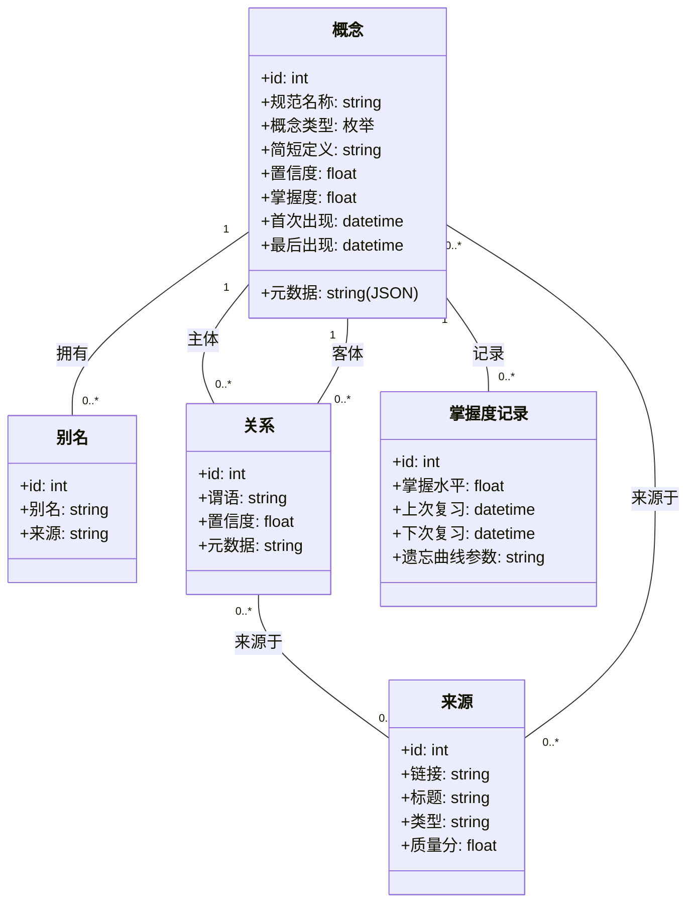

# 《织》功能设计

> **文档状态**：草案（Draft）
> **创建日期**：2026-03-09
> **适用模块**：`fredica_pyutil_server`、`composeApp`、`shared`、`fredica-webui`
> **关联计划**：`workflow-design.md`、`llm-call-design.md`

---

## 1. 产品概述

> “Wir weben, wir weben!”
>
> —— 《Die schlesischen Weber》

### 1.1 背景与愿景

现代学习者面临信息过载、注意力碎片化、知识体系难以构建的困境。传统学习工具要么过于简单（如单词卡），要么过于复杂（如专业笔记软件），难以兼顾沉浸式体验与系统性知识构建。

**知境**旨在打造一款**全自动、无感知**
的AI学习助手，让用户只需“思考”和“浏览”，而AI在后台默默完成知识整理、关联、复习安排。通过极简的UI和强大的知识图谱引擎，将碎片化学习与系统性构建无缝融合，帮助用户进入“心流”状态。

### 1.2 核心价值

- **沉浸式碎片学习**：通过概念瀑布流，让用户像刷短视频一样轻松吸收知识点。
- **自动知识体系构建**：AI从视频、文档中自动抽取概念、关系，构建个人知识图谱，无需手动整理。
- **智能复习与路径规划**：基于遗忘曲线和目标导向，自动推送复习卡片和学习路径。
- **上下文不丢失**：跳转视频片段时，通过上下文UI保持用户方位感。

---

## 2. 用户画像

- **核心用户**：18-30岁学生、自学者，日常通过B站、YouTube等平台学习，但常因开小差、注意力分散而效率低下。
- **用户痛点**：
    - 看完视频就忘，无法形成体系。
    - 想复习却找不到重点。
    - 笔记杂乱，整理耗时。
    - 面对大量内容不知从何下手。
- **用户目标**：用最少的时间、最少的操作，掌握最多的知识，并获得掌控感和成就感。

---

## 3. 核心概念

### 3.1 知识图谱（KG）

- **概念节点**：知识的最小单元，包含名称、类型、定义、元数据、掌握度等。
- **关系边**：概念之间的语义联系（如“包含”、“依赖”、“用于”），可附带置信度、来源。
- **来源**：每个概念和关系可关联到原始视频/文档片段，支持追溯。

### 3.2 概念类型（可扩展）

| 类型   | 说明      | 元数据示例     |
|------|---------|-----------|
| 理论   | 基本原理、定律 | 公式、推导     |
| 术语   | 专业名词    | 全称、语境     |
| 硬件经验 | 硬件实践心得  | 适用器件、注意事项 |
| 开发经验 | 编程技巧、坑点 | 代码示例、解决方案 |
| 方法技巧 | 通用方法    | 步骤、适用场景   |
| 工具软件 | 开发工具    | 版本、配置     |
| 器件芯片 | 硬件型号    | 厂商、参数     |
| 协议   | 通信规范    | 时序图、寄存器   |
| 公式   | 数学表达式   | 变量说明      |
| 设计模式 | 软件模式    | 示例代码      |

### 3.3 视频内容提取

每个课程视频自动提取以下内容：

- **概念与关系**：用于图谱构建。
- **时间戳摘要**：分段摘要，每个摘要关联概念。
- **闪卡**：自动生成的问答卡片，用于间隔复习。
- **附件资料**：代码、手册、链接等。
- **巩固测验**：选择题/填空题，检验理解。
- **思维导图大纲**：视频结构概览。
- **常见问题（FAQ）**：从弹幕/评论挖掘。
- **实践任务**：动手练习建议。
- **讨论线索**：关联社区讨论。
- **学习路径线索**：前置/后置知识推荐。

---

## 4. 功能模块

### 4.1 概念瀑布流（主界面）

- **卡片式上下滑动**：每个卡片展示一个概念，包含名称、简短定义、掌握度进度条、相关概念标签。
- **预览按钮**：点击播放该概念的精华视频片段（15秒/30秒/60秒可选），无需跳转。
- **交互**：
    - 点击卡片中部 → 进入概念详情页。
    - 点击底部标签 → 跳转到对应概念卡片。
    - 长按卡片 → 进入连线模式（手动建立关联）。
    - 其他 → 收藏、稍后提醒。

### 4.2 概念详情页

- **视频片段区**：横向滑动切换不同来源的视频片段，点击播放。
- **定义与元数据**：AI生成的简短定义及类型特定信息。
- **附件资料**：下载/预览代码、手册等。
- **关系图谱缩略图**：显示当前概念及其邻居，点击进入全屏图谱。
- **我的笔记**：用户可添加文字/语音笔记，AI自动关联。
- **社区讨论**：显示相关讨论，可参与。

### 4.3 全屏知识图谱

- **力导向图布局**：节点可拖拽、缩放，点击节点聚焦。
- **边类型视觉编码**：实线/虚线/颜色表示不同关系。
- **路径模式**：输入目标后高亮从当前状态到目标的最优路径。
- **快速连线**：双击节点进入连线模式，拖拽到另一节点建立关系。

### 4.4 视频播放器与上下文保持

- **进度条知识点标记**：圆点表示概念位置，当前概念高亮。
- **顶部横幅**：显示当前概念名称及前后概念，点击跳转。
- **迷你时间轴**：横向缩略时间轴，显示知识点分布，可滑动跳转。
- **前情提要/后续预览**：点击查看前后知识点的精华片段或要点。
- **“60秒预览”按钮**：点击弹出预览窗口，展示接下来60秒的摘要视频和要点列表，支持跳转。

### 4.5 学习路径与目标

- **目标设定**：用户可输入学习目标（如“掌握PWM输出”）。
- **路径生成**：系统基于知识图谱和用户掌握度，自动生成学习路径，展示每一步概念及进度。
- **路径模式视图**：以列表或图谱形式展示，推荐下一步行动。

### 4.6 复习与推送

- **间隔重复算法**：基于遗忘曲线，在锁屏/通知栏推送复习卡片。
- **每日复习流**：瀑布流顶部展示待复习概念，用户可快速刷卡。

### 4.7 手动关联工具

- **卡片连线模式**：长按卡片进入连线，拖拽到另一卡片，选择关系类型。
- **图谱视图快速连线**：点击节点“关联”按钮，再点另一节点，选择关系。
- **批量关联**：编辑模式下勾选多个卡片，AI推荐可能关系，用户一键确认。

---

## 5. 用户界面设计

### 5.1 设计原则

- **极简**：隐藏复杂性，只呈现当前需要的信息。
- **一致手势**：上下滑动切换卡片，左右滑动返回/收藏，点击进入详情。
- **深色模式为主**：减少视觉疲劳，高亮色柔和。

### 5.2 核心界面布局

#### 瀑布流卡片

```
┌─────────────────────────────────────┐
│  🔵 术语 · 难度★★                    │
│  GPIO                               │
│  通用输入输出引脚                    │
│  ⚡ 掌握度 60%  [=====-----]          │
│  ▶ 预览15秒                          │
│  🔗 推挽输出 · 开漏输出 · 上拉        │
└─────────────────────────────────────┘
```

#### 视频播放器上下文栏

```
┌─────────────────────────────────────────────┐
│  📍 GPIO (2/15)  ← 定时器基础 | 推挽输出 →   │
│  [迷你时间轴] ███▓▓▓▓░░░░░░░░                │
│  ⏪ 前情  [ ▶ 60秒预览 ]  ⏩ 后续             │
└─────────────────────────────────────────────┘
```

#### 预览窗口

```
┌─────────────────────────────────────────────┐
│  ⏱️ 接下来60秒 · 可拖拽进度条                  │
│  🎬 [精华摘要视频]  ▶ 播放                    │
│  📋 要点：                                   │
│  • 预分频器公式      00:05                    │
│  • 代码配置示例      00:20  ★                 │
│  • 常见错误          00:45                    │
│  ⏪ 前60秒  [⏺️ 关闭]  ⏩ 后60秒                │
└─────────────────────────────────────────────┘
```

---

## 6. 数据模型（UML类图）



---

## 7. 技术实现要点

### 7.1 AI能力

- **ASR**：
    - 如果平台视频已经有字幕功能，则直接下载。
    - 如果缺少字幕，则启动 faster-whisper/第三方api（飞浆语音识别（支持专业术语热词）...）。
- **NER/关系抽取**：微调BERT模型，从转录文本中抽取概念和关系。
- **多模态分析**：OCR识别PPT文字、代码截图；关键帧提取图表；30秒切片内容识别；
- **摘要生成**：基于抽取式或生成式模型，为视频片段生成文字摘要。
- **精华片段提取**：识别重点。
- **遗忘曲线模型**：个性化调整复习间隔。

### 7.2 存储

- **SQLite**：轻量级本地存储，支持JSON字段和索引。主要表：concepts, aliases, relations, sources, mastery。
- **向量索引**：FAISS（或者其他的库……）用于相似概念检索。

### 7.3 前端

- **图谱可视化**：d3.js 实现。
- **视频播放器**：支持 B站、YouTube（通过下载功能） 和本地文件，集成时间戳跳转。

### 7.4 后端

- 主要存储于内置的 sqlite
- 图数据存储于:
    - JVM 端内嵌 neo4j。
    - Android 端暂不实现。后期寄希望于远程查询PC端的 neo4j。

---

## 8. 典型用户场景

1. **早晨锁屏**：收到复习卡片“GPIO的两种输出模式？”，点击进入瀑布流，刷3个概念。
2. **午休**：对“预分频器”感兴趣，点击预览15秒片段，觉得有用，左滑进入详情，观看完整视频片段并添加笔记。
3. **下午**：设定目标“PWM输出”，系统生成路径，按推荐学习“定时器基础”并完成练习。
4. **晚上**：查看学习周报，看到本周掌握了15个概念，获得成就感。

---

## 9. 未来展望

- **社区共建**：用户可分享自己的知识图谱片段，形成“概念集市”。
- **多模态输入**：支持文章、PDF、代码仓库自动导入。
- **AR/VR集成**：在三维空间中展示知识图谱，沉浸式探索。
- **教师端**：讲师可上传视频并预标注知识点，提升提取质量。

---

## 10. 结语

《织布》不仅仅是又一个学习App，它试图重新定义人与知识的关系：让学习回归思考本身，而所有机械的整理、复习工作交给AI。通过极简的UI和强大的后台，我们希望每个用户都能在碎片化时代，重新获得对知识体系的掌控感和心流体验。