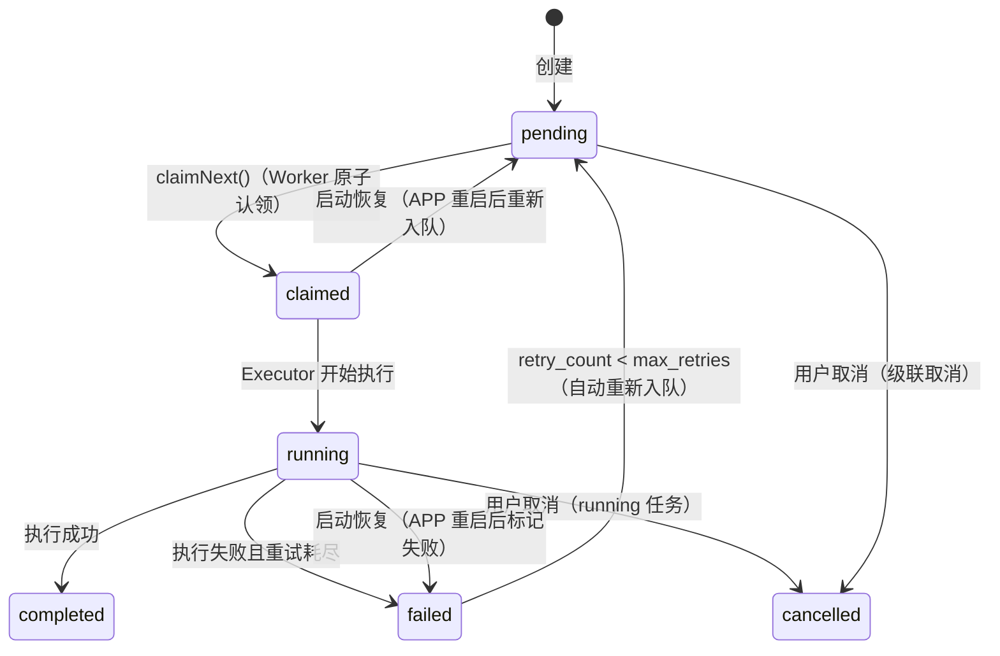
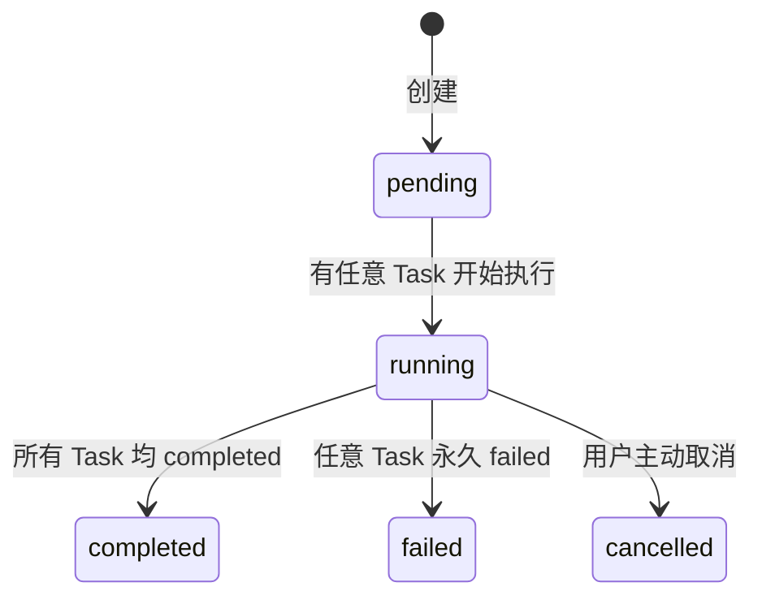

# 任务模型

本文介绍 Fredica 的异步任务系统，包括核心数据模型、状态机、DAG 调度机制、任务控制（取消/暂停/恢复）以及启动恢复流程。

---

## 概览

Fredica 的后台处理（下载、转码、字幕提取、AI 分析等）均通过**异步任务队列**驱动。整个系统由三层组成：

```
WorkflowRun（工作流运行实例）
  └─ Task × N（具体工作单元，支持 DAG 依赖）
       └─ TaskExecutor（执行逻辑，每种 type 对应一个实现）
```

- **`WorkflowRun`**：一次处理流程的容器，汇总所有子任务的整体状态和进度。
- **`Task`**：最小工作单元，携带执行参数（`payload`）和前置依赖（`depends_on`）。
- **`TaskExecutor`**：Kotlin 接口，每种任务类型对应一个实现，由 `WorkerEngine` 在运行时调用。

---

## Task 数据模型

定义位于 `shared/src/commonMain/kotlin/.../db/Task.kt`。

### 核心字段

| 字段 | 类型 | 说明 |
|------|------|------|
| `id` | String (UUID) | 任务唯一标识 |
| `type` | String | 任务类型，对应一个 `TaskExecutor`，如 `DOWNLOAD_VIDEO`、`FETCH_SUBTITLE` |
| `workflow_run_id` | String | 所属工作流运行实例 ID |
| `material_id` | String | 关联素材 ID |
| `status` | String | 当前状态（见状态机） |
| `priority` | Int | 调度优先级，数字越大越优先；同优先级按 `created_at` 升序（FIFO） |
| `depends_on` | String (JSON 数组) | 前置任务 ID 列表，全部 `completed` 才允许认领 |
| `payload` | String (JSON) | 执行参数，由各 Executor 自定义格式 |
| `result` | String? (JSON) | 执行结果，成功时由 Executor 写入，下游任务可读取 |
| `error` | String? | 最后一次失败的错误信息（human-readable） |
| `error_type` | String? | 错误类型标签，如 `TIMEOUT`、`IO_ERROR`，便于按类型统计 |
| `idempotency_key` | String? | 幂等键；相同 key 的任务只插入一条（`ON CONFLICT DO NOTHING`） |
| `retry_count` | Int | 已重试次数（首次执行不计入） |
| `max_retries` | Int | 最大重试次数，超过后永久 `failed`；默认 0（不重试） |
| `progress` | Int (0–100) | 执行进度，由 Executor 通过 `TaskRepo.updateProgress()` 实时写入 |
| `is_paused` | Boolean | 是否处于暂停状态；仅在 `status=running` 时有意义 |
| `is_pausable` | Boolean | 是否支持暂停；由 Python 端透传，`false` 时前端禁用暂停按钮 |

### 时间戳字段

| 字段 | 说明 |
|------|------|
| `created_at` | 创建时间（Unix 秒） |
| `claimed_at` | 被认领时间 |
| `started_at` | 开始执行时间（进入 `running` 时记录） |
| `completed_at` | 完成时间（进入 `completed`/`failed`/`cancelled` 时记录） |
| `heartbeat_at` | Worker 最后心跳时间（预留，Phase 3 死亡检测用） |

---

## Task 状态机



### 状态说明

| 状态 | 含义 |
|------|------|
| `pending` | 等待被认领，满足依赖条件后可被 `claimNext()` 取走 |
| `claimed` | 已被 Worker 认领，尚未开始执行（过渡态，通常极短暂） |
| `running` | 正在执行中，可能处于暂停状态（`is_paused=true`） |
| `completed` | 执行成功，`result` 字段含输出数据 |
| `failed` | 执行失败且重试次数耗尽，永久终态 |
| `cancelled` | 用户主动取消，永久终态 |

> `pending` 和 `claimed` 在前端统一展示为"等待中"；`running` 且 `is_paused=true` 展示为"已暂停"。

---

## WorkflowRun 数据模型

定义位于 `shared/src/commonMain/kotlin/.../db/WorkflowRun.kt`。

一次 `WorkflowRun` 代表对某个素材执行一次完整处理流程，是一组 `Task` 的容器。

| 字段 | 类型 | 说明 |
|------|------|------|
| `id` | String (UUID) | 运行实例唯一标识 |
| `material_id` | String | 关联素材 ID |
| `template` | String | 工作流模板标识，如 `manual_download_bilibili_video` |
| `status` | String | 汇总状态（见下方状态机） |
| `total_tasks` | Int | 子任务总数（由 `recalculate()` 维护） |
| `done_tasks` | Int | 已完成子任务数（`completed` 状态的任务数） |
| `created_at` | Long | 创建时间（Unix 秒） |
| `completed_at` | Long? | 进入 `completed` 状态的时间 |

### WorkflowRun 状态机



`WorkflowRun` 的状态**不由调用方直接写入**，而是由 `WorkflowRunRepo.recalculate()` 根据子任务实际状态汇总计算，在每次 Task 状态变更后由 `WorkerEngine` 触发。

---

## DAG 调度

`Task.depends_on` 是一个 JSON 数组，存放前置任务 ID：

```json
["task-uuid-a", "task-uuid-b"]
```

`TaskRepo.claimNext()` 只会认领满足以下条件的任务：

1. `status = 'pending'`
2. `depends_on` 中所有任务均已 `completed`
3. 按 `priority DESC`、`created_at ASC` 取第一条（原子操作，防并发重复认领）

这样，一个 `WorkflowRun` 下的多个 `Task` 自然形成有向无环图（DAG），无需额外调度器。

### 典型流水线示例

```
FETCH_SUBTITLE ──→ WEBEN_CONCEPT_EXTRACT
```

```
DOWNLOAD_VIDEO ──→ TRANSCODE_MP4
```

---

## TaskExecutor 接口

定义位于 `shared/src/commonMain/kotlin/.../worker/TaskExecutor.kt`。

```kotlin
interface TaskExecutor {
    val taskType: String          // 与 task.type 对应，如 "DOWNLOAD_VIDEO"

    suspend fun execute(task: Task): ExecuteResult

    fun canSkip(task: Task): Boolean = false   // 前置结果已存在时跳过

    suspend fun onTaskFailed(task: Task, result: ExecuteResult) {}  // 失败/取消回调
}
```

### ExecuteResult

```kotlin
data class ExecuteResult(
    val result: String = "{}",    // 成功时写入 task.result 的 JSON
    val error: String? = null,    // 失败时的错误信息
    val errorType: String? = null // 错误类型标签
)
```

`error == null` 表示成功，否则失败。`errorType` 特殊值：

| errorType | 含义 |
|-----------|------|
| `CANCELLED` | 用户主动取消，不触发重试 |
| `AWAITING_CREDENTIAL` | 等待用户配置凭据，不自动重试 |
| `PAYLOAD_ERROR` | payload 解析失败，不重试 |
| 其他 | 可重试（受 `max_retries` 限制） |

### onTaskFailed 回调

当任务永久失败或被取消时，`WorkerEngine` 会调用 `executor.onTaskFailed()`，供 Executor 处理业务副作用（如将关联的 `WebenSource.analysisStatus` 重置为 `"failed"`）。

默认空实现，不需要副作用的 Executor 无需覆写。

---

## WorkerEngine 调度引擎

定义位于 `shared/src/commonMain/kotlin/.../worker/WorkerEngine.kt`。

```
启动
  └─ runStartupRecovery()（同步，见下文）
      └─ 主轮询协程（每 1s 尝试 claimNext）
           └─ 认领成功 → launch 独立协程 → Semaphore(maxWorkers) 限并发
                └─ dispatch(task)
                     ├─ canSkip? → completed（跳过）
                     ├─ running → execute()
                     ├─ 成功 → completed → recalculate()
                     ├─ 失败可重试 → pending（retry_count++）
                     └─ 失败不可重试 → failed → onTaskFailed() → recalculate()
```

队列为空时自动退避到 5s 轮询间隔，减少空轮询开销。

---

## 任务控制：取消 / 暂停 / 恢复

### 取消

- **pending/claimed 任务**：直接更新 DB 状态为 `cancelled`（`TaskRepo.cancelPendingTasksByWorkflowRun()`）
- **running 任务**：通过 `TaskCancelService` 向 Executor 发送 `CompletableDeferred<Unit>` 取消信号；Executor 检测到信号后返回 `ExecuteResult(errorType="CANCELLED")`

```kotlin
// Executor 内部检测取消
if (cancelSignal.isCompleted) return@withContext null
```

### 暂停 / 恢复

通过 `TaskPauseResumeService` 管理每个运行中任务的 Channel 对：

```kotlin
data class TaskPauseResumeChannels(
    val pause: Channel<Unit>,
    val resume: Channel<Unit>,
)
```

Executor 在长任务循环中监听 `pauseChannel`，收到信号后挂起等待 `resumeChannel`。

### 信号注册生命周期

`WebSocketTaskExecutor` 基类统一管理信号的注册与注销，Executor 子类无需手动处理：

```kotlin
// 基类 execute() 内部
val cancelSignal = TaskCancelService.register(task.id)
val channels = TaskPauseResumeService.register(task.id)
try {
    return executeWithSignals(task, cancelSignal, channels)
} finally {
    TaskCancelService.unregister(task.id)
    TaskPauseResumeService.unregister(task.id)
}
```

---

## 启动恢复

APP 强杀后重启时，`WorkerEngine.start()` 在启动轮询前同步执行四道恢复保护：

| 步骤 | 操作 | 原因 |
|------|------|------|
| 1. 快照 | 记录所有非终态任务 | 为重启日志提供原始状态 |
| 2. 重置僵尸任务 | `running → failed`，`claimed → pending` | 执行结果不确定，`running` 标记失败；`claimed` 可安全重新入队 |
| 3. 写重启日志 | 写入 `restart_task_log` 表 | 可追溯哪些任务被中断 |
| 4. 孤立任务对账 | 无对应 `WorkflowRun` 的非终态任务 → `failed` | 防止僵尸任务永远占用队列 |
| 5. WorkflowRun 对账 | `reconcileNonTerminal()` 批量修正汇总状态 | 补偿上次会话中 `recalculate()` 失败遗留的落后状态 |

恢复步骤**同步完成后** `start()` 才返回，确保调用方在此后插入的新任务不会被误取消。

---

## 幂等键

`Task.idempotency_key` 防止重复创建相同任务：

```sql
INSERT OR IGNORE INTO task (...) VALUES (...)
-- 相同 idempotency_key 的任务只插入一条
```

典型用法：以 `"${materialId}:DOWNLOAD_VIDEO"` 作为幂等键，确保同一素材的下载任务不会重复入队。

---

## 职责边界

| 类 | 职责 |
|----|------|
| `TaskDb` | 只操作 `task` 表，**不含** `recalculate()` |
| `WorkflowRunDb` | 管理 `workflow_run` 表，含 `recalculate()` |
| `WorkerEngine` | 任务完成后调用 `WorkflowRunService.repo.recalculate()`，**不是** `TaskService` |
| `TaskCancelService` | 运行中任务取消信号注册表（`commonMain`） |
| `TaskPauseResumeService` | 暂停/恢复 Channel 注册表（`commonMain`） |
| `WebSocketTaskExecutor` | 信号注册/注销生命周期基类，Executor 子类继承后只需实现 `executeWithSignals()` |
