# 任务模型

本文只描述**当前代码里已经落地的任务链路**：前端如何发起任务、Kotlin 如何创建/调度 `WorkflowRun + Task`、Python 长任务如何通过 WebSocket 被控制，以及状态如何回流到前端。

为避免把设计稿和现状混在一起，文中默认都以“已实现”为准；尚未落地的能力统一收在文末“未来计划”一节，不作为当前行为说明。

> 核心代码入口：`Task`、`WorkflowRun`、`CommonWorkflowService`、`MaterialWorkflowService`、`WorkerEngine`、`TaskExecutor`、`WebSocketTaskExecutor`、`PythonUtil.PyUtilServer.websocketTask()`、`TaskEndpoint`。

---

## 1. 系统总览

Fredica 的下载、转码、字幕提取、ASR、知识提取等后台工作，统一走一套“**工作流容器 + 任务 DAG + Executor 执行器**”模型：

```text
WorkflowRun（一次业务流程）
  └─ Task × N（具体工作单元，支持 depends_on DAG）
       └─ TaskExecutor（Kotlin 执行器）
            ├─ 纯 Kotlin / JVM 本地逻辑
            └─ PythonUtil.websocketTask()/requestText() 调 Python 服务
```

核心分层：

| 层 | 代码位置 | 职责 |
|---|---|---|
| 前端展示/控制 | `fredica-webui/app/` | 发起工作流、轮询任务、触发暂停/恢复/取消 |
| HTTP 路由层 | `shared/src/commonMain/kotlin/.../api/routes/` | 暴露启动任务、查询任务、控制任务等 API |
| 工作流业务层 | `MaterialWorkflowService.kt` / `CommonWorkflowService.kt` | 生成 `WorkflowRun` 与 `Task` |
| 调度层 | `WorkerEngine.kt` | `claimNext()`、并发控制、重试、收尾、recalculate |
| 执行层 | `worker/executors/` | 每种 `task.type` 对应一个 `TaskExecutor` |
| Python 服务 | `fredica_pyutil_server/` | 承载长时间任务、子进程封装、主动上报进度/暂停请求 |

---

## 2. 建议按什么顺序读代码

如果你是第一次系统性看 Fredica 的任务系统，建议按下面顺序读；这样最容易把“数据模型 → 建流 → 调度 → 执行 → 前端展示”串起来。

### 2.1 第一遍：先建立整体骨架

1. `shared/src/commonMain/kotlin/com/github/project_fredica/db/Task.kt`
   - 看 `Task` 数据结构
   - 看 `TaskRepo` 提供哪些状态/调度能力
2. `shared/src/commonMain/kotlin/com/github/project_fredica/db/WorkflowRun.kt`
   - 看 `WorkflowRun` 是怎么汇总一组 Task 的
3. `shared/src/commonMain/kotlin/com/github/project_fredica/worker/TaskExecutor.kt`
   - 看任务执行的统一接口是什么
4. `shared/src/commonMain/kotlin/com/github/project_fredica/worker/WorkerEngine.kt`
   - 看系统如何 claim / dispatch / retry / recalculate

这四个文件看完，基本就知道“任务系统是什么”。

### 2.2 第二遍：看任务是怎么被创建的

1. `shared/src/commonMain/kotlin/com/github/project_fredica/api/routes/MaterialWorkflowRoute.kt`
   - 看前端 POST 进来后进入哪个业务入口
2. `shared/src/commonMain/kotlin/com/github/project_fredica/db/MaterialWorkflowService.kt`
   - 看某个模板如何拆成多个 Task
3. `shared/src/commonMain/kotlin/com/github/project_fredica/db/CommonWorkflowService.kt`
   - 看 `WorkflowRun + Task` 最终如何统一落库

这一层解决的是“任务从哪里来”。

### 2.3 第三遍：看运行中状态如何回流到前端

1. `shared/src/commonMain/kotlin/com/github/project_fredica/api/routes/WorkerTaskListRoute.kt`
   - 看前端轮询查的是什么
2. `shared/src/commonMain/kotlin/com/github/project_fredica/api/routes/TaskPauseRoute.kt`
3. `shared/src/commonMain/kotlin/com/github/project_fredica/api/routes/TaskResumeRoute.kt`
4. `shared/src/commonMain/kotlin/com/github/project_fredica/api/routes/TaskCancelRoute.kt`
5. `fredica-webui/app/components/ui/WorkflowInfoPanel.tsx`
   - 看前端如何把 Task 状态映射成 UI

这一层解决的是“用户看到什么、按钮控制了什么”。

### 2.4 第四遍：看 Python 长任务桥接

1. `shared/src/jvmMain/kotlin/com/github/project_fredica/worker/WebSocketTaskExecutor.kt`
   - 看取消/暂停/恢复信号是怎么统一注册的
2. `shared/src/jvmMain/kotlin/com/github/project_fredica/python/PythonUtil.kt`
   - 重点看 `PyUtilServer.websocketTask()`
3. `desktop_assets/common/fredica-pyutil/fredica_pyutil_server/util/task_endpoint_util.py`
   - 看 Python 端如何处理 `init_param_and_run / pause / resume / cancel`

这一层解决的是“Kotlin 怎么驱动 Python 长任务”。

### 2.5 最后：按具体 Executor 读业务链路

当你已经明白骨架后，再去看具体任务类型，例如：

- `DownloadBilibiliVideoExecutor`
- `TranscodeMp4Executor`
- `TranscribeExecutor`
- `DownloadTorchExecutor`
- `NetworkTestExecutor`

建议方式：**先看 Task type 在哪里创建，再看对应 Executor。**

---

## 3. 从前端到 Python 的调用链

### 3.1 启动一个工作流

以“Bilibili 下载 + 转码”模板为例：

```mermaid
flowchart TD
    A[React 页面/组件\nstartMaterialWorkflow()] --> B[MaterialWorkflowRoute]
    B --> C[MaterialWorkflowService.startBilibiliDownloadTranscode()]
    C --> D[CommonWorkflowService.createWorkflow()]
    D --> E[写入 workflow_run]
    D --> F[写入 task\nDOWNLOAD_BILIBILI_VIDEO]
    D --> G[写入 task\nTRANSCODE_MP4\ndepends_on=DOWNLOAD_BILIBILI_VIDEO]
    F --> H[WorkerEngine.claimNext()]
    G --> H
    H --> I[TaskExecutor.execute(task)]
    I --> J[本地逻辑 / PythonUtil 调 Python]
```

对应函数：

- 前端入口：`startMaterialWorkflow()` in `fredica-webui/app/util/materialWorkflowApi.ts`
- 路由入口：`MaterialWorkflowRoute.handler()`
- 模板构建：`MaterialWorkflowService.startBilibiliDownloadTranscode()`
- 通用建流：`CommonWorkflowService.createWorkflow()`

### 3.2 前端如何观察任务状态

当前前端主要通过**轮询任务列表接口**观察任务进度，而不是直接订阅 Worker：

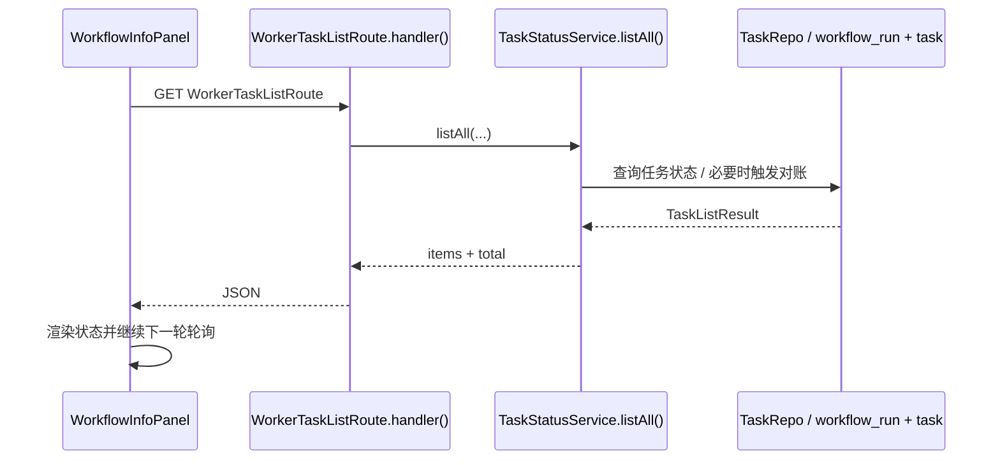

对应函数：

- 前端轮询：`WorkflowInfoPanel()`
- 后端查询入口：`WorkerTaskListRoute.handler()`
- 查询服务：`TaskStatusService.listAll()`

前端的几个关键点：

- `WorkflowInfoPanel` 每 2 秒请求一次 `WorkerTaskListRoute`
- 轮询条件可按 `workflow_run_id` 或 `material_id` 过滤
- 所有任务进入终态后自动停止轮询
- 暂停 / 恢复 / 取消按钮直接打 `TaskPauseRoute` / `TaskResumeRoute` / `TaskCancelRoute`

---

## 4. 任务模型：Task

定义入口：`Task` data class in `Task.kt`。

`Task` 是最小工作单元，每条记录对应一次可调度的执行动作，例如：

- `DOWNLOAD_BILIBILI_VIDEO`
- `TRANSCODE_MP4`
- `FETCH_SUBTITLE`
- `WEBEN_CONCEPT_EXTRACT`
- `DOWNLOAD_TORCH`

### 4.1 核心字段

| 字段 | 类型 | 说明 |
|---|---|---|
| `id` | String | 任务 ID（UUID） |
| `type` | String | 任务类型，对应一个 `TaskExecutor` |
| `workflow_run_id` | String | 所属工作流实例 |
| `material_id` | String | 关联素材 |
| `status` | String | `pending / claimed / running / completed / failed / cancelled` |
| `depends_on` | String(JSON 数组) | 前置任务 ID 列表 |
| `payload` | String(JSON) | 执行参数 |
| `result` | String? | 成功结果 JSON |
| `error` | String? | 失败信息 |
| `error_type` | String? | 失败类型标签 |
| `retry_count` / `max_retries` | Int | 重试控制 |
| `progress` | Int | 0–100 进度 |
| `status_text` | String? | 最近一条状态文本 |
| `is_paused` | Boolean | 当前是否暂停 |
| `is_pausable` | Boolean | 当前是否支持暂停 |
| `idempotency_key` | String? | 幂等键 |

### 4.2 当前前端真正用到的字段

从 `WorkflowInfoPanel` 看，前端最关心这些字段：

- `type`：映射为“下载视频 / 转码 MP4 / 获取字幕”等标签
- `status`：决定展示“等待中 / 进行中 / 已完成 / 失败”
- `progress`：绘制进度条
- `status_text`：展示阶段文本
- `error` + `error_type`：展示失败原因或“等待配置”态
- `is_paused` + `is_pausable`：控制暂停/恢复按钮

也就是说，`Task` 既是调度记录，也是前端任务 UI 的直接数据源。

对应类 / 函数：

- 数据模型：`Task`
- 查询接口：`TaskRepo.listAll()`、`TaskRepo.listByWorkflowRun()`
- 前端消费：`WorkflowInfoPanel()`

---

## 5. 工作流模型：WorkflowRun

定义入口：`WorkflowRun` data class in `WorkflowRun.kt`。

`WorkflowRun` 是一组 Task 的容器，表示一次完整处理流程。

例如：

- 一个 `bilibili_download_transcode` 工作流
- 一个 `FETCH_SUBTITLE -> WEBEN_CONCEPT_EXTRACT` 工作流

### 5.1 核心字段

| 字段 | 说明 |
|---|---|
| `id` | 工作流运行实例 ID |
| `material_id` | 关联素材 ID |
| `template` | 工作流模板名 |
| `status` | 汇总状态 |
| `total_tasks` | 子任务总数 |
| `done_tasks` | 已完成任务数 |
| `created_at` | 创建时间 |
| `completed_at` | 完成时间 |

### 5.2 与 Task 的关系

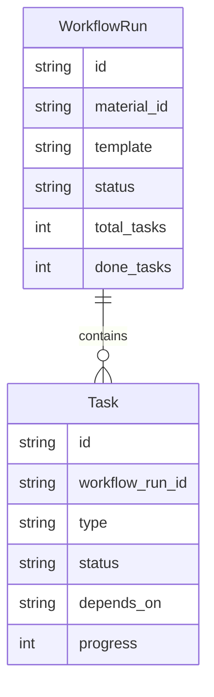

注意：

- `WorkflowRun` **不直接保存任务列表**，需要通过 `TaskRepo.listByWorkflowRun()` 查询
- `WorkflowRun.status / done_tasks / total_tasks` **不是调用方手动维护**，而是 `WorkflowRunRepo.recalculate()` 根据 task 表汇总计算

对应类 / 函数：

- 数据模型：`WorkflowRun`
- 汇总入口：`WorkflowRunRepo.recalculate()` / `WorkflowRunDb.recalculate()`
- 查询入口：`WorkflowRunRepo.listActiveByMaterial()`、`WorkflowRunRepo.listHistoryByMaterial()`

---

## 6. Task 状态机

实际流转逻辑主要在 `WorkerEngine.dispatch()` 与 `TaskRepo.updateStatus()` 的配合里。

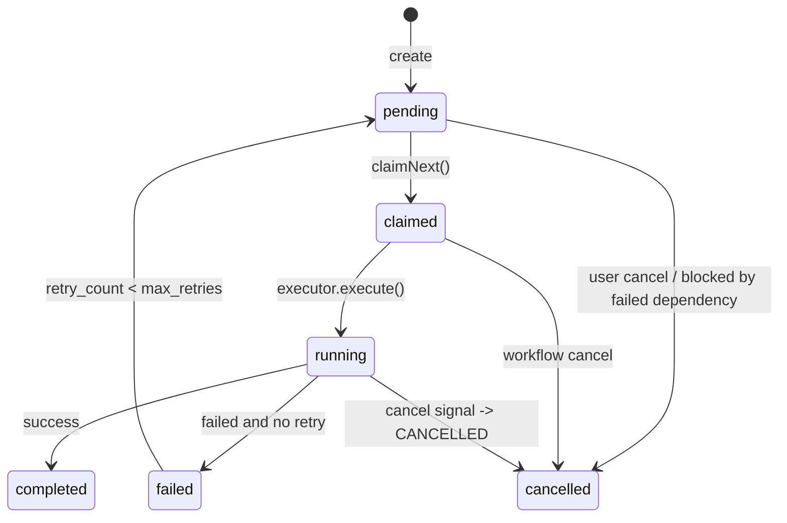

### 6.1 各状态含义

| 状态 | 说明 |
|---|---|
| `pending` | 等待执行，且尚未被 Worker 认领 |
| `claimed` | 已认领，等待进入执行逻辑 |
| `running` | 正在执行 |
| `completed` | 执行成功 |
| `failed` | 执行失败且不可再重试 |
| `cancelled` | 用户取消或依赖失败导致级联取消 |

### 6.2 前端展示口径

前端并不 1:1 展示底层状态：

- `pending + claimed`：都可视为“等待中 / 排队中”
- `running + is_paused=true`：展示为“已暂停”
- `completed + result.skipped=true`：展示为“已跳过”
- `error_type = AWAITING_ASR_CONFIG`：展示为“等待配置”

对应函数：

- 核心流转：`WorkerEngine.dispatch()`
- 前端状态映射：`getStatus()` in `WorkflowInfoPanel.tsx`

---

## 7. DAG 调度：depends_on 如何工作

Fredica 当前没有单独的工作流编排器；**任务 DAG 直接由 `Task.depends_on` + `claimNext()` 实现**。

### 7.1 典型例子

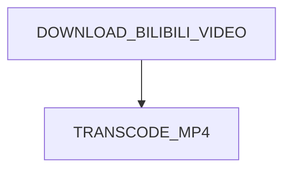

或：

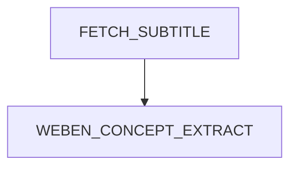

### 7.2 调度规则

`TaskRepo.claimNext()` 只认领同时满足下列条件的任务：

1. `status = pending`
2. `depends_on` 里的任务全部 `completed`
3. 按 `priority DESC, created_at ASC` 取下一条

这意味着：

- 上游没完成，下游不会被执行
- 上游失败后，下游 pending 任务会在后续 `recalculate()` 中被批量取消
- 不需要额外 DAG 引擎，也能实现线性或树状流水线

对应函数：

- 任务认领：`TaskRepo.claimNext()`
- 被阻塞任务取消：`TaskRepo.cancelBlockedTasks()`
- 工作流汇总：`WorkflowRunDb.recalculate()`

---

## 8. 工作流是如何创建出来的

当前推荐路径不是直接手写 SQL / DB 操作，而是：

```text
Route -> xxxWorkflowService -> CommonWorkflowService.createWorkflow()
```

### 8.1 真实代码：Bilibili 下载 + 转码

`MaterialWorkflowService.startBilibiliDownloadTranscode()` 会：

1. 先检查当前素材是否已有活跃下载/转码任务
2. 构造两个 `TaskDef`
3. 声明 `TRANSCODE_MP4.dependsOnIds = [downloadTaskId]`
4. 调 `CommonWorkflowService.createWorkflow()` 一次性写入 `workflow_run + task`

```mermaid
flowchart TD
    A[startBilibiliDownloadTranscode()] --> B{已有活跃任务?}
    B -- 是 --> C[返回 AlreadyActive]
    B -- 否 --> D[生成 downloadTaskId / transcodeTaskId]
    D --> E[构造 payload]
    E --> F[createWorkflow()]
    F --> G[create WorkflowRun]
    F --> H[create DOWNLOAD_BILIBILI_VIDEO]
    F --> I[create TRANSCODE_MP4\ndependsOnIds=[downloadTaskId]]
```

对应函数：

- 模板入口：`MaterialWorkflowService.startBilibiliDownloadTranscode()`
- 通用创建：`CommonWorkflowService.createWorkflow()`

### 8.2 CommonWorkflowService 的职责

`CommonWorkflowService.createWorkflow()` 负责：

- 生成 `workflowRunId`
- 插入 `WorkflowRun`
- 将 `TaskDef.dependsOnIds` 序列化为 `depends_on` JSON 数组
- 批量插入所有 Task

对应函数：`CommonWorkflowService.createWorkflow()`

### 8.3 运行时动态展开：ASR 转录流水线

并非所有工作流都能在创建时确定全部任务。**ASR 语音识别**就是一个典型场景：音频需要先切段，切出多少段取决于音频时长，只有切段完成后才知道。

Fredica 用**三级任务链**解决这个问题：

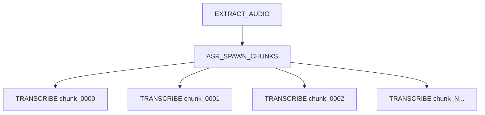

#### 创建阶段（静态）

`MaterialWorkflowService.startWhisperTranscribe()` 只创建**两个**任务：

1. **EXTRACT_AUDIO**：FFmpeg 将视频切为多段音频（chunk_0000.m4a, chunk_0001.m4a, ...）
2. **ASR_SPAWN_CHUNKS**：`dependsOn = [EXTRACT_AUDIO]`，负责读取切段结果并动态创建后续任务

此时 chunk 数量未知，无法预先创建 TRANSCRIBE 任务。

#### 展开阶段（运行时）

`AsrSpawnChunksExecutor` 执行时：

1. 从 `EXTRACT_AUDIO` 任务的 `result` 字段读取 `chunks` 数组，获得实际切段列表
2. 为每个 chunk 创建一个 `TRANSCRIBE` 任务，payload 包含 `audio_path`、`chunk_index`、`core_start_sec`、`core_end_sec` 等
3. 所有 TRANSCRIBE 任务的 `dependsOn = [ASR_SPAWN_CHUNKS.id]`
4. 调用 `TaskStatusService.createAll()` 批量写入

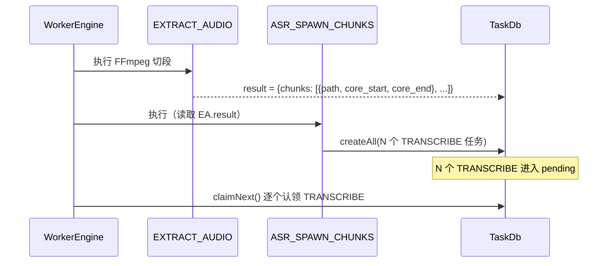

#### 为什么这样设计

- **静态创建不可行**：chunk 数量取决于音频时长和 `chunk_duration_sec` 参数，创建工作流时无法预知
- **复用 DAG 调度**：动态创建的 TRANSCRIBE 任务同样通过 `depends_on` + `claimNext()` 调度，无需额外编排器
- **天然支持并行**：多个 TRANSCRIBE 任务互不依赖，WorkerEngine 可并发执行
- **幂等与缓存**：每个 TRANSCRIBE 任务通过 `canSkip()` 检查 `chunk_XXXX.done` 文件（SHA-256 hash + model_size + language），已完成的 chunk 自动跳过

对应函数：

- 静态创建：`MaterialWorkflowService.startWhisperTranscribe()`
- 动态展开：`AsrSpawnChunksExecutor.execute()`
- 转录执行：`TranscribeExecutor.execute()`
- 结果合并：`TranscribeExecutor.tryMergeChunks()`

---

## 9. WorkerEngine：调度与执行中枢

定义入口：`WorkerEngine` object。

`WorkerEngine` 是整个任务系统的核心：

- 轮询队列
- 原子认领任务
- 控制最大并发
- 调用对应 `TaskExecutor`
- 处理成功 / 失败 / 重试 / 取消
- 触发 `WorkflowRun.recalculate()`

### 9.1 主循环结构

```mermaid
flowchart TD
    A[start()] --> B[runStartupRecovery()]
    B --> C[claimNext(WORKER_ID)]
    C -->|无任务| D[退避轮询]
    C -->|有任务| E[Semaphore 限流]
    E --> F[dispatch(task)]
    F --> G{找到 executor?}
    G -- 否 --> H[finishFailed()]
    G -- 是 --> I{check_skip && canSkip?}
    I -- 是 --> J[completed skipped]
    I -- 否 --> K[updateStatus(running)]
    K --> L[executor.execute(task)]
    L --> M{结果}
    M -- success --> N[completed]
    M -- cancelled --> O[cancelled]
    M -- retry --> P[pending + retry_count+1]
    M -- final fail --> Q[failed]
    N --> R[afterTaskFinished()]
    O --> R
    P --> R
    Q --> R
```

### 9.2 关键实现点

#### claim + dispatch

- `start()` 中每轮调用 `TaskService.repo.claimNext(WORKER_ID)`
- 认领后使用 `Semaphore(maxWorkers)` 控制并发
- 真正执行逻辑在 `dispatch(task)`

对应函数：`WorkerEngine.start()`、`WorkerEngine.dispatch()`

#### check_skip

如果 `payload.check_skip = true` 且 `executor.canSkip(task)` 返回真，则：

- 不进入 `running`
- 直接标记 `completed`
- `result = {"skipped": true}`

对应函数：`WorkerEngine.dispatch()`、`TaskExecutor.canSkip()`

#### 重试策略

失败后是否重试取决于：

- `task.retryCount < task.maxRetries`
- `errorType != AWAITING_CREDENTIAL`

可重试时会：

- `incrementRetry(task.id)`
- `updateStatus(..., status="pending")`
- 等下一轮重新 claim

对应函数：`WorkerEngine.dispatch()`、`TaskRepo.incrementRetry()`、`TaskRepo.updateStatus()`

---

## 10. Kotlin Executor 与 Python 长任务的衔接

很多任务不是在 Kotlin 里直接算完，而是由 Kotlin Executor 调 Python 服务执行。

典型桥接点是：`PythonUtil.Py314Embed.PyUtilServer.websocketTask()`。

### 10.1 调用关系

当前已实现的 Kotlin 执行器分两类：

```mermaid
flowchart TD
    A[WorkerEngine.dispatch()] --> B[TaskExecutor.execute(task)]
    B --> C[纯 Kotlin / JVM 本地逻辑]
    B --> D[WebSocketTaskExecutor.execute()]
    D --> E[注册 cancelSignal / pauseResumeChannels]
    E --> F[executeWithSignals()]
    F --> G[PythonUtil.PyUtilServer.websocketTask()]
    G --> H[Python TaskEndpoint]
```

其中：

- `TaskExecutor` 定义统一执行接口
- `WebSocketTaskExecutor` 负责自动注册/注销取消与暂停信号
- 只有需要 Python 长任务协议的 Executor 才会走 `websocketTask()` 这条链

对应类 / 函数：

- 接口：`TaskExecutor`
- 基类：`WebSocketTaskExecutor.execute()`、`WebSocketTaskExecutor.executeWithSignals()`
- Python 桥：`PythonUtil.PyUtilServer.websocketTask()`

### 10.2 Python WebSocket 协议

Kotlin 发送给 Python 的控制命令：

```json
{"command":"init_param_and_run","data":{}}
{"command":"pause"}
{"command":"resume"}
{"command":"cancel"}
{"command":"status"}
```

Python 发回 Kotlin 的关键消息：

```json
{"type":"progress","percent":35,"statusText":"正在下载...","pausable":true}
{"type":"pause_request","reason":"gpu_oom"}
{"type":"resume_request"}
{"type":"done", ...}
{"type":"error","message":"..."}
```

### 10.3 Kotlin 侧如何消费这些消息

`websocketTask()` 会把 Python 消息映射成回调：

| Python 消息 | Kotlin 回调 | 常见用途 |
|---|---|---|
| `progress.percent` | `onProgress(Int)` | 更新 `task.progress` |
| `progress.statusText` | `onProgressLine(String)` | 更新 `task.status_text` |
| `progress.pausable` | `onPausable(Boolean)` | 更新 `task.is_pausable` |
| `pause_request` | `onPauseRequest(reason)` | 更新 `task.is_paused=true` |
| `resume_request` | `onResumeRequest()` | 更新 `task.is_paused=false` |
| `done` | 返回结果字符串 | 作为 `ExecuteResult.result` |
| `error` | 抛异常 | 进入失败处理 |

对应函数：`PythonUtil.PyUtilServer.websocketTask()`

---

## 11. Python 任务封装：TaskEndpoint

Python 端不是裸写 WebSocket，而是统一继承 `TaskEndpoint` 基类。

定义入口：`TaskEndpoint` in `task_endpoint_util.py`。

### 11.1 两种运行形态

```mermaid
flowchart TD
    A[TaskEndpoint] --> B[TaskEndpointInEventLoopThread]
    A --> C[TaskEndpointInSubProcess]
    B --> D[_run(param)]
    C --> E[spawn 子进程]
    E --> F[status_queue / cancel_event / resume_event]
```

#### TaskEndpointInEventLoopThread

适合：

- 直接在 asyncio 事件循环中跑的协程任务
- 需要在协程里频繁 `await wait_if_paused()` 的场景

关键 API：

- `report_progress(percent)`
- `report_status(data)`
- `request_pause(reason)`
- `request_resume()`

对应类 / 函数：`TaskEndpointInEventLoopThread`、`wait_if_paused()`、`request_pause()`、`request_resume()`

#### TaskEndpointInSubProcess

适合：

- CPU/GPU 重任务
- 需要独立 Python 子进程的任务
- 使用 `multiprocessing.Queue/Event` 与父进程通信

关键机制：

- `status_queue`：子进程上报状态
- `cancel_event`：父进程通知取消
- `resume_event`：父进程控制暂停/恢复

对应类 / 函数：`TaskEndpointInSubProcess`、`_run_queue_reader()`、`subprocess_request_pause()`

### 11.2 为什么前端能看到“可暂停 / 已暂停”

因为 Python 端点会在 progress 消息里透传“当前能不能暂停”，Kotlin 再写回 task 表：

```text
Python _does_support_pause()
  -> progress.pausable
  -> Kotlin onPausable(Boolean)
  -> task.is_pausable
  -> WorkerTaskListRoute
  -> WorkflowInfoPanel 按钮可用性
```

对应函数：`TaskEndpoint._does_support_pause()`、`PythonUtil.PyUtilServer.websocketTask()`、`TaskRepo.updatePausable()`

---

## 12. 取消 / 暂停 / 恢复 的真实链路

### 12.1 用户点击“暂停”

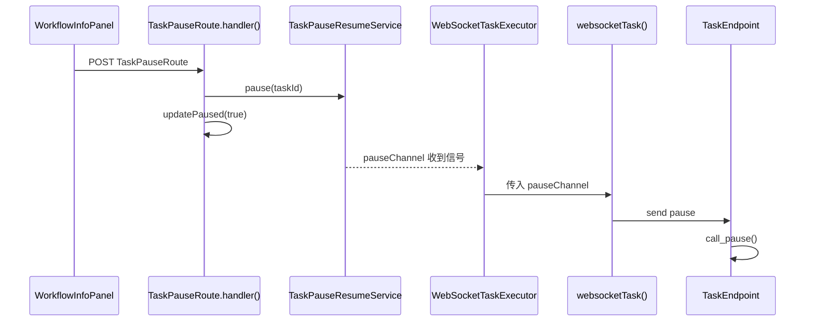

对应函数：

- 前端触发：`handlePause()` in `WorkflowInfoPanel.tsx`
- 路由：`TaskPauseRoute.handler()`
- Python 桥：`PythonUtil.PyUtilServer.websocketTask()`
- Python 处理：`TaskEndpoint.call_pause()`

### 12.2 用户点击“恢复”

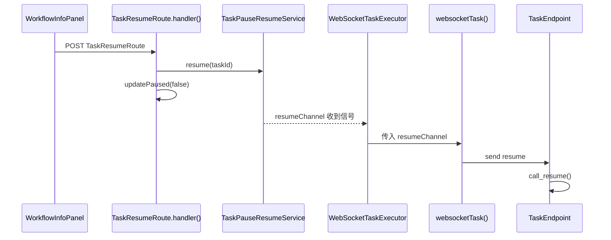

对应函数：

- 前端触发：`handleResume()` in `WorkflowInfoPanel.tsx`
- 路由：`TaskResumeRoute.handler()`
- Python 桥：`PythonUtil.PyUtilServer.websocketTask()`
- Python 处理：`TaskEndpoint.call_resume()`

### 12.3 用户点击“取消”

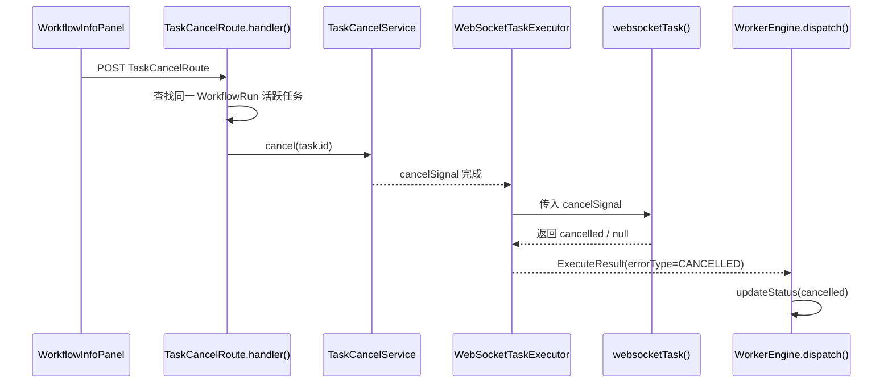

如果目标任务还处于 `pending / claimed`，还没有注册信号，`TaskCancelRoute` 会直接把 DB 状态改成 `cancelled`。

对应函数：

- 前端触发：`handleCancel()` in `WorkflowInfoPanel.tsx`
- 路由：`TaskCancelRoute.handler()`
- 取消信号：`TaskCancelService.cancel()`
- 执行收尾：`WorkerEngine.dispatch()`

### 12.4 Python 主动请求暂停

这是当前架构里非常值得说明的一点：暂停不总是前端主动发起，Python 也可以主动要求 Kotlin 把任务标记为暂停。

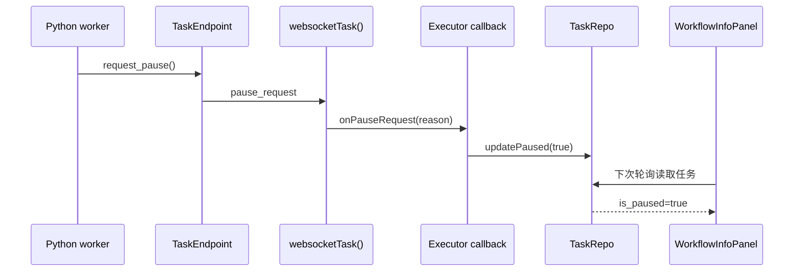

对应函数：

- Python 发起：`TaskEndpointInEventLoopThread.request_pause()`、`subprocess_request_pause()`
- Kotlin 消费：`PythonUtil.PyUtilServer.websocketTask()`
- Executor 回调：各 Executor 传入的 `onPauseRequest`

---

## 13. WorkflowRun 汇总状态如何计算

`WorkflowRun` 的状态并不是前端、路由或 Executor 手动写进去的，而是由 `WorkflowRunRepo.recalculate()` 汇总 Task 状态后得到。

### 13.1 触发时机

`WorkerEngine.afterTaskFinished()` 会在每次任务状态发生关键变化后调用：

- completed
- failed
- cancelled
- retry 回到 pending
- skipped completed

对应函数：`WorkerEngine.afterTaskFinished()`、`WorkflowRunDb.recalculate()`

### 13.2 汇总语义

`WorkflowRunDb.recalculate()` 的优先级大致是：

- 有任何 failed Task → `failed`
- 全部 completed → `completed`
- 有 running / claimed / pending → `running`
- 全部 cancelled → `cancelled`
- 否则 → `pending`

同时还会维护：

- `total_tasks`
- `done_tasks`
- `completed_at`

### 13.3 一个重要的边界：阻塞任务取消

如果上游任务失败，则下游 pending 任务永远无法满足 DAG 条件。为了避免整个工作流卡死：

- `WorkflowRunDb.recalculate()` 会先调用 `TaskRepo.cancelBlockedTasks()`
- 把“依赖了 failed/cancelled 上游”的 pending 任务批量标记为 `cancelled`
- 再进行状态汇总

对应函数：`WorkflowRunDb.recalculate()`、`TaskRepo.cancelBlockedTasks()`

---

## 14. 启动恢复：为什么 APP 重启后任务不会乱掉

`WorkerEngine.start()` 返回前，会先同步执行 `runStartupRecovery()`：

```mermaid
flowchart TD
    A[WorkerEngine.start()] --> B[snapshotNonTerminalTasks()]
    B --> C[resetStaleTasks()]
    C --> D[recordRestartSession()]
    D --> E[failOrphanedTasks()]
    E --> F[reconcileNonTerminal()]
    F --> G[开始正常轮询]
```

当前恢复步骤：

| 步骤 | 操作 |
|---|---|
| 1 | 快照所有非终态任务，用于重启日志 |
| 2 | 重置僵尸任务 |
| 3 | 记录 `restart_task_log` |
| 4 | 清理孤立任务 |
| 5 | 对账所有非终态 `WorkflowRun` |

对应函数：`WorkerEngine.runStartupRecovery()`、`TaskRepo.resetStaleTasks()`、`TaskRepo.failOrphanedTasks()`、`WorkflowRunRepo.reconcileNonTerminal()`

这一步很关键，因为 Fredica 是桌面应用，强退 / 崩溃 / 热重启都比较常见。

---

## 15. 真实页面里的组件封装关系

如果要从前端理解任务模型，建议从这几个组件/工具文件入手：

```mermaid
flowchart TD
    A[具体页面 / 业务组件] --> B[startMaterialWorkflow()]
    A --> C[WorkflowInfoPanel]
    B --> D[MaterialWorkflowRoute]
    C --> E[WorkerTaskListRoute]
    C --> F[TaskPauseRoute / TaskResumeRoute / TaskCancelRoute]
```

### 15.1 `materialWorkflowApi.ts`

职责：

- 封装 `MaterialWorkflowRoute`
- 封装 `MaterialWorkflowStatusRoute`
- 为页面提供 `startMaterialWorkflow()`、`fetchActiveWorkflows()`

对应函数：`startMaterialWorkflow()`、`fetchActiveWorkflows()`、`findActiveEncodeWorkflowRunId()`

### 15.2 `WorkflowInfoPanel.tsx`

职责：

- 查询任务列表
- 计算当前活跃任务状态
- 展示每步任务卡片
- 提供暂停 / 恢复 / 取消按钮
- 识别 `skipped`、`AWAITING_ASR_CONFIG`、`is_paused` 等 UI 特殊态

对应函数：`WorkflowInfoPanel()`、`TaskList()`、`deriveActiveState()`、`getStatus()`

这意味着：**当前任务系统的前端主视图是“Task 列表视图”，不是 Workflow 图视图**。所以文档和调试时都应优先围绕 `Task` 状态来理解问题。

---

## 16. 职责边界

这是代码里反复强调的一组边界，文档里也建议牢记：

| 类/模块 | 只负责什么 | 不负责什么 |
|---|---|---|
| `TaskDb` / `TaskRepo` | task 表 CRUD、claim、progress、pause 等 | `WorkflowRun` 汇总 |
| `WorkflowRunDb` / `WorkflowRunRepo` | workflow_run 表、`recalculate()` | 单个 Task 状态流转 |
| `CommonWorkflowService` | 批量创建 `WorkflowRun + Task` | 执行任务 |
| `MaterialWorkflowService` | 业务模板、payload、幂等检查 | HTTP 解析 |
| `WorkerEngine` | 调度、执行、重试、收尾、触发 recalculate | 具体业务逻辑 |
| `TaskExecutor` | 单个任务的业务执行 | 全局调度 |
| `PythonUtil.PyUtilServer.websocketTask()` | Kotlin 与 Python 长任务桥接 | 任务创建 / 状态汇总 |
| `TaskEndpoint` | Python 侧 WebSocket 控制协议封装 | Kotlin 侧数据库更新 |

---

## 17. 调试建议：遇到任务问题时先看哪里

### 17.1 启动了但没执行

优先检查：

1. `MaterialWorkflowRoute.handler()` 是否真正创建了任务
2. `MaterialWorkflowService` 生成的 `dependsOnIds` 是否正确
3. `TaskRepo.claimNext()` 是否能认领到任务
4. `WorkerEngine.start()` 是否已注册对应 `TaskExecutor`

### 17.2 前端显示一直卡住

优先检查：

1. `WorkerTaskListRoute.handler()` 返回的 `status / progress / is_paused / status_text`
2. Executor 是否调用了 `TaskRepo.updateProgress()` / `TaskRepo.updatePaused()` / `TaskRepo.updateStatusText()`
3. Python progress 帧是否包含 `percent`、`statusText`、`pausable`

### 17.3 暂停/恢复无效

优先检查：

1. 任务是否走 `WebSocketTaskExecutor`
2. Executor 是否把 `pauseChannel` / `resumeChannel` 传给 `websocketTask()`
3. Python 端点是否实现 `call_pause()` / `call_resume()` 或 `resume_event.wait()`
4. 前端按钮是否被 `is_pausable=false` 禁用

---

## 18. 当前模型的定位

当前 Fredica 的任务系统本质上是：

- **数据模型上**：`WorkflowRun` + `Task`
- **调度上**：`depends_on` 驱动的轻量 DAG
- **执行上**：Kotlin `TaskExecutor` 统一入口
- **长任务桥接上**：Kotlin `websocketTask()` ↔ Python `TaskEndpoint`
- **前端展示上**：轮询 `Task` 列表并映射到 UI 状态

这也是为什么很多问题都能沿着下面这条链定位：

```text
前端按钮/面板
  -> Kotlin Route
  -> WorkflowService / TaskRepo
  -> WorkerEngine
  -> TaskExecutor
  -> PythonUtil.websocketTask
  -> Python TaskEndpoint / subprocess
  -> progress/error/done 回流
  -> task 表
  -> WorkerTaskListRoute
  -> 前端轮询展示
```

---

## 19. 相关代码入口

### Kotlin

- `shared/src/commonMain/kotlin/com/github/project_fredica/db/Task.kt`
- `shared/src/commonMain/kotlin/com/github/project_fredica/db/WorkflowRun.kt`
- `shared/src/commonMain/kotlin/com/github/project_fredica/db/CommonWorkflowService.kt`
- `shared/src/commonMain/kotlin/com/github/project_fredica/db/MaterialWorkflowService.kt`
- `shared/src/commonMain/kotlin/com/github/project_fredica/worker/TaskExecutor.kt`
- `shared/src/commonMain/kotlin/com/github/project_fredica/worker/WorkerEngine.kt`
- `shared/src/commonMain/kotlin/com/github/project_fredica/api/routes/MaterialWorkflowRoute.kt`
- `shared/src/commonMain/kotlin/com/github/project_fredica/api/routes/WorkerTaskListRoute.kt`
- `shared/src/commonMain/kotlin/com/github/project_fredica/api/routes/TaskPauseRoute.kt`
- `shared/src/commonMain/kotlin/com/github/project_fredica/api/routes/TaskResumeRoute.kt`
- `shared/src/commonMain/kotlin/com/github/project_fredica/api/routes/TaskCancelRoute.kt`
- `shared/src/jvmMain/kotlin/com/github/project_fredica/worker/WebSocketTaskExecutor.kt`
- `shared/src/jvmMain/kotlin/com/github/project_fredica/python/PythonUtil.kt`

### Frontend

- `fredica-webui/app/util/materialWorkflowApi.ts`
- `fredica-webui/app/components/ui/WorkflowInfoPanel.tsx`

### Python

- `desktop_assets/common/fredica-pyutil/fredica_pyutil_server/util/task_endpoint_util.py`

---

## 20. 未来计划

以下内容目前更适合视为**未来演进方向**，而不是当前已实现能力：

- `WorkflowDefinition + WorkflowNodeRun`：把当前 `WorkflowRun + Task` 的轻量模型演进为更完整的图运行模型
- 更细粒度的节点级运行信息、条件分支、中间节点停止能力
- 多节点 / 节点亲和性 / 心跳与死亡检测等预留字段的真正启用

这些方向在当前代码中已有部分注释或预留字段，但本文前面的链路说明都不依赖这些未来能力。

其中最明确的一处代码说明见：`WorkflowRun.kt` 对 Phase 1.5 演进方向的注释。